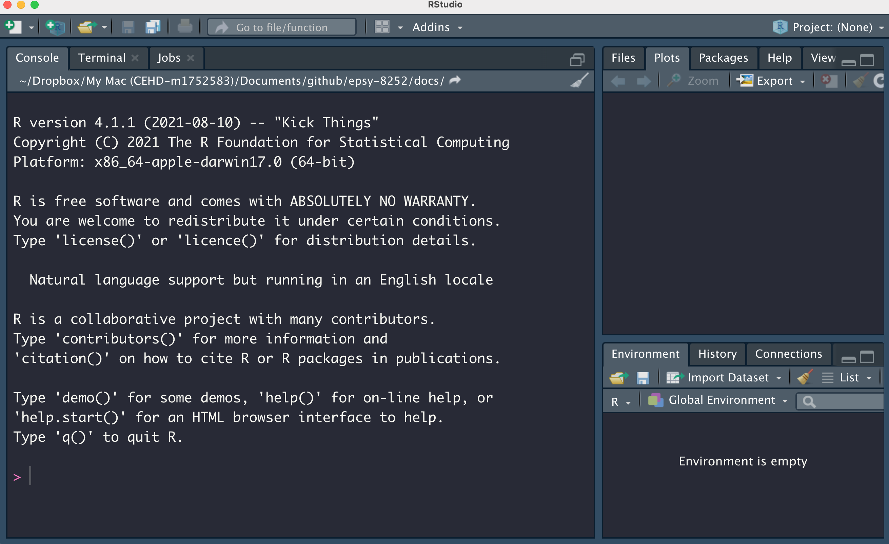

# Installing the Computational Tools for the Course


In this chapter, we will walk you through the process of installing the computational tools that you will need to use to create the data visualizations for this course. There are three applications that you will need to install on your computer:

- R
- RStudio Desktop
- Spreadsheet Application (e.g., Microsoft Excel or Apple Numbers)


RStudio is the program that you will interact with to create the data visualizations. RStudio itself is just a program for interacting with R. Although you could interact directly with R, RStudio has a lot of features that make it easier and more efficient for using R.

You will also need a spreadsheet application for interacting with and creating data sets. In particular you need to be able to create a CSV file. Most common spreadsheet applications can create a CSV file, including Microsoft Excel, Apple Numbers, and even Google Sheets).

You will also need to install a helper tool: Command Line Tools (for Mac users) and Rtools (for PCs). This will be necessary to build some of the R packages that we will use in the course.

Below we provide instruction for installing each of these applications.


<br />


## Installing R

To install R, navigate your web browser to:

<p style="margin-left:auto; margin-right:auto;"><https://www.r-project.org/></p>

Then,

- Click the `CRAN` link under `Download` on the left-hand side of the page.
- Select a mirror site. These should all be the same, but I tend to choose the `Iowa State University` link under `USA`.^[When internet used to be dial-up (i.e., super slow), you wanted to choose a mirror site  that was closest in proximity to your location as it sped up the download. This is less of a concern now that internet download speeds are much faster.]
- In the `Download and Install R` box, choose the binary that matches the operating system (OS) for your computer.

This is where the installation directions diverge depending on your OS.

**Mac Instructions**

So long as you are running MacOS 10.13 or higher just click the first link for the PKG, which will download the installer for the most current version of R (4.5.2 as of October 31, 2025). Once the download completes, open the installer and follow the directions to install R on your computer.

If you are running an older version of MacOS, you will have to install an older version of R. You can find these links under the `Binaries for legacy OS X systems` heading further down the install page. Click the appropriate PKG link for R your version of MacOS. Once the download completes, open the installer and follow the directions to install R on your computer.

If you are unsure which version of the MacOS is running on your computer, select `About this Mac` from the Apple menu in your toolbar. 


**Windows Instructions**

Click the link that says `Install R for the first time` (or click `base`; they go to the same place). Then click the `Download R-4.5.2 for Windows` link, which will download the installer for the most current version of R (4.5.2 as of October 31, 2025). Once the download completes, open the installer and follow the directions to install R on your computer.

:::fyi
**FYI**

Although you will need to install R to use RStudio, once they are installed you will only interact with RStudio when you compute. You will never open R directly.
:::


<br />


## Installing RStudio Desktop


After you have installed R, you next need to install RStudio Desktop. To do this, navigate your web browser to:

<p style="margin-left:auto; margin-right:auto;"><https://rstudio.com/products/rstudio/download/></p>

Then,

- Select the blue `Download` button under the free, open-source version of RStudio Desktop.
- Select the installer associated with your computer's OS.
- Once the download completes, open the installer and follow the directions to install RStudio Desktop on your computer.

<br />


## Checking that Things Worked

From your Applications or Programs folder, open the RStudio application. If you have successfully downloaded both programs, this should open the application and you should see a message indicating that you are using "R version 4.5.2" (or whichever version of R you installed) in the console pane.

```{r}
#| label: fig-rstudio
#| fig-cap: "Once you open RStudio, you should see a message indicating that you are using `R version 4.6.0` (or whichever version of R you installed) in the console pane. Here the console pane is on the left-side, but it may be in a different location for you. Your RStudio may also have a white background rather than the black background seen here."
#| fig-alt: "Once you open RStudio, you should see a message indicating that you are using `R version 4.6.0` (or whichever version of R you installed) in the console pane. Here the console pane is on the left-side, but it may be in a different location for you. Your RStudio may also have a white background rather than the black background seen here."
#| echo: false
#| out-width: "100%"


```

<br />


## Installing a Spreadsheet Application

As a University of Minnesota student, Microsoft Office 365 Pro Plus is available at no charge so long as you are registered for at least one credit. This includes access to Microsoft Excel, Word, and PowerPoint. You can learn more about how to installl this at <https://it.umn.edu/services-technologies/how-tos/microsoft-office-365-pro-plus-faculty>.


<br />


## Install Rtools/Command Line Tools

You may need to install some additional functionality to your system in order to get certain packages to install or load properly. On a Windows machine, you might need to install *Rtools*. Mac users might need to add the *Command Line Tools*. These tools also allow you to write and compile your own R packages. RStudio has well written instructions for adding these tools at: <https://support.rstudio.com/hc/en-us/articles/200486498-Package-Development-Prerequisites>.


<br />


