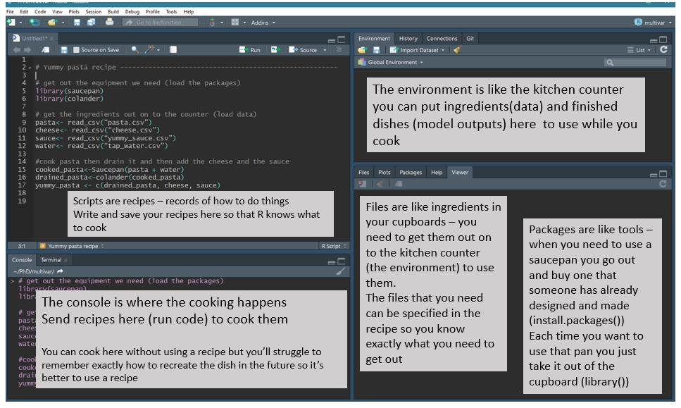
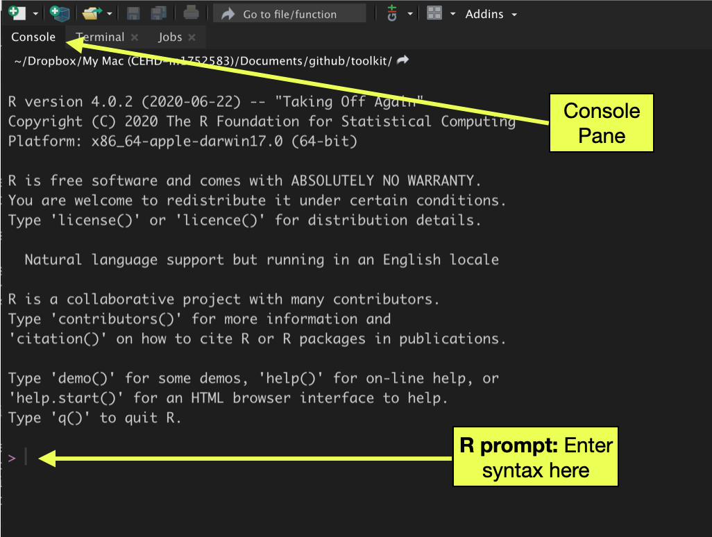
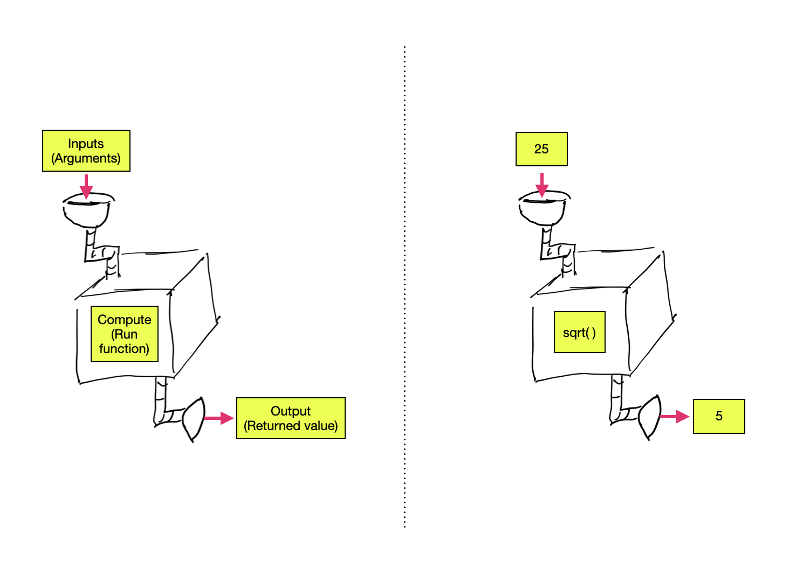
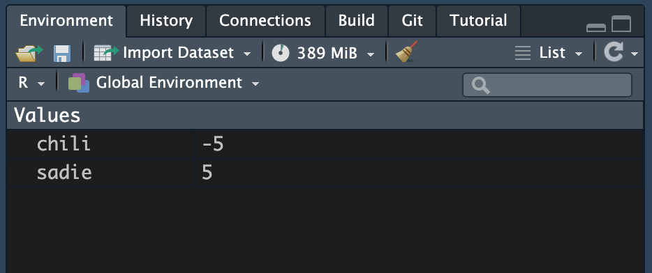
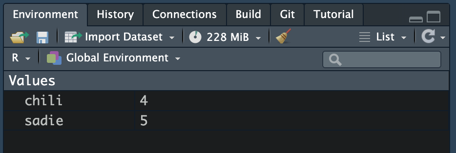

# Introduction to Using RStudio


In this chapter, you will be get started working with RStudio. RStudio is how you will interact and compute with R. **Although R needs to be installed on your computer, you will never open R directly; you will always use R by opening and working in RStudio.** To begin,

- Open a new session in RStudio.

A "session" is the terminology we use to describe the duration from opening RStudio to closing RStudio. You can begin a new R session by either opening the RStudio application on your computer, or, if you are already in an existing R session, by selecting `Session > New Session` from the RStudio menu. 

There are four main windows (called *panes*) that we will use in RStudio. (You might only see three of the four panes when you initially open a session.) Jessica Ward in a [Twitter/X post on the R-Ladies Newcastle account](https://x.com/RLadiesNCL/status/1138812826917724160) explains the functionality of the four panes using a cooking metaphor. This metaphor is displayed in @fig-cooking.

```{r}
#| label: fig-cooking
#| fig-cap: "The functions for each of the four RStudio panes is explained via a cooking metaphor."
#| fig-alt: "The functions for each of the four RStudio panes is explained via a cooking metaphor." 
#| echo: false


```


## Customizing RStudio

While the information in this section is not crucial for making things work, it is useful to get RStudio looking good and setting some default settings. Open the `Tools > Global Options` menu to access the different options. 

```{r}
#| label: fig-rstudio-options
#| fig-cap: "The RStudio options/preferences menu has many settings to customize RStudio."
#| fig-alt: "The RStudio options/preferences menu has many settings to customize RStudio."
#| echo: false
#| out-width: "50%"

knitr::include_graphics("figs/01-01-options.png")
```


- In the `General > Basic` settings, change the option on `Save workspace to .Rdata on exit` to be "Never". Click the "Apply" button.
- In the `Appearance` settings, customize the look of RStudio to something aesthetically appealing to you. When you are finished, click the "Apply" button.
- There are also options you can set in the `Accessibility` settings if you use a screen reader. If you change anything, don't forget to click the "Apply" button.

When you are finished customizing RStudio, click the "OK" button.


<br />


## Computing in RStudio

There are a couple ways to interact with R within RStudio: (1) via the console pane, and (2) via a script file. In general we will almost always use a script file, but computing via the console is a good first step to interacting with R your first time. You can compute in RStudio by typing and running syntax directly in the RStudio console pane. Computing in the console is similar to working with a calculator: you type syntax, hit enter/return, and R runs the syntax. Then it forgets what you entered and is ready for the next bit of syntax. 

The `>` symbol in the console pane is called the "R prompt" and is prompting you to enter syntax. After you enter any syntax, you hit the `<return>` or `<enter>` key to execute the syntax.

```{r}
#| label: fig-console
#| fig-cap: "The console pane in RStudio is one way to compute with R. Syntax is entered at the R prompt and executed by hitting the <return> or <enter> key."
#| fig-alt: "The console pane in RStudio is one way to compute with R. Syntax is entered at the R prompt and executed by hitting the <return> or <enter> key."
#| echo: false
#| out-width: "70%"


```

To get started, we will have R carry out some arithmetic. At the prompt enter each of the following lines of syntax. After each line, hit the `<return>` or `<enter>` key.

```{r}
#| eval: false

# Addition
2 + 3

# Subtraction
6 - 10

# Multiplication
4 * 5

# Division
23 / 2

# Exponents
10 ^ 3
```

Executing each line of syntax returns the results of the computation in the console pane. The result, in R parlance, is referred to as a "returned value". After executing the computation, the R prompt reappears and you can issue a new line of syntax.


:::fyi
**PROTIP**

If at some point in your computational career, you look at the prompt in the console pane, and instead of `>` you see a `+`, hit the `<esc>` key until the `>` prompt is re-shown. Then you can skeep on computing!
:::


**Space in Syntax:** For the computation in R, space is irrelevant. For example, each of the following syntactical statements is equivalent:

```{r}
#| eval: false

4 * 5
4*5
4    *            5
```

That being said, well-written code includes space! Space in code makes it easier to read and debug, in the same way that including space in written prose helps us read and parse words, sentences, and paragraphs. 

<br />


## Functions: The Workhorse of R

Almost all commands in R are built around the use of a function. Functions carry out operations on their inputs (called *arguments*) and produce an output (called a *returned value*).

```{r}
#| label: fig-functions
#| fig-cap: "LEFT: Arguments are inputted into a function which returns an output. RIGHT: The value 25 is inputted into the square root function which returns the value of 5."
#| fig-alt: "LEFT: Arguments are inputted into a function which returns an output. RIGHT: The value 25 is inputted into the square root function which returns the value of 5."
#| echo: false
#| out-width: "70%"


```

The syntax for using most functions in R follows a simple structure: The name of the function is followed by a pair of parentheses. Argument values (inputs) are specified inside the parentheses. In general,

```{r}
#| eval: false

function_name(argument)
```

Below are several example of this structure for some common mathematical functions. 

```{r}
#Square root
sqrt(25)

#Absolute value
abs(-23)

#Factorial
factorial(5)
```

Functions can take multiple arguments (inputs). If there is more than one argument, the arguments are always separated by a comma.

```{r}
#| eval: false

function_name(argument_1, argument_2, ...)
```

For example, the `seq()` function creates a sequence of values that have a particular start and end value.

```{r}
seq(1, 5)
```
Note that the order of the arguments matters! Reversing the order of the arguments inputted to the `seq()` function returns different output.

```{r}
seq(5, 1)
```

Each of the arguments actually has a name, and if those names are used to assign the values we are inputting to the function, then the order of the arguments is irrelevant.

```{r}
# Named arguments
seq(from = 1, to = 5)

# Order no longer matters
seq(to = 5, from = 1)
```

:::fyi
**PROTIP**

It is a good habit to use named arguments when you are writing your syntax. It makes the code more readable and easier to adapt if you come back to it later.
:::

<br />


### Assignment

We can also connect computations through **assignment**. With assignment, we store the output of a computation by assigning it to a named object. We can then use that named object in another computation. For example, here we first store the integers between $-5$ and $-1$ in an object called `chili`. Then we find the absolute value of each value by using `chili` as the argument in the `abs()` function.

```{r}
# Assign the value -5 to the object chili
chili = -5 

# Compute the absolute value
abs(chili)
```

To view the contents of an object, just print the name of the object. For example, to see the contents of `chili` we simply type `chili` at the prompt:

```{r}
chili
```


You can also assign the output from functions into an object. Here we assign the output from the `sqrt()` function into an object called `sadie`. Then we view its contents. 

```{r}
# Assign function output to sadie
sadie = sqrt(25)

# View contents of sadie
sadie
```

Pretty much any name can be used when you create an object, with some caveats: object names cannot begin with a digit nor include hyphens or spaces. Although they are legal object names, `chili` and `sadie` are not particularly good object names. Better object names would describe the contents of the object. 

In my own workflow, I tend to use all lowercase letters in my object names and I use underscores for word breaks. For example,

- `ses`, `gpa`, `occupation`
- `act_math`, `education_level`

<br />


## Objects in the R Working Environment

You can see which objects you have by looking in your `Environment` tab. 

```{r}
#| label: fig-environment
#| fig-cap: "The environment pane shows the objects in the R working environment. It also displays the object's class and gives a preview of the the contents."
#| fig-alt: "The environment pane shows the objects in the R working environment. It also displays the object's class and gives a preview of the the contents."
#| echo: false
#| out-width: "60%"


```

Not only does this pane indicate the name of the objects in the working environment, but is also displays each object's class. In this case we can tell that `chili` is an integer vector and `sadie` is a numeric vector.^[The difference between the two classes is technical and related to how R internally stores the information in the vector.] Moreover, we are told that each vector includes five elements, shown in the environment pane as `[1:5]`. Lastly, we are given a preview of each object's contents. Since these vectors only contain five elements, we see all the values in the preview.

You can also use syntax to obtain a list of objects that are in your working environment using the `ls()` function with no arguments.

```{r}
# List the objects in working environment
ls()
```


We can continue to use the objects in your environment (e.g., `chili` and `sadie`) in our computations. 

```{r}
# Sum the pairwise elements of the two objects
chili + sadie

# Find the square root of the chili object
sqrt(sadie)

# Sum of the chili and sadie objects
sum(chili, sadie)
```

In RStudio you can see which objects are in your working environment by examining the `Environment` pane.

<br />


### Re-using an Object Name

When an object name is re-used, the previous value of the object is lost.

```{r}
# Assign the values 4 to chili
chili = 4
```

After assigning the new value to `chili`, we can see the information in the environment pane has been updated to reflect the new contents of the object.

```{r}
#| label: fig-chili
#| fig-cap: "The object `chili` is now 4 instead of -5."
#| fig-alt: "The object `chili` is now 4 instead of -5."
#| echo: false
#| out-width: "40%"


```

Any computations carried out with `chili` will use the new object.

```{r}
# Add 2 to chili
chili + 2
```

If you want the previous version of `chili` you need to re-create the object. 

:::fyi
**FYI**

If you close your R session all of the objects you created in your environment will be gone. 
:::

<br />

