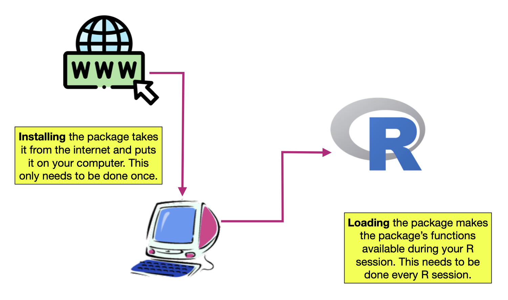
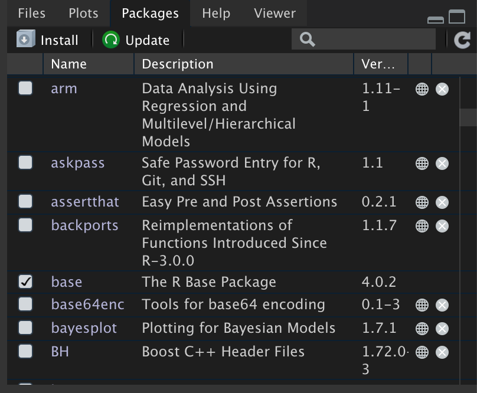
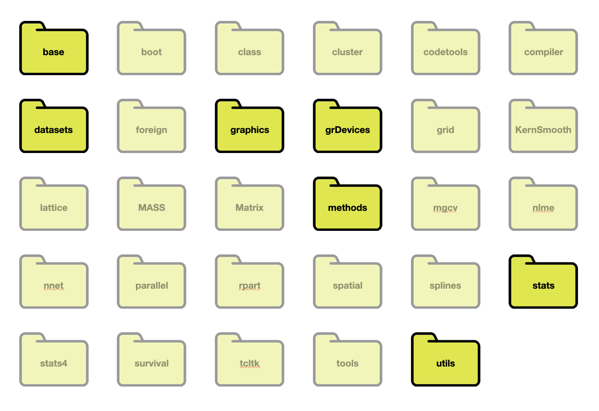
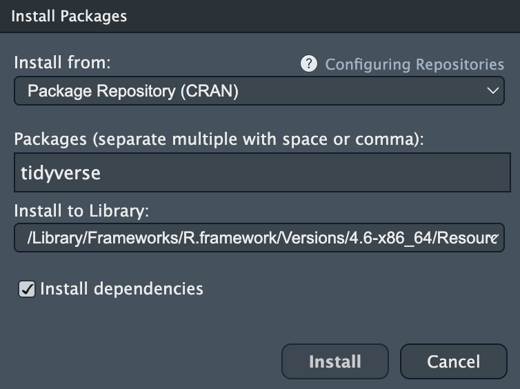

# Installing and Loading R Packages

Every R function is housed in a *package*, also sometimes referred to as a *library*. I like to think of a package as an apartment building for functions; different functions live in different buildings (packages). We will denote a package by enclosing the package name in curly braces. For example `{tidyverse}` is the `tidyverse` package. To use the functions in a particular package, the package needs to be (1) installed, and (2) loaded into memory. 

```{r}
#| label: fig-packages
#| fig-cap: "Packages need to be installed and loaded."
#| fig-alt: "Packages need to be installed and loaded."
#| echo: false
#| out-width: "70%"


```

@Ismay:2024 give the following analogy for thinking about the difference between installing and loading a package.

> A good analogy for R packages is they are like apps you can download onto a mobile phone...while it has a certain amount of features when you use it for the first time, it doesn’t have everything. R packages are like the apps you can download onto your phone from Apple's App Store or Android's Google Play.
>
> Let's continue this analogy by considering the Instagram app for editing and sharing pictures. Say you have purchased a new phone and you would like to share a photo you have just taken with friends on Instagram. You need to:
>
> - *Install the app:* Since your phone is new and does not include the Instagram app, you need to download the app from either the App Store or Google Play. You do this once and you’re set for the time being. You might need to do this again in the future when there is an update to the app.
> - *Open the app:* After you’ve installed Instagram, you need to open it.
>
> Once Instagram is open on your phone, you can then proceed to share your photo with your friends and family. The process is very similar for using an R package. You need to:
>
> - *Install the package:* This is like installing an app on your phone. Most packages are not installed by default when you install R and RStudio. Thus if you want to use a package for the first time, you need to install it first. Once you’ve installed a package, you likely won’t install it again unless you want to update it to a newer version.
> - *"Load" the package:* "Loading" a package is like opening an app on your phone. Packages are not "loaded" by default when you start RStudio on your computer; you need to "load" each package you want to use every time you start RStudio.

<br />


## The Packages Tab: Viewing the Installed and Loaded Packages 

You can see which packages are installed by clicking on the `Packages` tab in RStudio. Every package listed there has been installed. You will also be able to see the version number of the package that is installed. Some of those packages may be checked. These are the packages that are currently loaded into memory.

```{r}
#| label: fig-packages2
#| fig-cap: "The packages tab shows which packages are installed. The list of packages you have installed will likely be different. Checked packages are loaded into memory. In the packages seen here, only the base package is loaded into memory."
#| fig-alt: "The packages tab shows which packages are installed. The list of packages you have installed will likely be different. Checked packages are loaded into memory. In the packages seen here, only the base package is loaded into memory."
#| echo: false
#| out-width: "50%"


```

Twenty-nine packages were included when you installed R on your computer. When you start an R session by opening RStudio, some of those packages are also loaded into memory. 

```{r}
#| label: fig-packages3
#| fig-cap: "The 29 packages installed as part of R. The base, datasets, graphics, grDevices, methods, stats, and utils packages are loaded into memory when you start an R session. The other 22 packages are installed but not loaded into memory."
#| fig-alt: "The 29 packages installed as part of R. The base, datasets, graphics, grDevices, methods, stats, and utils packages are loaded into memory when you start an R session. The other 22 packages are installed but not loaded into memory."
#| echo: false
#| out-width: "70%"


```

<br />


## Installing Packages

You can install other packages onto your R system. R, in fact, has a repository called CRAN^["CRAN is a network of ftp and web servers around the world that store identical, up-to-date, versions of code and documentation for R."], that includes 24,700 different packages (as of August 2026). The easiest way to install a package from CRAN onto your computer is to use the `Install` button in the `Packages tab of RStudio.

This will open a pop-up window where you can type the CRAN package you want to install in a text box. Ensure that the "Install dependencies" box is checked (this will also install any package dependencies), and then click "Install".  

```{r}
#| label: fig-install
#| fig-cap: "Pop-up window to install packages. Here we are installing the `{tidyverse}` package. Note that the 'Install dependencies' box is checked."
#| fig-alt: "Pop-up window to install packages. Here we are installing the `{tidyverse}` package. Note that the 'Install dependencies' box is checked."
#| echo: false
#| out-width: "50%"


```

You may be prompted to choose a nearest mirror. If so, choose a mirror location. If you are successful in installing the package, you will get a message like the following:

```
Installing package into ‘/Users/zief0002/Library/R/4.6/library’
(as ‘lib’ is unspecified)
trying URL 'https://cran.rstudio.com/bin/macosx/contrib/4.6/tidyverse_2.0.0.tgz'
Content type 'application/x-gzip' length 1209135 bytes (1.2 MB)
==================================================
downloaded 1.2 MB


The downloaded binary packages are in
	/var/folders/s3/sqlc9xw92w54166w86dgkd000000gr/T//Rtmps80Uf8/downloaded_packages
```

The message you get on Windows may be slightly different, but **the key is that there is not an error** (the message does not say "Error"). 

:::fyi
**FYI**

If the installation was successful, you should now be able to see the installed package show up in the list of packages in RStudio's `Packages` tab.
:::

<br />


## Loading Packages

To load a package that is installed, you use the `library()` function and include the name of the package you want to load in as the sole argument. For example, to load the `{ggplot2}` package, type the following syntax into the console:

```{r}
library(tidyverse)
```

In general if the package loaded successfully there will be no error message printed to the console. Sometimes there will be a messgae, but as long as it doesn't say "Error", it shouldn't be a problem. For example, here is what happens when we load the `{tidyverse}` package.

```{r}
#| message: true

library(tidyverse)
```

The message that `{tidyverse}` was "attaching core tidyverse packages" informed us that the dependent packages were also loaded in addition to the `{tidyverse}` package.


:::fyi
**FYI**

You can check the `Packages` tab to see that your package was successfully loaded. If so, a check mark will appear in the box next to the package name. Note that packages will need to be loaded every time you launch a new R session. 
:::

<br />


<!-- #### Conflicts or Masked Objects -->

<!-- Sometimes you will get a message about conflicts or objects being *masked*. **This is not a problem.** It is just informative and means that the  package you just loaded has a function that has the *exact same name* as a previously loaded package. If you use that particular function, the most recently loaded package's version of the function will be used. For example, after loading the `{tidyverse}` library the following message is printed: -->

<!-- ``` -->
<!-- ── Conflicts ────────────────────────────────────────── -->
<!-- ✖ dplyr::filter() masks stats::filter() -->
<!-- ✖ dplyr::lag()    masks stats::lag() -->
<!-- ℹ Use the conflicted package to force all conflicts to become errors -->
<!-- ```     -->

<!-- This tells me that the `{dplyr}` package includes two functions (`filter()` and `lag()`) that have the same name as functions included in other packages that have already been loaded into memory (both from the `{stats}` package.) Since `{dplyr}` was the most recently loaded package (it loaded when you loaded `{tidyverse}`), if you were to use the `filter()` function, R would use `{dplyr}`'s `filter()` function rather than that from the `{stats}` package^[If you really wanted to use the `filter()` function from the `{stats}` package you could specify this in the syntax using the `::` operator, `stats::filter()`. This operator also allows you to use a function without loading the package with the `library()` function.]. -->

<!-- <br /> -->


### Error Loading a Package

Once in a while, when loading a package, you may get an error message (it will say "Error" in the message.). **Don't panic.** There are two errors that are common. The first error you may get indicates that the package did not get installed. For example, if the `{tidyverse}` package was not installed, trying to use the `library()` function to load that package would result in an error.

```{r}
#| eval: false

library(tidyverse)
```

```
Error in library(tidyverse) : there is no package called ‘tidyverse’
```

Simply install the package and then re-try loading it. 

The second error that you might run across when trying to load a package occurs when the installation did not include the package dependencies. For example,

```{r}
#| eval: false

library(tidyverse)
```

```
Error: package or namespace load failed for ‘tidyverse’ in loadNamespace(j <- i[[1L]], c(lib.loc, .libPaths()), versionCheck = vI[[j]]):
there is no package called ‘ggplot2’
```

Again, don't panic! Here the error message is saying that the `{ggplot2}` package is a dependency and it is not installed. To fix this, install the `{ggplot2}` package and then try again. (You may need to open a new R session first.) You may need to install more than one dependency, so just keep installing what is missing until it works.

<br />


