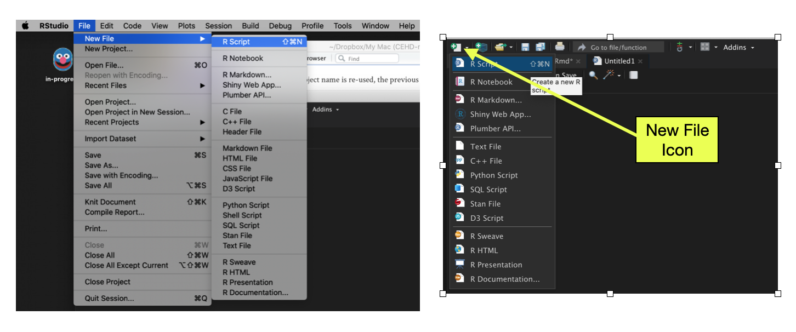
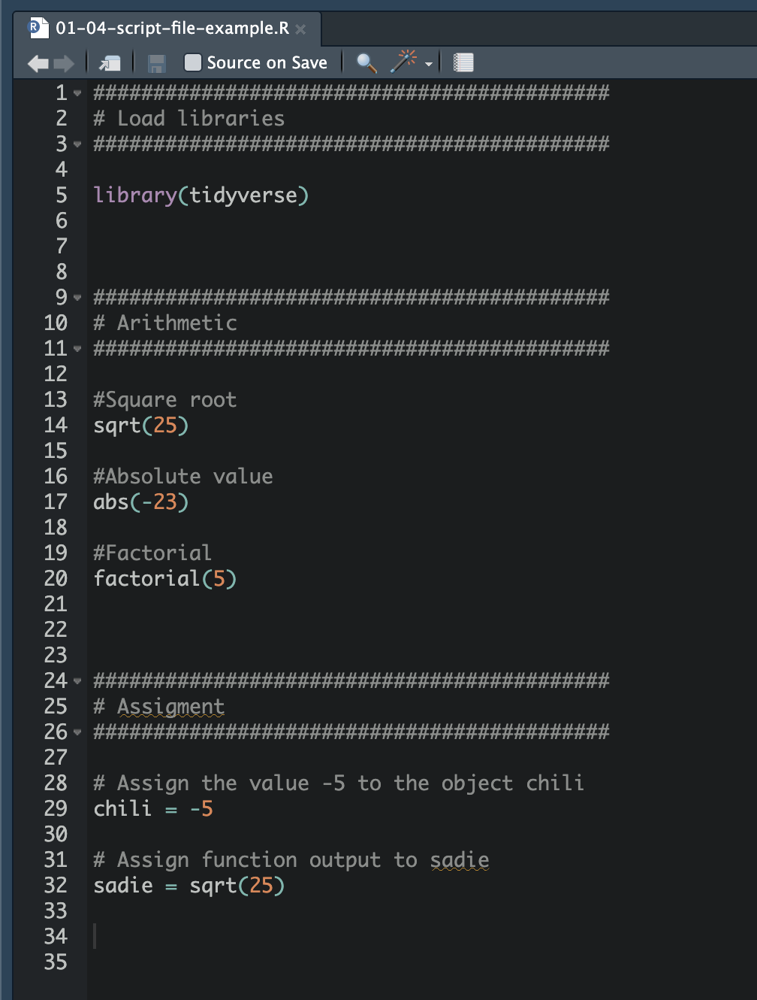
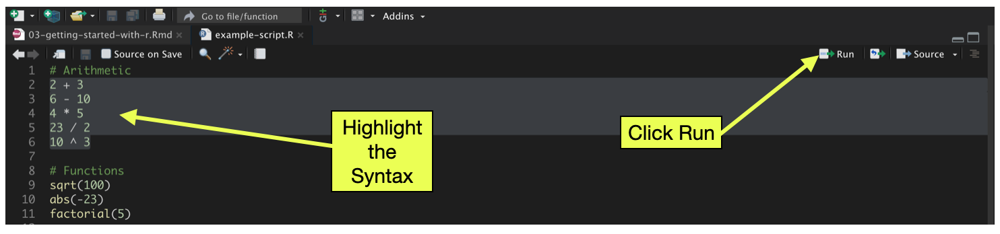

# Script Files: Saving Your Syntax

One problem with using the console is that R immediately forgets the syntax---it does not save your work. This is ok for some things that we do that only need to be done one time (e.g., installing packages), but for other things we will want to save our code. Using a script file allows us to "save" your work, and it also acts as a record of the analysis for your collaborators in the spirit of reproducible work. Script files are the primary method we will use in EPSY 1261 to compute in RStudio. 

<br />


## Creating a New Script File

You can create a new script file by selecting `File > New File > R Script` from the RStudio menu bar. You can also obtain a new R script by clicking the `New File` icon (document with the plus-sign) on the tool bar and selecting `R Script`. (This should open the script file in a new RStudio pane!)


```{r}
#| label: fig-script
#| fig-cap: "LEFT: Create a new script file using RStudio's `File` menu. RIGHT: Create a new script file by clicking on the `New File` icon in the toolbar."
#| fig-alt: "LEFT: Create a new script file using RStudio's `File` menu. RIGHT: Create a new script file by clicking on the `New File` icon in the toolbar."
#| echo: false
#| out-width: "90%"

```

**Script files should only include your R syntax and comments.** Script files should NOT include:

- prompts (`>`)
- output


<br />


## Comments and Code Chunks

Comments, which are human-readable annotations or explanations of the syntax, are written using the hashtag (`#`). These can be placed on their own line in the script file, or can be placed at the end of a line with syntax. The comment continues until you hit the <enter> key. Comments help other people understand your syntax and also act as a reminder for the future you of what your code actually does. Get is the habit of including comments in your syntax. Not only is it good coding practice, but it also will help you become familiar with and learn the R syntax as you describe the purpose of the syntax you are writing.

In the script files you create in EPSY 1261 we will use the hashtags to create code chunks. Code chunks are larger chunks of code that are grouped together. Think of the code chunks as sections of your code. Consider the following script file.

```{r}
#| label: fig-script2
#| fig-cap: "Example script file with three code chunks."
#| fig-alt: "Example script file with three code chunks."
#| echo: false
#| out-width: "70%"


```

This script file has three different code chunks. In the first code chunk we load the `{tidyverse}` library. In the second code chunk we have some arithmetic computations. And, in the third code chunk we assign values into two objects. Note that computations in each code chunk go together logically---they form a coherent group of computations. Within each code chunk we have further comments explaining individual pieces of syntax.

How do you denote a code chunk? I type several hashtags on a line, then on the next line a single hashtag followed by a description of what is in that chunk. Then on the next line, the same number of hashtags as on the initial line. So for example:

```
######################################
# Load libraries
######################################
```

I typically separate each code chunk by three or four blank lines in the script file. This gives me a visual cue for easily finding different code chunks.


:::fyi
**FYI**

When you hit `<enter>` in the script file, the cursor moves to a new line, but doesn't execute the computation like it did in the console.
:::

<br />


## Saving a Script File

Script files can be saved and opened the same as any other document. So, no more worrying about losing your work or objects that you created when you close your R session. To save your script file you can select `File > Save` from the RStudio menu (or use command-s on a Mac or ctrl-s on Windows). Alternatively you can click on the disk icon (💾) in the script file pane's toolbar.

The first time you save you will be asked to name your saved file. You can also select where you want to save the file. (Protip: Save it in your 1261 folder!) When you look at the script file on your computer, it should have a `.R` file suffix. 

If you have closed your RStudio session, you can now double-click the script file on your computer to open it in RStudio. (Note. If when you double-click on the .R file it opens R instead of RStudio, close it and type "how do i get a .R file to open in rstudio instead of r" into Google. Then follow the instructions for making the default so that it opens in RStudio.)

:::fyi
**PROTIP**

Save your syntax often! Unlike Google applications, script files do NOT autosave. If you forget to save your script file, when you re-open it later, you will have lost your work!
:::

<br />


### Running Syntax from a Script File

Not only does the script file record your syntax, but it can also act as the vehicle from which you run your R syntax. Syntax in the script file can be executed by highlighting it and pressing the `Run` button in the toolbar. You can run one line at a time, or highlight multiple lines and execute all of them sequentially. 

```{r}
#| label: fig-execute
#| fig-cap: "To execute syntax from the script file, highlight the syntax you want to run and then click the `Run` button in the toolbar."
#| fig-alt: "To execute syntax from the script file, highlight the syntax you want to run and then click the `Run` button in the toolbar."
#| echo: false
#| out-width: "80%"


```

Writing syntax directly in the script file and running it is a groovy workflow for using R. Writing syntax directly in the script file also saves you from having to copy-and-paste syntax you want to save from the console. In my own work, I use this workflow almost daily. 

<br />
