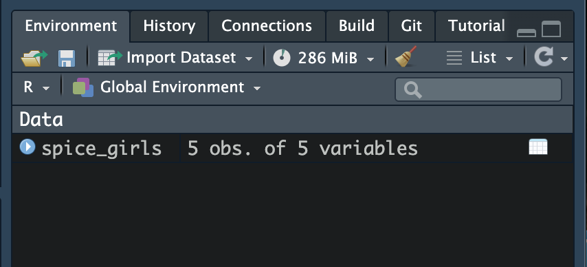
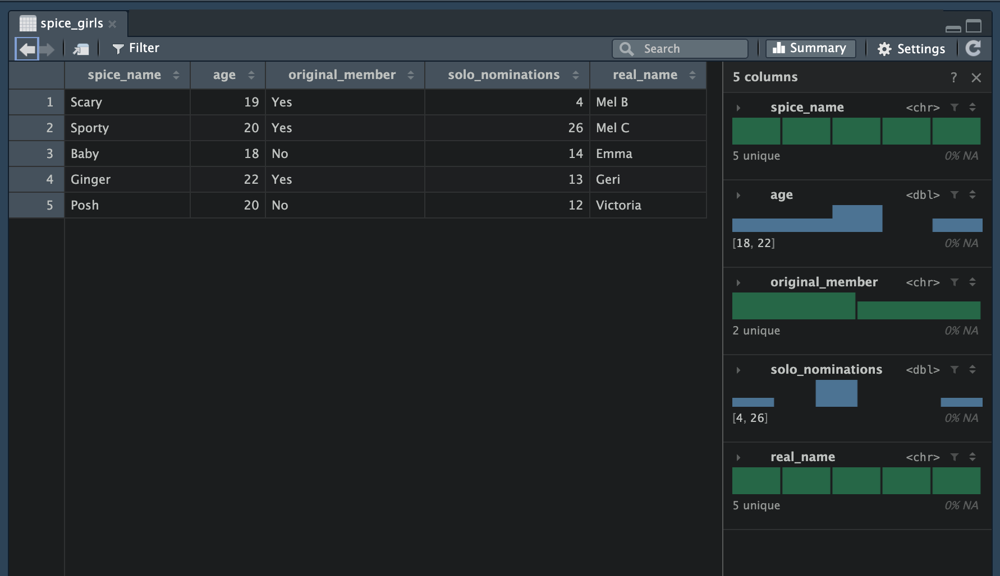

# Importing Data into RStudio

To be able to create a data visualization, we need to be able to import a dataset into RStudio. In this chapter, you will learn how to import a CSV file into RStudio. You will also learn how to prepare a dataset in a spreadsheet application (e.g., Microsoft Excel) and save it as a CSV file. 

<br />


## CSV Files: A Format for Tabular Data

Data are stored in many formats. For example, some data are stored in databases. Other data is stored in JavaScript Object Notation (JSON). One common format for storing data for statistical analysis is the *Comma Separated Value* (CSV) file. (CSV files generally have the file suffix .csv.) A CSV file is a *plain text* file. Plain text simply means a file that doesn't include any formatting---it is only text. Files that have formatting are referred to as *rich text* files. (An example of a rich text file would be an Excel file (.xslx) or a Google Sheet file (GSHEET). These files often include formatting information (e.g., bold, italics, color) that is irrelevant to the raw data.)

Below is a screenshot of a CSV file after it is opened in a text editor. You can see that the file is just text with no formatting. Each row of the CSV file corresponds to the a different case. Each attribute is separated by a comma. This is how the comma separated value file gets its name! 

```{r}
#| label: fig-csv-plain-text
#| fig-cap: "Screenshot of the *spice-girls.csv* file after it is opened in a text editor. Data values in each row are separated by a comma."
#| fig-alt: "Screenshot of the *spice-girls.csv* file after it is opened in a text editor. Data values in each row are separated by a comma."
#| echo: false

knitr::include_graphics("figs/02-02-09-plain-text.png")
```
:::


<br />


## Locating the Data on Your Computer

Before we import the data, you need to locate the CSV file on your computer. To do this, enter the following syntax into the console pane:

```{r}
#| eval: false

file.choose()
```

Hit enter. This will bring up a new window from which you can navigate to the CSV file you want to import. Once you select that file, some text will be printed in the console. When I did this, the text printed in my console was:

```
/Users/zief0002/Desktop/epsy-1261/data/spice-girls.csv
```

This text includes two things: (1) the file path and (2) file name for your data. The file name is `spice-girls.csv`. This is the actual name of your data file, including the file suffix (.csv). The other part of this, `/Users/zief0002/Desktop/epsy-1261/data/`, is called the file path. This is the syntactic address of where the data file lives on your computer.

While the file path might look complicated, it's not. When you read a file path, every time you see a `/` say the words "go into the folder called...". (Note. If you are on a Windows machine you might have `\\` instead of `/`.) For example, my file path says:

> Start at the root of the computer (the very first `/`), then go into the Users folder, then go into the zief0002 folder, then go into the Desktop folder, then go into the epsy-1261 folder, then go into the data folder. That is where the `spice-girls.csv` file lives. 


<br />


## Importing the Data

To import the data we will use the `read_csv()` function. This function, which is part of the `{tidyverse}` package, will read in a CSV file. This function takes the argument `file=`. We provide this argument the path and file name of the data. Because the path and file name is a string (i.e., words/letters) it is enclosed in quotation marks. We also need to assign the output of the `read_csv()` function into an object. If we don't do that, R will read the CSV file and immediately forget it.

In your script file, create a new code chunk. In this code chunk you will load the `{tidyverse}` package. We need to do this so we have access to the `read_csv()` function. In a second code chunk import the data using the `read_csv()` function. The syntax looks like this:

```{r}
#| label: code-chunk-syntax
#| eval: false

######################
# Load libraries
######################

library(tidyverse)


######################
# Import data
######################

spice_girls = read_csv(file = "/Users/zief0002/Desktop/epsy-1261/data/spice-girls.csv")
```

If you imported the data successfully, you should now see your data object in RStudio's environment tab.

```{r}
#| label: fig-spice-env
#| fig-cap: "The `spice_girls` object shows up in the RStudio environment tab after the data has been successfully imported."
#| fig-alt: "The `spice_girls` object shows up in the RStudio environment tab after the data has been successfully imported."
#| echo: false


```


<br />


### Data Frames

When we import data into an object, that object is called a *data frame*. A data frame is R's name for data stored in a tabular structure (rows and columns). To view the data after it is imported, you double-click on the object name in the environment tab. it opens RStudio's data viewer where you can browse the data.


```{r}
#| label: fig-data-viewer
#| fig-cap: "The `spice_girls` object viewed in the data viewer."
#| fig-alt: "The `spice_girls` object viewed in the data viewer."
#| echo: false


```

In the data viewer you will see the tabular structure of the data. You can also see the attribute names. On the right-side of the viewer you can also learn more information about each of the attributes. One thing you can learn about is the attribute type. This is seen inside the `<>`. For example, the attribute `spice_name` is `<chr>`. This is a character attribute. In contrast `age` is `<dbl>`, a double attribute. Character and double are formal ways that the data is being stored in R. **For us it isn't important how the attributes are being stored, but rather that we can identify that the attribute as quantitative or categorical.**

<br />


## Creating New Data in a Spreadsheet 

Spreadsheets are incredibly useful for organizing and preparing tabular data. This is because the spreadsheet is essentially a table of rows and columns. Open your spreadsheet application and create a new document.

```{r}
#| label: fig-blank-sheet
#| fig-cap: "After creating a new spreadsheet document you will see a blank array of rows and columns---perfect for entering tabular data."
#| fig-alt: "After creating a new spreadsheet document you will see a blank array of rows and columns---perfect for entering tabular data."
#| echo: false

knitr::include_graphics("figs/02-02-01-blank-spreadsheet.png")
```


<br />


### Attribute Names

When we enter data into a spreadsheet to use with data visualization applications, the attribute names are entered into the first row of the spreadsheet. To mimic the Spice Girls data enter the following attribute names into the first row of your spreadsheet. Be sure to enter each attribute name into a separate column.

- `spice_name`
- `age`
- `original_member`
- `solo_nominations`
- `real_name`


```{r}
#| label: fig-attribute-names
#| fig-cap: "Attribute names are entered in the first row of a spreadsheet, each in a separate column."
#| fig-alt: "Attribute names are entered in the first row of a spreadsheet, each in a separate column."
#| echo: false

knitr::include_graphics("figs/02-02-02-attribute-names.png")
```


Here we have given you the attribute names to use. If you have your own data, you will need to decide what the attribute names will be. The attribute name should be descriptive about what the attribute represents, but should also be succinct. There are a couple rules to keep in mind about attribute names:

- You cannot have spaces in attribute names.
- Attribute names cannot begin with a number or any punctuation (e.g., period, exclamation point).

In the Spice Girls attributes you saw earlier, take a look at the first attribute. This is the performing name of each spice girl. We cannot call this attribute "spice name" because our attribute name cannot contain  spaces. Instead of a space, we use an underscore. Thus the attribute name is "spice_name". (This convention of using underscores is called snake case.)

Not every data scientist uses underscores instead of spaces. Here are several conventions that data scientists use to write attribute names:

- Snake Case: `Spice_Name`
- Camel Case: `SpiceName`
- Kebab Case: `Spice-Name` (You cannot use this for attribute names with R.)

The choice of uppercase or lowercase letters is also a choice. While different data scientists may choose different conventions for writing attribute names, it is important to be consistent with your choice. For example, in this book and in the data you encounter in EPSY 1261, we will always use lowercase letters and snake case for attribute names.

<br />


### Entering the Data

After adding the attribute names to the spreadsheet, you can enter in the actual data. Recall that each row is a case, so all the data in a particular row should be associated with that case. For example, the first case in our Spice Girls data is associated with Scary Spice. Her data values are:

- `spice_name`: Scary
- `age`: 19
- `original_member`: Yes
- `solo_nominations`: 4
- `real_name`: Mel B

Each data value is associated with a particular attribute in the spreadsheet. After entering Scary Spice's data your spreadsheet should now look like the following:


```{r}
#| label: fig-scary-spice
#| fig-cap: "Scary Spice's data is entered into the row after the attribute names."
#| fig-alt: "Scary Spice's data is entered into the row after the attribute names."
#| echo: false

knitr::include_graphics("figs/02-02-03-scary-spice.png")
```


The remaining Spice Girls have the following data. Enter this into your spreadsheet. Remember, each Spice Girl's data is entered into a different row. 


- `spice_name`: Sporty
- `age`: 20
- `original_member`: Yes
- `solo_nominations`: 26
- `real_name`: Mel C

<br />

- `spice_name`: Baby
- `age`: 18
- `original_member`: No
- `solo_nominations`: 14
- `real_name`: Emma

<br />

- `spice_name`: Ginger
- `age`: 22
- `original_member`: Yes
- `solo_nominations`: 13
- `real_name`: Geri

<br />

- `spice_name`: Posh
- `age`: 20
- `original_member`: No
- `solo_nominations`: 12
- `real_name`: Victoria


The spreadsheet should look like the following when you are done.


```{r}
#| label: fig-all-spice-girls
#| fig-cap: "All five Spice Girl's data is entered into spreadsheet. Each Spice Girl's data appears in a different row."
#| fig-alt: "All five Spice Girl's data is entered into spreadsheet. Each Spice Girl's data appears in a different row."
#| echo: false

knitr::include_graphics("figs/02-02-04-all-spice-girls.png")
```


A couple of notes about entering data. First, it is fine to have spaces in the actual data values themselves (e.g., "Mel B"). We just cannot have spaces in attribute names. Again, be consistent about how you enter values within a column. For example you wouldn't want to enter "YES" and "Yes" in the same column. (The data visualization application will see these as two different values!) Lastly, if you are entering data and there is no value to enter, leave that spreadsheet cell blank. For example, if we didn't have data on Sporty Spice's age, the data entered in the spreadsheet would look like the following:

```{r}
#| label: fig-blank-cell
#| fig-cap: "If Sporty Spice's age were unknown or missing, we would leave that cell blank in the spreadsheet."
#| fig-alt: "If Sporty Spice's age were unknown or missing, we would leave that cell blank in the spreadsheet."
#| echo: false

knitr::include_graphics("figs/02-02-05-blank-age.png")
```


<br />


### Exporting the Data to a CSV File

Once you have your data entered, we need to export the data from the spreadsheet into a file that is compatible with the data visualization application. R can read many different file types, but we will save our data file as a *Comma Separated Value* (CSV) file. To save your spreadsheet as a CSV file:


**Using Excel:** Select `File > Save As...` Then in the "File Format" dropdown menu, select "CSV UTF-8 (Comma delimited)(.csv)". Give your filename the name "spice-girls.csv" and click "Save". 

**Using Google Sheets:** Select `File > Download > Comma Separated Values (.csv)`. This will download the CSV file to your computer. Find the file and rename it to "spice-girls.csv". 

:::fyi
**FYI**

Your filename should not have any spaces in it.
:::


Once it has been exported you can import the data into RStudio!


<br />
