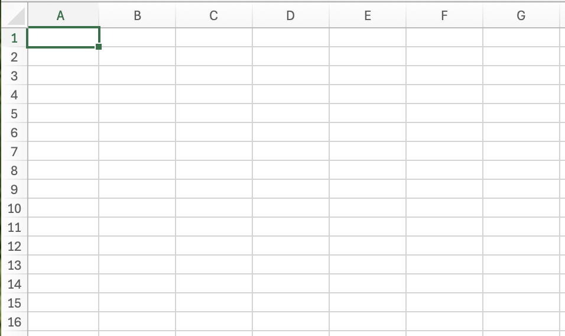
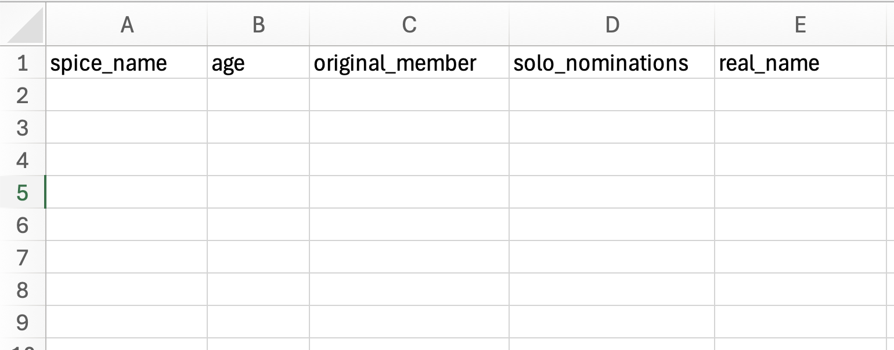
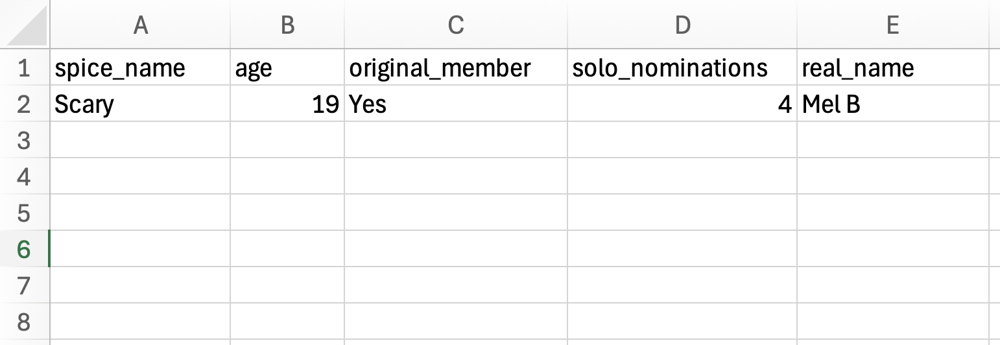
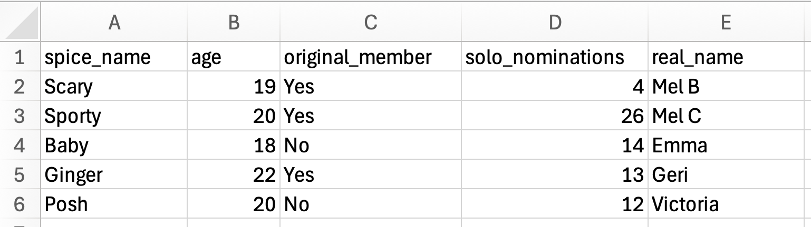
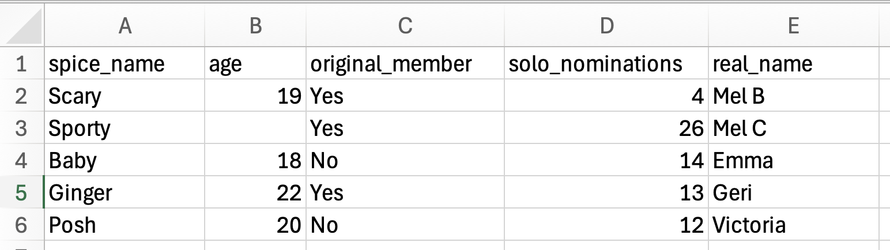
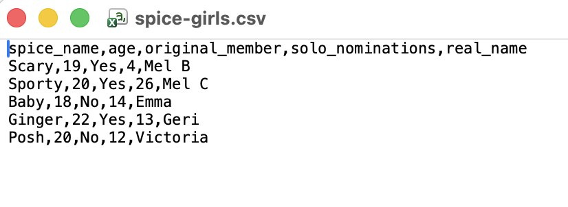
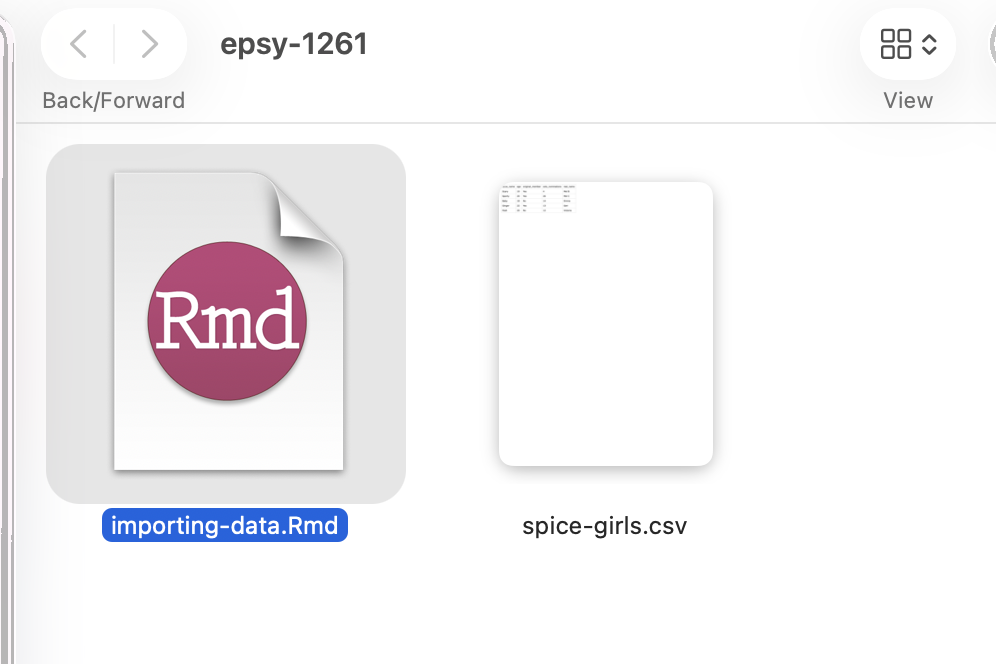
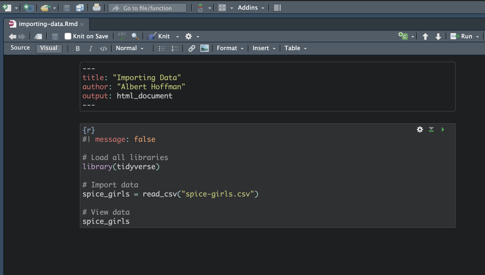
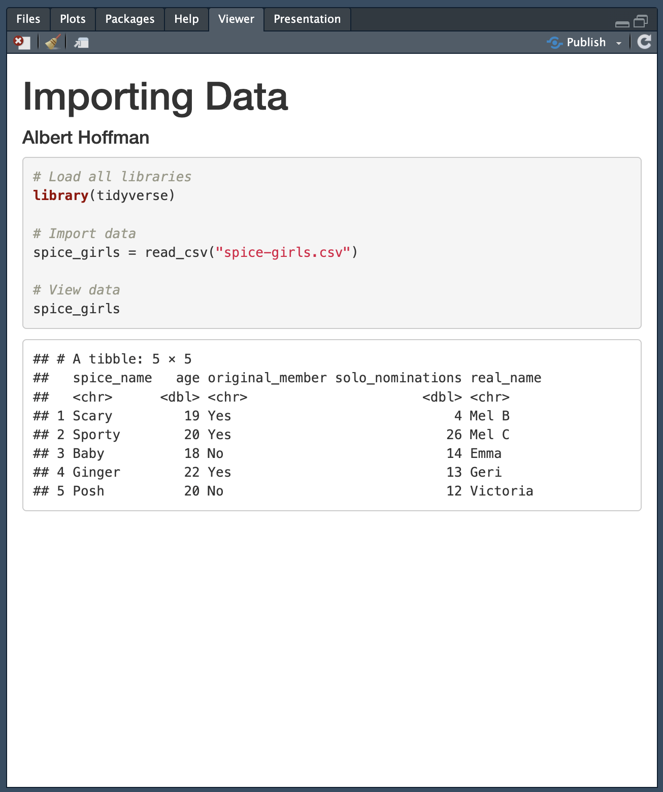

# Importing Data into an RMD Document

To be able to create a data visualization, we need to be able to import a dataset into our RMD document. In this chapter, you will learn how to prepare a dataset in a spreadsheet application (e.g., Microsoft Excel) and save it as a CSV file. You will also learn how to import the CSV file into your RMD document.

<br />


## Spice Girls Data

Recall that the data structure that is useful for our data visualization tools is tabular in that the data are organized into rows and columns. Remember also that in this structure, the rows represent **cases** and the columns represent **attributes**. Consider the data below about the 1990's band The Spice Girls.

```{r}
#| label: spice-girls-data
#| echo: false
#| message: false

spice = readr::read_csv("data/spice-girls.csv")
DT::datatable(spice)
```

In this data, each row indicates a different Spice Girl (cases) and the five attributes include information (e.g., name, age, number of solo award nominations, and whether they were an original band member) about each of them. We are going to create a CSV file of these data and import that CSV file into a RMD document.

<br />


## Data Creation Using a Spreadsheet Application

Spreadsheets are incredibly useful for organizing and preparing tabular data. This is because the spreadsheet is essentially a table of rows and columns. Open your spreadsheet application and create a new document.

```{r}
#| label: fig-blank-sheet
#| fig-cap: "After creating a new spreadsheet document you will see a blank array of rows and columns---perfect for entering tabular data."
#| fig-alt: "After creating a new spreadsheet document you will see a blank array of rows and columns---perfect for entering tabular data."
#| echo: false


```


<br />


### Attribute Names

When we enter data into a spreadsheet to use with data visualization applications, the attribute names are entered into the first row of the spreadsheet. 


To mimic the Spice Girls data enter the following attribute names into the first row of your spreadsheet. Be sure to enter each attribute name into a separate column.

- `spice_name`
- `age`
- `original_member`
- `solo_nominations`
- `real_name`


```{r}
#| label: fig-attribute-names
#| fig-cap: "Attribute names are entered in the first row of a spreadsheet, each in a separate column."
#| fig-alt: "Attribute names are entered in the first row of a spreadsheet, each in a separate column."
#| echo: false


```


Here we have given you the attribute names to use. If you have your own data, you will need to decide what the attribute names will be. The attribute name should be descriptive about what the attribute represents, but should also be succinct. There are a couple rules to keep in mind about attribute names:

- You cannot have spaces in attribute names.
- Attribute names cannot begin with a number or any punctuation (e.g., period, exclamation point).

In the Spice Girls attributes you saw earlier, take a look at the first attribute. This is the performing name of each spice girl. We cannot call this attribute "spice name" because our attribute name cannot contain  spaces. Instead of a space, we use an underscore. Thus the attribute name is "spice_name". (This convention of using underscores is called snake case.)

Not every data scientist uses underscores instead of spaces. Here are several conventions that data scientists use to write attribute names:

- Snake Case: `Spice_Name`
- Camel Case: `SpiceName`
- Kebab Case: `Spice-Name` (You cannot use this for attribute names with R.)

The choice of uppercase or lowercase letters is also a choice. While different data scientists may choose different conventions for writing attribute names, it is important to be consistent with your choice. For example, in this book and in the data you encounter in EPSY 1261, we will always use lowercase letters and snake case for attribute names.

<br />


### Entering the Data

After adding the attribute names to the spreadsheet, you can enter in the actual data. Recall that each row is a case, so all the data in a particular row should be associated with that case. For example, the first case in our Spice Girls data is associated with Scary Spice. Her data values are:

- `spice_name`: Scary
- `age`: 19
- `original_member`: Yes
- `solo_nominations`: 4
- `real_name`: Mel B

Each data value is associated with a particular attribute in the spreadsheet. After entering Scary Spice's data your spreadsheet should now look like the following:


```{r}
#| label: fig-scary-spice
#| fig-cap: "Scary Spice's data is entered into the row after the attribute names."
#| fig-alt: "Scary Spice's data is entered into the row after the attribute names."
#| echo: false


```


The remaining Spice Girls have the following data. Enter this into your spreadsheet. Remember, each Spice Girl's data is entered into a different row. 


- `spice_name`: Sporty
- `age`: 20
- `original_member`: Yes
- `solo_nominations`: 26
- `real_name`: Mel C

<br />

- `spice_name`: Baby
- `age`: 18
- `original_member`: No
- `solo_nominations`: 14
- `real_name`: Emma

<br />

- `spice_name`: Ginger
- `age`: 22
- `original_member`: Yes
- `solo_nominations`: 13
- `real_name`: Geri

<br />

- `spice_name`: Posh
- `age`: 20
- `original_member`: No
- `solo_nominations`: 12
- `real_name`: Victoria


The spreadsheet should look like the following when you are done.


```{r}
#| label: fig-all-spice-girls
#| fig-cap: "All five Spice Girl's data is entered into spreadsheet. Each Spice Girl's data appears in a different row."
#| fig-alt: "All five Spice Girl's data is entered into spreadsheet. Each Spice Girl's data appears in a different row."
#| echo: false


```


A couple of notes about entering data. First, it is fine to have spaces in the actual data values themselves (e.g., "Mel B"). We just cannot have spaces in attribute names. Again, be consistent about how you enter values within a column. For example you wouldn't want to enter "YES" and "Yes" in the same column. (The data visualization application will see these as two different values!) Lastly, if you are entering data and there is no value to enter, leave that spreadsheet cell blank. For example, if we didn't have data on Sporty Spice's age, the data entered in the spreadsheet would look like the following:

```{r}
#| label: fig-blank-cell
#| fig-cap: "If Sporty Spice's age were unknown or missing, we would leave that cell blank in the spreadsheet."
#| fig-alt: "If Sporty Spice's age were unknown or missing, we would leave that cell blank in the spreadsheet."
#| echo: false


```


<br />


## CSV Files: A Format for Tabular Data

Once you have your data entered, we need to export the data from the spreadsheet into a file that is compatible with the data visualization application. R can read many different file types, but we will save our data file as a *Comma Separated Value* (CSV) file. To save your spreadsheet as a CSV file:


**Using Excel:** Select `File > Save As...` Then in the "File Format" dropdown menu, select "CSV UTF-8 (Comma delimited)(.csv)". Give your filename the name "spice-girls.csv" and click "Save". 

**Using Google Sheets:** Select `File > Download > Comma Separated Values (.csv)`. This will download the CSV file to your computer. Find the file and rename it to "spice-girls.csv". 

:::fyi
**FYI**

Your filename should not have any spaces in it.
:::


<br />

:::mathnote
**LEARN MORE: What is a CSV File?**

When you save this work, many spreadsheet programs use a proprietary format for saving the information (e.g., Excel saves as a XLSX file; Google Sheets saves as a GSHEET file). These often include extraneous information (e.g., formatting such as bold, italics, color) that is irrelevant to the raw data. A CSV file, which is short for comma separated value, removes all of that extra formatting and creates a *plain text* file. (Plain text simply means a file that doesn't include any formatting---it is only text. Files that have formatting are referred to as *rich text* files.) 

Below is a screenshot of the *spice-girls.csv* file after it is opened in a text editor. You can see that the table-like structure of the spreadsheet is no longer there---it is all just text. But, similar to the spreadsheet each row of the CSV file corresponds to the rows we created in the spreadsheet. However, unlike the spreadsheet, each attribute is not in a separate column in the CSV file. Instead, the data in each "column" is separated by a comma. This is how the comma separated value file gets its name!

```{r}
#| label: fig-csv-plain-text
#| fig-cap: "Screenshot of the *spice-girls.csv* file after it is opened in a text editor. Data values in each row are separated by a comma."
#| fig-alt: "Screenshot of the *spice-girls.csv* file after it is opened in a text editor. Data values in each row are separated by a comma."
#| echo: false


```
:::

<br />


## Importing Data into a RMD File

After you have saved your data, place it in the same folder as your RMD file. This is where R will look for the data when you give it the syntax to import the CSV file.


```{r}
#| label: fig-import-rmd
#| fig-cap: "The RMD and CSV files should be located in the same folder on your computer."
#| fig-alt: "The RMD and CSV files should be located in the same folder on your computer."
#| echo: false


```


In your RMD file, create a new code chunk. This code chunk should be immediately after the YAML in your RMD file. This code chunk is your setup code chunk, and in it you will (1) load all the libraries you will need to use in the RMD document, and (2) import the data. The syntax you will enter into this chunk is as follows:

```{r}
#| label: code-chunk-syntax
#| eval: false

# Load all libraries
library(tidyverse)

# Import data
spice_girls = read_csv("spice-girls.csv")

# View data
spice_girls
```


The first part of the syntax is `library(tidyverse)`. Remember, this loads the `{tidyverse}` library. This is important because the `read_csv()` function lives is part of the `{tidyverse}` library, and we cannot use it until the library is loaded.

The second part of the code chunk---`spice_girls = read_csv("spice-girls.csv")`---is actually importing the data. The `read_csv()` function is being used to read and import a CSV file. The argument in this function tells the function the name of the CSV file that you want to import. In this case the file is called *spice-girls.csv*. This needs to go inside quotation marks since it is a character string. The imported data is then being assigned to an object called `spice_girls`. 

```{r}
#| label: fig-rmd-document
#| fig-cap: "An RMD document with a setup code chunk loading libraries and importing the data. This code chunk is immediately after the YAML."
#| fig-alt: "An RMD document with a setup code chunk loading libraries and importing the data. This code chunk is immediately after the YAML."
#| echo: false


```


Note that at the top of the code chunk, I have included a code chunk option. Code chunk options are included at the top of the code chunk and begin with `#|`. The code chunk options are then written in the same "key: value" method that we write YAML, and always are in lowercase. The code chunk option `message: false` suppresses messages that R prints out when you run certain syntax. This just keeps the output in your knitted file cleaner, it isn't necessary to run the syntax.


<br />


### Data Frames

When we import data into an object, that object is called a *data frame*. A data frame is R's name for data stored in a tabular structure. To view the data after it is imported, we just type the name of the data frame object, in our example `spice_girls`. This will give you a preview of the data. Here is what the printed data frame looks like after viewing it.

```{r}
#| label: view-data2
#| echo: false
#| message: false

# Load all libraries
library(tidyverse)

# Import data
spice_girls = read_csv("data/spice-girls.csv")

# View data
spice_girls
```


The first line tells us that this is a data frame: `A tibble: 5 × 5`---a tibble is just another name for a data frame. It also tells us the number of rows and columns (row x columns). In our data frame we have 5 rows and 5 columns. 

Then we see the data saved in the data frame object. The top line indicates the attribute names. (If there are a lot of attributes in your data, R may not show you all of them, but instead list the other attribute names at the bottom of the data.) The second line informs you about the attribute type. In our data we see we have `<chr>` and `<dbl>` attributes. These are character and double attributes. As you might suspect, character attributes are categorical because they are made up of strings or characters. Double attributes are numbers or quantitative attributes. Note that computers and applications have different ways of storing numbers in their memory. Double is one way that R stores numbers in its memory. **For us it isn't important how the numbers are being stored, but rather that we can identify that the attribute is quantitative.**

Finally, we see the data itself. This is printed in a tabular way, similar to how we saw it in the spreadsheet. Usually only the first 6 rows of the data will print out to save space on your computer screen---you usually do not want to print out thousands of cases!

<br />


### Knitting the RMD Document


Once you click the `knit` button, your RMD document should render into an HTML file. This should include the syntax you used to load the `{tidyverse}` library, import the data, and view the data. The rendered html document looks like the following:


```{r}
#| label: fig-rendered-rmd
#| fig-cap: "The rendered RMD file should show your syntax and the output of viewing the data."
#| fig-alt: "The rendered RMD file should show your syntax and the output of viewing the data."
#| echo: false


```


<br />
