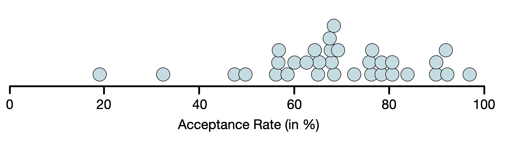
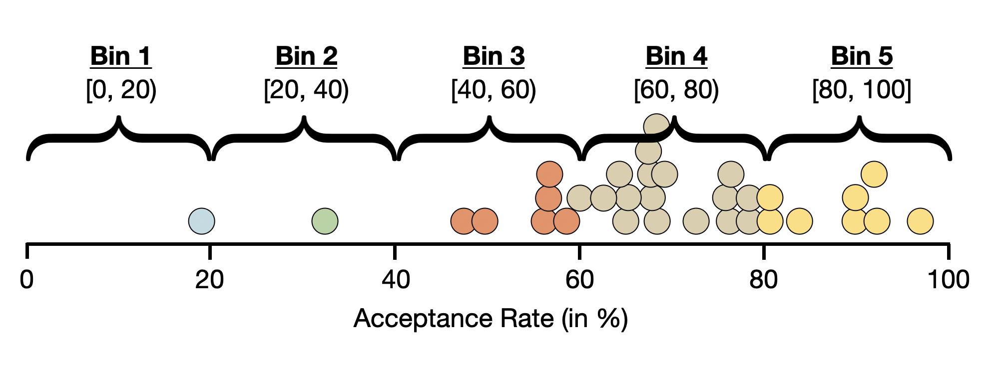
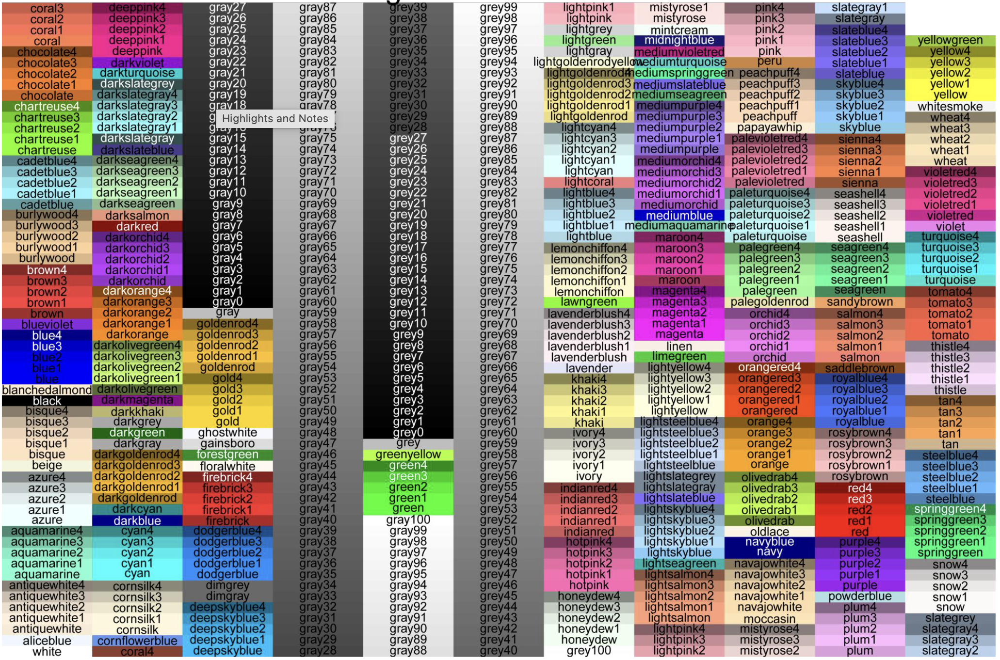

# Visualizing and Describing Quantitative Attributes {#sec-quant-attributes}

This chapter will focus on the visualization and description of quantitative attributes. To illustrate how we can summarize and visualize quantitative attributes using R, we will use the **mn-colleges.csv** data. This data includes admissions related data for the 33 institutions of higher learning in Minnesota. 

```{r}
#| label: load-packages
#| message: false
#| echo: false

# Load libraries
library(tidyverse)

# Import data
mn <- read_csv("data/mn-colleges.csv")

# View data
DT::datatable(mn)
```


In these data each case is an institution of higher education in the state of Minnesota. There are 33 institutions in our sample. There are several quantitative attributes in the data, including: the number of applicants, the number of applicants who were admitted, and the acceptance rate. We will focus on the acceptance rate attribute in this chapter.

<br />


## Dot Plot

The first visualization we will examine is a dot plot. A dot plot is a simple visualization of a quantitative attribute that uses a dot to represent the attribute value for each case. The plot of all the dots (which is plotted over a number line) allows us to easily see the frequency of cases at each value.

```{r}
#| label: fig-dotplot
#| fig-cap: "A dot plot of the acceptance rates for the 33 institutions of higher education in Minnesota."
#| fig-alt: "A dot plot of the acceptance rates for the 33 institutions of higher education in Minnesota."
#| out-width: "80%"
#| echo: false


```

Each dot is a different institution of higher education. For example, the dot on the far left of the plot is Carleton College (which has an acceptance rate of 19.1%). Looking at this plot, we can see that:

- The acceptance rate for these schools is quite variable with the lowest acceptance rate of around 20% (Carleton College) and the highest acceptance rate is near 100% (Dunwoody College of Technology).
- There are several colleges have an acceptance rate around 65%. (This is the highest stack/clump of dots.)

While the dot plot does allow us to see each individual case, it is not often used in visualization. This is because when there are many cases in your data set, the dot plot becomes overwhelming. Even with only 33 cases you see that the dots are crowded.


## Histograms

A more common visualization used for quantitative attributes is the histogram. The histogram essentially puts the cases from the dot plot into a bin.

```{r}
#| label: fig-binned-dotplot
#| fig-cap: "A dot plot of the acceptance rates for the 33 institutions of higher education in Minnesota. Each dot is put in a single bin. Dots that are the same color are in the same bin."
#| fig-alt: "A dot plot of the acceptance rates for the 33 institutions of higher education in Minnesota. Each dot is put in a single bin. Dots that are the same color are in the same bin."
#| out-width: "80%"
#| echo: false


```

Then a bar is drawn for each bin. The height of this bar indicates the number (count) of cases in that bin.

```{r}
#| label: fig-hist
#| fig-cap: "A histogram of the acceptance rates for the 33 institutions of higher education in Minnesota."
#| fig-alt: "A histogram of the acceptance rates for the 33 institutions of higher education in Minnesota."
#| out-width: "80%"
#| echo: false

ggplot(data = mn, (aes(x = accept_rate))) +
  geom_histogram(
    breaks = seq(0, 100, by = 20), 
    color = "black", fill = "#7A0019", 
    alpha = 0.8
    ) +
  scale_x_continuous(name = "Acceptance Rate (in %)", breaks = seq(0, 100, by = 20)) +
  scale_y_continuous(name = "Count", breaks = seq(0, 20, by = 5))
```

Notice that although the histogram is less cluttered than the dot plot, we do lose some nuance. For example, it is now difficult to determine what the lowest (or highest) acceptance rate is since we no longer see the individual cases. We only know that the lowest acceptance rate is somewhere between 0 and 20.

We can fix this by changing the bin width. Rather than a bin width of 20, we could try a bin width of 10 or 5.


```{r}
#| label: fig-binwidth
#| fig-cap: "A histogram of the acceptance rates for the 33 institutions of higher education in Minnesota."
#| fig-subcap:
#|   - "The bin width for each bin is 10."
#|   - "The bin width is 5."
#| fig-alt: "A histogram of the acceptance rates for the 33 institutions of higher education in Minnesota."
#| out-width: "100%"
#| layout-ncol: 2
#| echo: false
#| lightbox: 
#|   group: histograms
#|   description: 
#|     - This histogram has a bin width of 10.
#|     - This histogram has a bin width of 5.

ggplot(data = mn, (aes(x = accept_rate))) +
  geom_histogram(
    breaks = seq(0, 100, by = 10), 
    color = "black", fill = "#7A0019", 
    alpha = 0.8
    ) +
  scale_x_continuous(name = "Acceptance Rate (in %)", breaks = seq(0, 100, by = 20)) +
  scale_y_continuous(name = "Count", breaks = seq(0, 20, by = 5))


ggplot(data = mn, (aes(x = accept_rate))) +
  geom_histogram(
    breaks = seq(0, 100, by = 5), 
    color = "black", fill = "#7A0019", 
    alpha = 0.8
    ) +
  scale_x_continuous(name = "Acceptance Rate (in %)", breaks = seq(0, 100, by = 20)) +
  scale_y_continuous(name = "Count", breaks = seq(0, 20, by = 5))
```

The histogram with a bin width of 5 gives enough nuance to hone in on the lowest and highest values pretty well. In this histograms, we also see that the highest bar is around 65%---similar to what we saw in the dot plot. You also see that the higher bars tend to be on the right-side of the plot, indicating that there are more institutions with higher acceptance rates than there are with lower acceptance rates.

<br />


## Density Plot

An alternative to the histogram is a density plot. To create a density plot, imagine throwing a sheet over the top of a histogram. The resulting plot is a density plot. 


```{r}
#| label: fig-density
#| fig-cap: "A density plot of the acceptance rates for the 33 institutions of higher education in Minnesota."
#| fig-alt: "A density plot of the acceptance rates for the 33 institutions of higher education in Minnesota."
#| out-width: "80%"
#| echo: false


ggplot(data = mn, (aes(x = accept_rate))) +
  geom_density(
    color = "black", fill = "#7A0019", 
    alpha = 0.8
    ) +
  scale_x_continuous(name = "Acceptance Rate (in %)", breaks = seq(0, 100, by = 10)) +
  scale_y_continuous(name = "Density")
```


In a density plot, we are no longer plotting counts on the *y*-axis, but instead are plotting something called "density". While density is pretty technical, you can think about it like probability. So looking at this density plot, it is more probable that institutions have an acceptance rate of around 50% than an acceptance rate around 30% because the density is higher at the acceptance rate of 50% than it is at 30%. The highest density occurs around 65%, which is the most probable acceptance rate. 

Similar to the dot plot, the density plot also allows us to easily see the lowest and highest acceptance rates---around 20% and 95%, respectively. Like the histogram, we also see that in the density plot, the density values on the right-hand side of the plot are higher than those on the left-hand side of the plot. This tells us that it is more likely for these institutions to have a higher acceptance rate than for them to have a lower acceptance rate.

<br />


## Describing the Distribution

Data scientists have a specific vocabulary for describing the distribution of quantitative attributes. They would say that the distribution of acceptance rates is *left-skewed*. A left skewed distribution has the majority of cases on the right side of the distribution (i.e., at higher values of the attribute). In contrast, a distribution that has the majority of cases on the left side of the distribution (i.e., at lower values of the attribute) is called *right-skewed*. @fig-skewed-dists shows examples of both a left-skewed and right-skewed distribution.

```{r}
#| label: fig-skewed-dists
#| layout-ncol: 2
#| fig-cap: "Examples of a left-skewed and right-skewed distribution."
#| fig-subcap:
#|   - "Left-Skewed Distribution"
#|   - "Right-Skewed Distribution"
#| fig-alt: "Examples of a left-skewed and right-skewed distribution."
#| echo: false


# Left-skewed
tibble(
  x = c(rep(0, 1), rep(1, 1), rep(2, 3), rep(3, 4), rep(4, 1), rep(5, 5), rep(6, 8), rep(7, 7),
        rep(8, 10), rep(9, 9), rep(10, 7), rep(11, 2), rep(12, 3), rep(13, 1),
        rep(-1, 2), rep(-2, 1), rep(-3, 1), rep(-4, 1))
) |>
  ggplot(aes(x = x)) +
  geom_histogram(fill = "lavender", color = "black", binwidth = 1) +
  theme_bw() +
  xlab("") +
  ylab("") +
  theme(
    axis.text.x = element_blank(),  #remove x-axis labels
    axis.ticks.x = element_blank(), #remove x-axis ticks
    axis.text.y = element_blank(),  #remove y-axis labels
    axis.ticks.y = element_blank()  #remove y-axis ticks
  )

# Right-skewed
tibble(
  x = c(rep(1, 2), rep(2, 5), rep(3, 4), rep(4, 3), rep(5, 9), rep(6, 12),
        rep(7, 15), rep(8, 13), rep(9, 14), rep(10, 11), rep(11, 13),
        rep(12, 10), rep(13, 12), rep(14, 8), rep(15, 6),  rep(16,5), rep(17, 7),
        rep(18, 10), rep(19, 7), rep(20, 4), rep(21, 9), rep(22, 5), rep(23, 3),
        rep(24, 2), rep(25, 4), rep(26, 5), rep(27, 4), rep(28, 1), rep(29, 2),
        rep(30, 1), rep(31, 3), rep(32, 2), rep(33, 2), 34, 35)
) |>
  ggplot(aes(x = x)) +
  geom_histogram(fill = "lightblue", color = "black", binwidth = 1) +
  theme_bw() +
  xlab("") +
  ylab("") +
  theme(
    axis.text.x = element_blank(),  #remove x-axis labels
    axis.ticks.x = element_blank(), #remove x-axis ticks
    axis.text.y = element_blank(),  #remove y-axis labels
    axis.ticks.y = element_blank()  #remove y-axis ticks
  )


```

The skewness of a distribution describes a characteristic that we refer to as the **shape of the distribution**. Some distributions are not skewed, these distributions have a **symmetric** shape. @fig-symmetric shows an example of a symmetric distribution.

```{r}
#| label: fig-symmetric
#| fig-cap: "Example of a symmetric distribution."
#| fig-alt: "Example of a symmetric distribution."
#| out-width: "50%"
#| echo: false

tibble(
  x = c(rep(1, 1), rep(2, 3), rep(3, 2), rep(4, 5), rep(5, 6),
        rep(6, 7), rep(7, 8), rep(8, 10), rep(9, 9), rep(10, 7),
        rep(11, 5), rep(12, 2), rep(13, 4), rep(14, 3), rep(15, 1))
) |>
  ggplot(aes(x = x)) +
  geom_histogram(fill = "orange", color = "black", binwidth = 1) +
  theme_bw() +
  xlab("") +
  ylab("") +
  theme(
    axis.text.x = element_blank(),  #remove x-axis labels
    axis.ticks.x = element_blank(), #remove x-axis ticks
    axis.text.y = element_blank(),  #remove y-axis labels
    axis.ticks.y = element_blank()  #remove y-axis ticks
  )
```

<br />


In addition to the overall shape of the distribution, another aspect of shape that we should describe is the number of modes in the distribution. The distributions we have looked as so far have been **unimodal**, that is, they have a single mode or "hump" in the distribution.

Other distributions have multiple modes. For example, the distribution in @fig-tc-marathon is **bimodal** (it has two modes). If a distribution has more than one mode, it often indicates that there are different groups that have been mixed into the data. For example, in @fig-tc-marathon we see one mode around 180 minutes (3 hours) and another taller mode around 300 minutes (5 hours). This might indicate that there are two different groups of runners that competed in the Legacy Marathon---one smaller group that was faster (e.g., elite runners) and one larger group that was slower.


```{r}
#| label: fig-tc-marathon
#| fig-cap: "Distribution of times for a random sample of runners who competed in the 2022 Legacy Marathon."
#| fig-alt: "Distribution of times for a random sample of runners who competed in the 2022 Legacy Marathon."
#| fig-width: 8
#| fig-height: 6
#| echo: false

set.seed(100)
tibble(
  x = c(rnorm(100, mean = 180, sd = 40), rnorm(200, mean = 300, sd = 45))
) |>
  filter(x > 132) |>
  ggplot(aes(x = x)) +
  geom_density(fill = "lightgreen", color = "black") +
  theme_bw() +
  xlab("Minutes") +
  ylab("") +
  theme(
    #axis.text.x = element_blank(),  #remove x-axis labels
    #axis.ticks.x = element_blank(), #remove x-axis ticks
    axis.text.y = element_blank(),  #remove y-axis labels
    axis.ticks.y = element_blank()  #remove y-axis ticks
  )
```


<br />


### Center and Variation: Two Additional Characteristics to Describe

In addition to the describing the shape of the distribution, there are two other characteristics of a quantitative distribution that we should describe: the **center** and the **variation**.

The "center" of a distribution is misleading in that it doesn't literally mean the center of the distribution. What it really means is "typical value". In the distribution of acceptance rates (e.g., @fig-density), a typical acceptance rate might be around 65%. This value is at the mode in the distribution.

We also need to describe the variation in the distribution. When estimating the variation from a density plot we typically describe the overall range of values, as well as, the range of values within which most of the data falls. In the distribution of acceptance rates presented earlier, there are acceptance rates between 20% and 96%, but most of the institutions of higher learning have an acceptance rate between 55% and 75%. This could also be given as a range of values around the typical value---$65\% \pm 10\%$

In a multi-modal distribution, the identification of center and variation is more difficult, since there are multiple typical values. For example, in the distribution of marathon times presented in @fig-tc-marathon, there are two typical values, one around 180 minutes and another around 300 minutes. Similarly, in describing the variation we often describe a range of values around each typical value that depicts where most of the data fall. From @fig-tc-marathon, most of the faster runners finished the Legacy Marathon between 160 and 190 minutes, whereas most of the slower runners finished with a time between 200 and 400 minutes.


:::fyi
**INTERPRETATION**

A full description of a quantitative distribution includes shape, number of modes, center, and variation. It also needs to incorporate the context of the data. 
:::


Here is how we might describe the distribution of acceptance rates:

> The distribution of acceptance rates for Minnesota's 33 institutions of higher eduction is left-skewed. Most institutions admit a high proportion of applicants. A typical institution in the distribution admits around 65% of its applicants ($\pm$ 10%). There are, however, a few institutions that are quite selective, admitting fewer than 30% of the students who apply. Similarly there are some institutions that accept almost all of their applicants.


<br />


## Using R to Create Histograms

To create a histogram or a density plot, we will use functions from the `{tidyverse}` library. As a reminder, in the first code chunk of your QMD document, load the `{tidyverse}` library. Also use the `read_csv()` function to import the *mn-colleges.csv* data and assign the data into an object called `mn`. You also might want to view the data to ensure that it imported into the QMD correctly. (Don't forget to add code comments as well!)


```{r}
#| label: load-packages2
#| eval: false

# Load libraries
library(ggformula)
library(tidyverse)

# Import data
mn <- read_csv("data/mn-colleges.csv")

# View data
mn
```


To create a histogram of the acceptance rates, we will first create a new code chunk in your QMD document where you want the histogram to appear. In the ggplot syntax we will use two layers in our plot: `ggplot()` and `geom_histogram()`. Remember that the `ggplot()` layer (the global layer) indicates the data object and sets the primary aesthetic mapping for the plot. The `geom_histogram()` layer will use the information in the global layer to create the histogram. 

In the global layer we will indicate the data object is `mn` using the argument `data=mn`. We will also set the aesthetic mapping for the *x*-position using `x=accept_rate` to indicate that we want to use the `accept_rate` attribute when we create the histogram. Also, remember that since we are mapping a column in the data set, the aesthetic mapping needs to be enclosed in the `aes()` function. The syntax is as follows:

```{r}
#| eval: false

ggplot(data = mn, aes(x = accept_rate)) +
  geom_histogram()
```


This should result in the following histogram:


```{r}
#| label: fig-hist-01
#| fig-cap: "Histogram of acceptance rates for the 33 institutions of higher learning in Minnesota."
#| fig-alt: "Histogram of acceptance rates for the 33 institutions of higher learning in Minnesota."
#| out-width: "70%"
#| echo: false
#| message: false

ggplot(data = mn, aes(x = accept_rate)) +
  geom_histogram()
```

A couple things to note.

1. While the bars in the histogram are there, because we haven't made their border visible, some bars look wider than others.
2. You will likely have a message saying: `stat_bin()  using bins = 30. Pick better value binwidth`. This is because R by default chooses to create the bin width so that there are 30 bins in the histogram. Sometimes this is fine, other times we want more control over the bins.

<br />


### Adding Border and Bar Color

To show the histogram bins more clearly, we can color the bin lines (the bar borders) to highlight the different bins. To do this we include an additional argument, `color=`, in the `geom_histogram()` function. We can also set the color for the bars themselves using the `fill=` argument. Here we color the bin lines black and set the bar color to yellow. Recall that since "black" and "yellow" are strings, we enclose them in quotation marks in the function. Also note that these mappings are NOT enclosed in an `aes()` functions since "black" and "yellow" are not column names in the `mn` data object.


```{r}
#| label: fig-hist-02
#| fig-cap: "Histogram of acceptance rates for the 33 institutions of higher learning in Minnesota. The bin lines are now colored black and the bars are colored yellow."
#| fig-alt: "Histogram of acceptance rates for the 33 institutions of higher learning in Minnesota. The bin lines are now colored black and the bars are colored yellow."
#| out-width: "70%"
#| echo: true
#| message: false

ggplot(data = mn, aes(x = accept_rate)) +
  geom_histogram(color = "black", fill = "yellow")
```

There are 657 different color names that R knows. These are depicted in @fig-named-colors.


```{r}
#| label: fig-named-colors
#| fig-cap: "The 657 color names that R knows."
#| fig-alt: "The 657 color names that R knows."
#| out-width: "100%"
#| echo: false


```

<br />


### Changing the Bin Width


To change the number of bins, we add the argument `bins=` to the `geom_histogram()` function. For example, if we wanted there to be 10 bins rather than the 30 default bins, we would use the following syntax:

```{r}
#| label: fig-hist-03
#| fig-cap: "Histogram of acceptance rates for the 33 institutions of higher learning in Minnesota. This histogram has 10 bins."
#| fig-alt: "Histogram of acceptance rates for the 33 institutions of higher learning in Minnesota. This histogram has 10 bins."
#| out-width: "70%"
#| message: false

ggplot(data = mn, aes(x = accept_rate)) +
  geom_histogram(color = "black", fill = "yellow", bins = 10)
```

By changing the number of bins we are changing how wide each bin actually is. The way R computes the bin width is to take the maximum value in the data and subtract the minimum value in the data, and then divide it by the number of bins. In our example, the maximum acceptance rate in the data is 96.90 and the minimum acceptance rate is 19.10. So for the default of 30 bins:

$$
\mathrm{Bin~Width} = \frac{96.90 - 19.10}{30} \approx 2.59
$$
So the first bin would include values between 19.10 and 21.69. The second bin would include values from 21.69 and 24.28. Etc.

When we used 10 bins the bin width was:

$$
\mathrm{Bin~Width} = \frac{96.90 - 19.10}{10} \approx 7.78
$$
In this histogram the first bin would include values between 19.10 and 26.88. The second bin would include values from 26.88 and 34.66. Etc.


Rather than choosing the number of bins, you can instead choose the desired bin width by including the argument `binwidth=` in the `geom_histogram()` function. For example, to choose a bin width of 1, we could use the following:

```{r}
#| label: fig-hist-04
#| fig-cap: "Histogram of acceptance rates for the 33 institutions of higher learning in Minnesota. This histogram has a bin width of 5."
#| fig-alt: "Histogram of acceptance rates for the 33 institutions of higher learning in Minnesota. This histogram has a bin width of 5."
#| out-width: "70%"

ggplot(data = mn, aes(x = accept_rate)) +
  geom_histogram(color = "black", fill = "yellow", binwidth = 1)
```

:::fyi
**PROTIP**

In the `geom_histogram()` function you cannot include both `bins=` and `binwidth=`. Use one or the other. If you include both, R will use whichever one appears first in the function and will ignore the other argument.
:::


As the storyteller of the data, it is up to you to determine an appropriate bin width or number of bins for the quantitative attribute you are visualizing. There is no one correct bin width or number of bins. Usually the main concept being communicated with a histogram is its shape. So the key is to choose the bin width/number of bins so that we can get a good sense of the shape of the distribution.

To do that, you generally want to find the middle ground between each data value being its own bar in the graph (`binwidth=1`) and the data being grouped so there is only a single bar (`binwidth=` the range of the data). It is common to try different bin widths/number of bars and see how the histogram changes. You will notice when you are close to an appropriate bin width that making the bin a little wider or narrower really does not change the overall appearance of the graph.


<br />


## Using R to Create Density Plots

The syntax for creating a density plot, is quite similar to that for creating a histogram, except we use the `geom_density()` rather than the `geom_histogram()` function. Start by creating a new code chunk to hold the syntax for your density plot. Then, in the code chunk, add the following syntax.


```{r}
#| label: fig-density-plot-01
#| fig-cap: "Density plot of acceptance rates for the 33 institutions of higher learning in Minnesota."
#| fig-alt: "Density plot of acceptance rates for the 33 institutions of higher learning in Minnesota."
#| out-width: "70%"

ggplot(data = mn, aes(x = accept_rate)) +
  geom_density()
```

Similar to the histogram, we can also specify the `color=` and `fill=` arguments in the `geom_density()` function. The `color=` argument specifies the border color of the density plot and `fill=` specifies the interior color of the density plot. 

```{r}
#| label: fig-density-plot-02
#| fig-cap: "Density plot of acceptance rates for the 33 institutions of higher learning in Minnesota. The border is colored black and the interior of the plot is filled with yellow."
#| fig-alt: "Density plot of acceptance rates for the 33 institutions of higher learning in Minnesota. The border is colored black and the interior of the plot is filled with yellow."
#| out-width: "70%"

ggplot(data = mn, aes(x = accept_rate)) +
  geom_density(color = "black", fill = "yellow")
```


Deciding between using a histogram or density plot to visualize a quantitative attribute is really the data scientist's choice. One advantage of the density plot over the histogram is that we don't have to worry about changing the bin width. A disadvantage is that the idea of density is quite technical and will likely be more difficult for people to understand than counts. However, there is no right or wrong as they both allow people to understand the attribute by visualizing the shape, center, and variation of the distribution. 


<br />


## Exercises: Your Turn {-}

1. Create a histogram of the number of applicants (`applicants`) for the 33 institutions of higher learning in Minnesota. Color the bin lines of the histogram maroon and color the bars gold.

<button class="solution-btn solution-btn-default" onclick="toggle_visibility('exercise_03-01-01');">Show/Hide Solution</button>

<div id="exercise_03-01-01" style="display:none; margin: -40px 0 40px 40px;">
```{r}
#| fig-alt: "Histogram of the number of applicants for the 33 institutions of higher learning in Minnesota."
#| message: false

ggplot(data = mn, aes(x = applicants)) +
  geom_histogram(color = "maroon", fill = "gold")
```
</div>


2. Create another histogram of the number of applicants (`applicants`) for the 33 institutions of higher learning in Minnesota. But this time use only 15 bins. Color the bin lines of the histogram black and pick a fun color to fill the bars.

<button class="solution-btn solution-btn-default" onclick="toggle_visibility('exercise_03-01-02');">Show/Hide Solution</button>

<div id="exercise_03-01-02" style="display:none; margin: -40px 0 40px 40px;">
```{r}
#| fig-alt: "Histogram of the number of applicants for the 33 institutions of higher learning in Minnesota."

ggplot(data = mn, aes(x = applicants)) +
  geom_histogram(bins = 15, color = "black", fill = "mediumpurple1")
```
</div>


3. The following histogram displays the number of applicants for the 33 institutions of higher learning in Minnesota. The first bar has a height of 13. Interpret what that means using the context of the problem.

```{r}
#| label: fig-hist-applicants
#| fig-cap: "A histogram of the number of applicants for the 33 institutions of higher education in Minnesota."
#| fig-alt: "A histogram of the number of applicants for the 33 institutions of higher education in Minnesota."
#| out-width: "80%"
#| echo: false

ggplot(data = mn, aes(x = applicants)) +
  geom_histogram(
    breaks = seq(from = 0, to = 42000, by = 2000), 
    color = "black", fill = "#7A0019", 
    alpha = 0.8
  ) +
  scale_x_continuous(
    name = "Number of Applicants", 
    breaks = seq(from = 0, to = 42000, by = 2000),
    labels = scales::label_number(suffix = "k", scale = 1e-3, big.mark = ",")
    ) +
  scale_y_continuous(name = "Count", breaks = seq(0, 15, by = 1))
```

<button class="solution-btn solution-btn-default" onclick="toggle_visibility('exercise_03-01-03');">Show/Hide Solution</button>

<div id="exercise_03-01-03" style="display:none; margin: -40px 0 40px 40px;">
There are 13 institutions of higher learning in Minnesota that got between 0 and 2,000 applicants.
</div>


4. Create a density plot of the number of applicants for the 33 institutions of higher learning in Minnesota. Fill the density plot with a color of your choice. Also color the border with a color of your choice.

<button class="solution-btn solution-btn-default" onclick="toggle_visibility('exercise_03-01-04');">Show/Hide Solution</button>

<div id="exercise_03-01-04" style="display:none; margin: -40px 0 40px 40px;">
```{r}
#| fig-alt: "Density plot of the number of applicants for the 33 institutions of higher learning in Minnesota."

ggplot(data = mn, aes(x = applicants)) +
  geom_density(color = "royalblue4", fill = "skyblue")
```

</div>


5. Use the density plot to describe the distribution of the number of applicants for the 33 institutions of higher learning in Minnesota. Be sure to describe the shape, center, and variation of this distribution. Also be sure to incorporate the context into your description.

<button class="solution-btn solution-btn-default" onclick="toggle_visibility('exercise_03-01-05');">Show/Hide Solution</button>

<div id="exercise_03-01-05" style="display:none; margin: -40px 0 40px 40px;">
The distribution of the number of applicants for the 33 institutions of higher learning in Minnesota is unimodal and right skewed. The typical number of applicants for these institutions is around 4,000. There are several institutions that get far fewer applicants (less than 2,000 students) and one that gets around 41,000 applicants! Most institutions get between 2,000 and 8,000 applicants.
</div>


