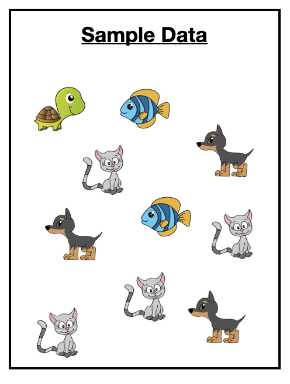
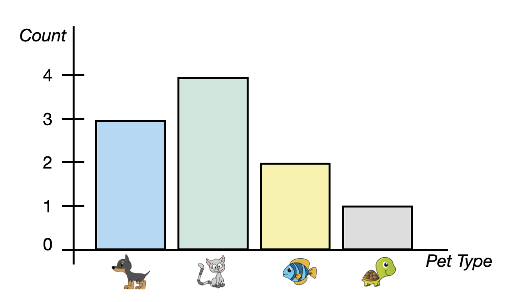
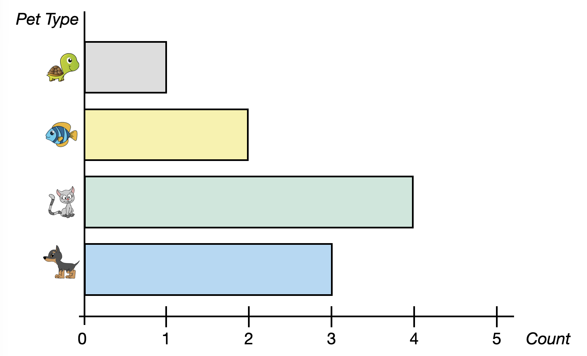
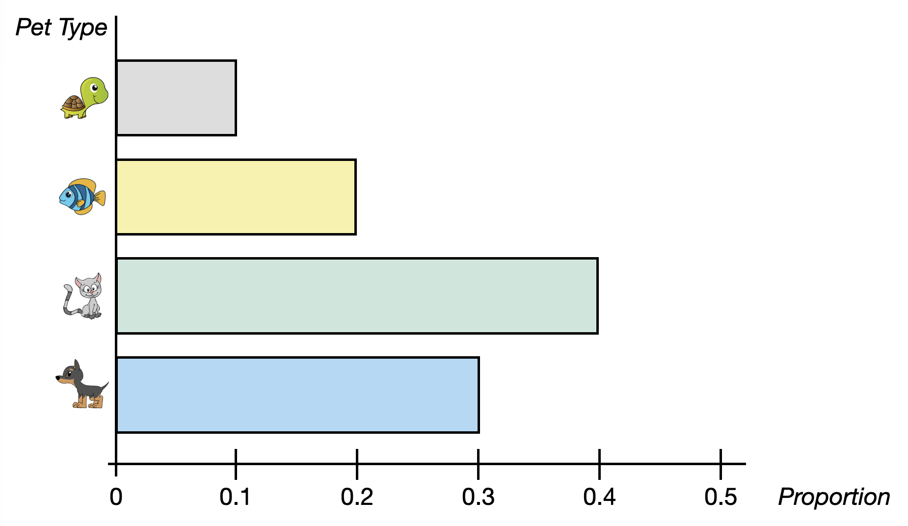
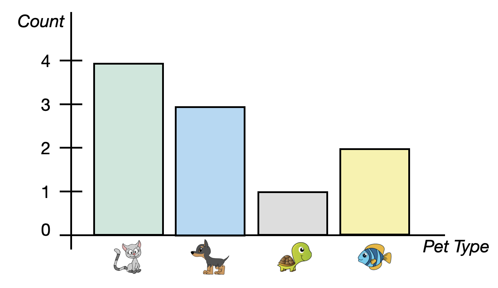
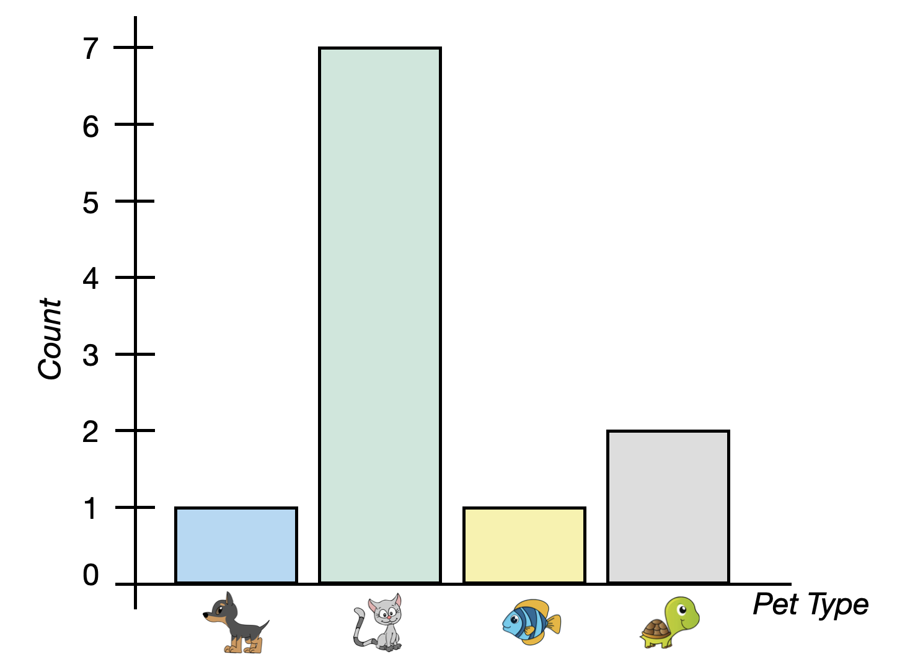
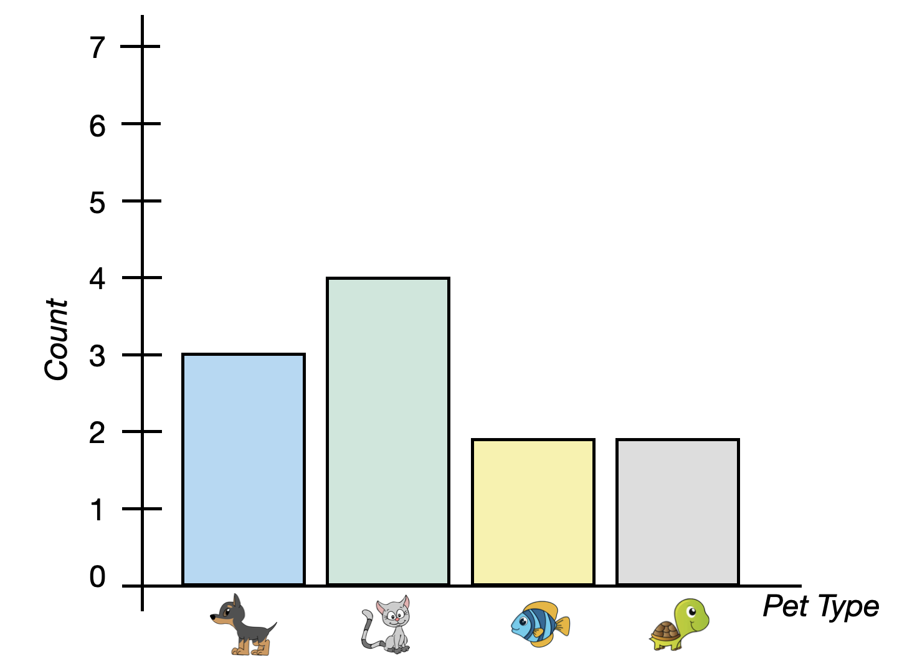
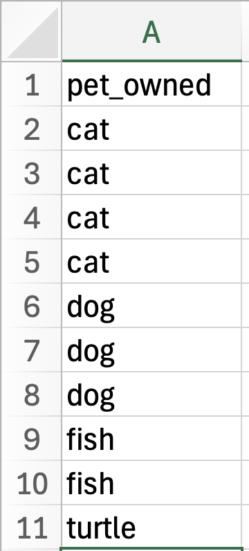
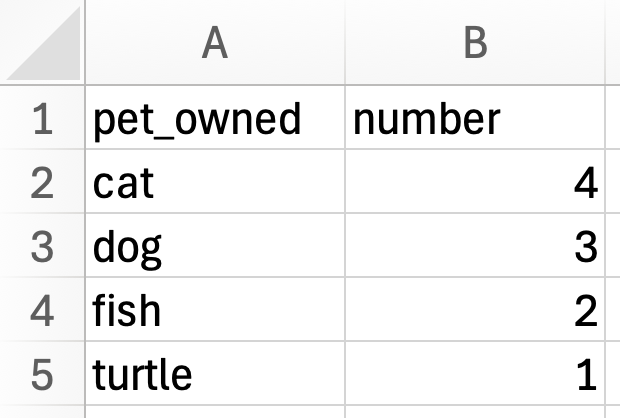

# Visualizing and Describing Categorical Attributes  {#sec-categorical-attributes}

This chapter will focus on the visualization and description of categorical attributes.

<br />


## Hypothetical Example: Pet Ownership

Imagine you have surveyed 10 pet owners about the type of pet they own.^[To keep it simple, assume each pet owner only has a single pet.] The data you collected is shown in @fig-pets.

```{r}
#| label: fig-pets
#| fig-cap: "Data collected from 10 pet owners about the type of pet the own."
#| fig-alt: "Data collected from 10 pet owners about the type of pet the own."
#| echo: false


```

Our goal in exploratory analysis is to describe the data. One way of describing the data is to list all of the values. For example here we could say the sample included a turtle, a fish, a cat, a dog, another dog, another fish, another cat, another cat, another cat, and another dog. While this is an accurate description, it isn't very generalizable. (Imagine trying to describe the data from 1000 pet owners or 10,000 pet owners!)

<br />


## Describing Categorical Attributes

A more natural way to describe these data is to summarize them by providing **counts** of each pet type. For example, describing our sample data using counts:

- 1 of the pet owners sampled owned a turtle, 
- 2 of the pet pet owners sampled owned a fish, 
- 3 of the pet pet owners sampled owned a dog, and 
- 4 of the pet pet owners sampled owned a cat.

Summarizing each type of pet owned by reporting counts of them is a much more natural way of describing the data. (This is  also useful when the sample size is much larger.) We also use this summary to viualize the data.

<br />


## Visualizing Categorical Attributes

To visualize categorical attributes we typically use a **bar chart**. A bar chart (also known as a bar graph or a bar plot) shows a bar for each category of the categorical attribute. The height of the bar indicates the count (or proportion or percentage) of each category. @fig-pet-barchart shows a bar chart of the pet data.

```{r}
#| label: fig-pet-barchart
#| fig-cap: Bar chart indicating the counts of each type of pet owned.
#| fig-alt: Bar chart indicating the counts of each type of pet owned.
#| echo: false


```


The bar chart in @fig-pet-barchart, includes four bars, one for each pet type. This bar chart is summarizing counts which is depicted on the *y*-axis. Each bar indicates the count of pet owners who own that type of pet. For example, the bar for cats has a height of four on the *y*-axis since four pet owners own a cat. 

Sometimes the axes in the bar chart are transposed; categories are placed on the *y*-axis and counts on the *x* axis. This is referred to as a *horizontal bar chart*. @fig-pet-barchart2 shows a horizontal bar chart indicating the number (count) of each pet type.

```{r}
#| label: fig-pet-barchart2
#| fig-cap: Horizontal bar chart indicating the counts of each type of pet owned. In this plot the categories are placed on the *y*-axis and the scale on the the *x* axis indicates the number of pet owners for each pet type.
#| fig-alt: Horizontal bar chart indicating the counts of each type of pet owned. In this plot the categories are placed on the *y*-axis and the scale on the the *x* axis indicates the number of pet owners for each pet type.
#| echo: false


```


<br />


## Two Alternative Methods to Summarize Categorical Attributes

Two other ways in which we summarize and visualize categorical attributes are to use proportions or percentages rather than counts.

<br />


### Proportions

To compute the **proportion** of each pet type owned, we take the count of each type of pet owned, and divide it by the total sample size.

$$
\mathrm{Proportion} = \frac{\mathrm{Count~of~Pet~Type}}{\mathrm{Total~Sample~Size}}
$$


For example, to compute the proportion of pet owners in our sample that owned a dog, we use:

$$
\mathrm{Proportion~of~Dogs} = \frac{3}{10} = 0.30
$$

:::fyi
**FYI**

Proportions will always be between 0 and 1. If you add all of the proportions of each category  together you will get 1, so long as values can only belong to one category.
:::

Describing our sample data using proportions:

- 0.10 of the pet owners sampled owned a turtle, 
- 0.20 of the pet pet owners sampled owned a fish, 
- 0.30 of the pet pet owners sampled owned a dog, and 
- 0.40 of the pet pet owners sampled owned a cat.

@tbl-pets indicates the counts and proportions of values in our hypothetical pet example.

```{r}
#| label: tbl-pets
#| tbl-cap: "Counts and proportions of pet owners who own each type of pet."
#| echo: false
#| tbl-colwidths: false

library(gt)
library(gtExtras)
dplyr::tibble(
  Pet = c("figs/dog.png", "figs/cat.png", "figs/fish.png", "figs/turtle.png"),
    #162, 155, 127, 144
  Count = c(3, 4, 2, 1),
  Proportion = c(.3, .4, .2, .1)
) |>
  gt() |>
  gt_img_rows(columns = Pet, height = 50) |>
  fmt_number(
    columns = Proportion,
    decimals = 2
  ) |>
  cols_align(
    align = "center",
    columns = c(Count, Proportion)
  ) |>
  tab_options(
    table.width = pct(60)
    ) |>
  as_raw_html()
```


We can also create a bar chart that visualizes the proportions rather than the counts. Similar to the bar charts of counts a bar chart of the proportions can be vertical or horizontal. @fig-pet-barchart3 shows a horizontal bar chart of the proportion of each pet type owned.

```{r}
#| label: fig-pet-barchart3
#| fig-cap: Horizontal bar chart indicating the proportion of each type of pet owned.
#| fig-alt: Horizontal bar chart indicating the proportion of each type of pet owned.
#| echo: false


```


<br />


### Percentages

We know from research on people's reasoning that proportions are difficult for people to reason about. Because of this, we often summarize categorical attributes using **percentages** rather than proportions. To compute the percentage of each pet type owned, we take the count of each type of pet owned, and divide it by the total sample size and then multiply this by 100.

$$
\mathrm{Percentage} = \frac{\mathrm{Count~of~Pet~Type}}{\mathrm{Total~Sample~Size}} \times 100
$$


For example, to compute the percentage of pet owners in our sample that owned a dog, we use:

$$
\mathrm{Percentage~of~Dogs} = \frac{3}{10} \times 100 = 30\%
$$

```{r}
#| label: tbl-pets-percent
#| tbl-cap: "Counts, proportions and percentages of pet owners who own each type of pet."
#| echo: false
#| tbl-colwidths: false

dplyr::tibble(
  Pet = c("figs/dog.png", "figs/cat.png", "figs/fish.png", "figs/turtle.png"),
    #162, 155, 127, 144
  Count = c(3, 4, 2, 1),
  Proportion = c(.3, .4, .2, .1),
  Percentage = c(30, 40, 20, 10)
) |>
  gt() |>
  gt_img_rows(columns = Pet, height = 50) |>
  fmt_number(
    columns = Proportion,
    decimals = 2
  ) |>
  fmt_percent(
    columns = Percentage,
    decimals = 0
  ) |>
  cols_align(
    align = "center",
    columns = c(Count, Proportion, Percentage)
  ) |>
  tab_options(
    table.width = pct(60)
    ) |>
  as_raw_html()
```


:::fyi
**FYI**

Percentages will always be between 0 and 100. If you add all of the percentages of each category you will get 100, so long as values can only belong to one category.
:::


We can also create a bar chart using percentages. @fig-pet-barchart4 shows a horizontal bar chart of the percentage of each pet type owned.

```{r}
#| label: fig-pet-barchart4
#| fig-cap: Horizontal bar chart indicating the percentage of each type of pet owned.
#| fig-alt: Horizontal bar chart indicating the percentage of each type of pet owned.
#| echo: false


```

<br />


### Counts, Proportions, or Percentages: Deciding How to Summarize the Data

How you summarize a categorical attribute---using counts, proportions, or percentages---is up to you. Each has advantages and pitfalls. Using proportions or percentages are useful since they provide a standard scale for measuring size. This can be especially useful if you are comparing two different groups that have different sizes. However, counts are often better for communication or when dealing with very small samples where a percentage might misrepresent the scale of the data. This is a choice that you need to make based on what makes the most sense given the context of the data and the question you are trying to answer with your data.


Looking at the bar chart for each summarization, the overall distribution looks the same. The bars are the same relative lengths regardless of whether you use counts, proportions of percentages. This implies that our description of the distribution will essentially be the same regardless of the summary measure we choose.


<br />


## Describing the Distribution

With quantitative attributes we described the distribution using shape, center (typical value), and variation. With categorical variables we are more restricted in how we can describe the distribution. To begin with, we cannot describe the shape of a categorical attribute. This is because the order of bars is arbitrary. To illustrate consider the initial bar chart of pets we considered and the variation of this below.


```{r}
#| label: fig-two-bar-plots
#| fig-cap: "Two bar charts of the number of pets."
#| fig-alt: "Two bar charts of the number of pets."
#| fig-subcap:
#|   - "Original bar chart of the number of pets."
#|   - "Another possible bar chart of the number of pets."
#| out-width: "100%"
#| layout-ncol: 2
#| echo: false
#| lightbox:
#|   group: histograms
#|   description:
#|     - Original bar chart of the number of pets.
#|     - Another possible bar chart of the number of pets.



```

Because the attribute being plotted on the *x*-axis is categorical, the order we put it in is irrelevant. Cats could be the first bar. dogs could be the first bar. Or fish or turtles. (This is quite different from a histogram of a quantitative attribute in which the values being plotted (numbers) have a distinct order.) Depending on which order we put the pets in the plot, the shape would change. That is why we cannot describe the shape of a categorical attribute.

Despite not being able to describe the shape, we can describe the center of a distribution of a categorical attribute. The typical value (center) that we describe with a categorical attribute is the mode. In our pet example cats are the pet that is owned most often. 

The way we described variation for a quantitative attribute---describing the overall range and the range for most cases---does not work as well for categorical attributes. Instead, we need to think about how similar or dissimilar the counts/proportions for the different categories compare. For example, consider the following two plots of pet ownership.

```{r}
#| label: fig-variation-bar-plots
#| fig-cap: "Two bar charts of the number of pets owned for 11 pet owners."
#| fig-alt: "Two bar charts of the number of pets owned for 11 pet owners."
#| fig-subcap:
#|   - "This bar chart shows low variability in the number of pets owned."
#|   - "This bar chart shows high variability in the number of pets owned."
#| out-width: "100%"
#| layout-ncol: 2
#| echo: false
#| lightbox:
#|   group: histograms
#|   description:
#|     - Original bar chart of the number of pets.
#|     - Another possible bar chart of the number of pets.




```

In both plots, there are 11 total pet owners and cats are the typical (modal) pet owned. The best way to think about variation in a categorical attribute is to think of it like "diversity". In our example, we would ask "how diverse are the types of pets that people own?"

The left bar chart shows a distribution that has a **low** amount of variability. That is, there is not a lot of diversity in the types of pets these 11 people own---almost all of the pets owned are cats. When you see a bar chart with one very tall bar and the rest are relatively short, that indicates a lack of diversity across the categories and low variability. In contrast, the bars in the bar chart on the right are all of similar heights. This plot indicates there is a lot of diversity in the types of pets these people own. Some own cats, some own dogs, some fish, and others turtles. We would say that there is a **high** amount of variability in this distribution. 

<br />


## Using R to Create a Bar Chart of Counts

To illustrate how we use R to create a bar chart, we are going to explore a data set (*umn-buildings.csv*) that includes data on all the buildings owned by the University of Minnesota. As a reminder, in the first code chunk of your QMD document, load the `{tidyverse}` library. Also use the `read_csv()` function to import the *umn-buildings.csv* data and assign the data into an object called `umn`. You also might want to view the data to ensure that it imported into the QMD correctly. (Don't forget to add code comments as well!)


```{r}
#| label: load-packages2
#| message: false

# Load libraries
library(ggformula)
library(tidyverse)

# Import data
umn <- read_csv("data/umn-buildings.csv")

# View data
umn
```

These data include information on 393 different buildings owned by the University of Minnesota. While there are several attributes included in the data for these buildings, we are most interested in the `type` attribute. This attribute includes information about the primary use of the building as classified by the university (e.g., parking, residential).


To create a bar chart of the number (count) of each of the building types, first create a new code chunk in your QMD document where you want the bar chart to appear. Bar charts use the `geom_bar()` function from the `{tidyverse}` library. Similar to the other plots we have created we need to start with a global `ggplot()` layer that indicates the data object using `data=` and maps the attribute we want to plot to the `x=` argument. The mappping will be placed inside an `aes()` function since the mapping uses a column name from the data set. The syntax in our code chunk will be:

```{r}
#| label: fig-buildings
#| fig-cap: "Bar chart of the number of each building type owned by UMN."
#| fig-alt: "Bar chart of the number of each building type owned by UMN."

ggplot(data = umn, aes(x = type)) +
  geom_bar()
```


We can also add border and fill color to our bar chart similar to how we did for histograms/density plots. For example, to add a black border and a maroon fill to the bars in our plot, we can use the following syntax.

```{r}
#| label: fig-buildings2
#| fig-cap: "Bar chart of the number of each building type owned by UMN. This plot includes a border and fill color."
#| fig-alt: "Bar chart of the number of each building type owned by UMN. This plot includes a border and fill color."

ggplot(data = umn, aes(x = type)) +
  geom_bar(color = "black", fill = "maroon")
```


One issue in our plot is that some of the data labels overlap each other. This makes the labels difficult to read (and some of them might be impossible to read). There are a few ways we can fix this:

- First, we could try to make the figure wider. By making it wide enough, we could get the labels so that they do not overlap. However, by stretching the figure to be wider, we change the aspect ratio of the figure, which may distort other things.
- Second, we could go back and change the labels in the original CSV file to make them shorter. For example we could change the label of "Performance / Exhibition / Conference" to "Perf/Exb/Conf". Sometimes this is a reasonable thing to do, but other times changing the label is not appropriate. (Would you know the "Perf/Exb/Conf" meant that the building type is designated as performance, exhibition, or conference space without additional text?)
- The third option is to flip plot so that the bars are horizontal rather than vertical. This would mean that the data labels would each be on a separate line of text and therefore would not overlap.


<br />


## Using R to Create a Horizontal Bar Chart

To create a horizontal bar chart, instead of using the aesthetic mapping of `x=` (which maps the attribute to the *x*-axis), we use `y=`. The syntax to create a horizontal bar chart of the building type data is shown below.


```{r}
#| label: fig-buildings3
#| fig-cap: "Horizontal bar chart of the number of each building type owned by UMN. This plot includes a border and fill color."
#| fig-alt: "Horizontal Bar chart of the number of each building type owned by UMN. This plot includes a border and fill color."

ggplot(data = umn, aes(y = type)) +
  geom_bar(color = "black", fill = "maroon")
```

Notice that by putting the data labels on the *y*-axis, we avoid having the labels overlapping each other! This makes our plot easier for others to understand by removing the cognitive load associated with overlapping labels.

<br />


## Using R to Create a Bar Chart of Proportions

Notice that in the bar charts we have created, there are two axes---one includes the categories of the attribute that we mapped in the `aes()` function, and the other indicates the count. For example in our horizontal bar charts, the categories of building type  are being mapped to the *y*-axis (we coded this with `y=type`) and the *x*-axis indicates the count of each type of building. It turns out that when we use `geom_bar()`, there is some implicit code in the `aes()` and `geom_bar()` functions that maps the counts to the opposite axis. For example, in our horizontal bar charts it is this:

```{r}
#| eval: false

ggplot(data = umn, aes(y = type, x = after_stat(count) )) +
  geom_bar(stat = "count")
```

The `stat="count` argument in `geom_bar()` is actually being used to compute a summary from the raw data, in this case counts. The `after_stat()` function  then uses those counts in the bar chart to map the counts to the *x*-axis. To summarize the proportion of each category (rather than counts) we can make use of this mapping in our bar chart and change what summary is being computed. For example, to compute proportions, we divide the count of each category by the sum of counts across all categories. Thus, the syntax to create a horizontal bar chart summarizing the proportion of each building type is shown below.


```{r}
#| label: fig-buildings-prop
#| fig-cap: "Horizontal bar chart of the proportion of each building type owned by UMN. This plot includes a border and fill color."
#| fig-alt: "Horizontal bar chart of the proportion of each building type owned by UMN. This plot includes a border and fill color."

ggplot(data = umn, aes(y = type, x = after_stat(count / sum(count)) )) +
  geom_bar(color = "black", fill = "maroon")
```

<br />

Note we don't have to include `stat="count` in the `geom_bar()` function as this is the default action---unless told otherwise it will create counts.


## Using R to Create a Bar Chart of Percentages

We can use a similar method for computing percentages rather than proportions. To create a horizontal bar chart summarizing the percentage of each building type, we use the `gf_percents()` function.

```{r}
#| label: fig-buildings-perc
#| fig-cap: "Horizontal bar chart of the percentage of each building type owned by UMN. This plot includes a border and fill color."
#| fig-alt: "Horizontal bar chart of the percentage of each building type owned by UMN. This plot includes a border and fill color."

ggplot(data = umn, aes(y = type, x = after_stat(count / sum(count) * 100) )) +
  geom_bar(color = "black", fill = "maroon")
```

<br />


## Using R to Create a Bar Chart with Summaries of Data

Sometimes you are provided with summaries of data rather than the actual data itself. For example in our pet ownership example the data would look like this:


```{r}
#| label: fig-data-types
#| fig-cap: "The raw data and summary data for the number of pets owned for 11 pet owners."
#| fig-alt: "The raw data and summary data for the number of pets owned for 11 pet owners."
#| fig-subcap:
#|   - "The raw data."
#|   - "The summary data."
#| out-width: "100%"
#| layout-ncol: 2
#| echo: false
#| lightbox:
#|   group: histograms
#|   description:
#|     - The raw data.
#|     - The summary data.



```


Notice that in the raw data, a case is an individual person and the `pet_owned` attribute indicates the pet that is owned by each of the 10 people in the data. The summary data summarizes the raw data by indicating how many people own each type of pet. In the summary data a case is the type of pet that is owned. This is also designated in the `pet_owned` attribute. The summary data also indicates the number of people that own each type of pet in the `number` attribute. A bar chart is essentially a plot of the summarized data---each bar indicates the type of pet owned, and the height of the bar indicates the count or number of people who own that type of pet.

So far, we have used raw data to create our bar charts, but is we have summary data instead of raw data we can also create a bar chart using R. To illustrate this, create a new code chunk in your QMD document and import the *pet-count.csv* data into an object called `pets` using the following code:


```{r}
#| label: import-pet-data
#| message: false

# Import data
pets <- read_csv("data/pet-counts.csv")

# View data
pets
```

To create a bar chart of these data we are going to again use the `geom_bar()` function to plot the categorical attribute (`pets_owned`) from the summary data object.


```{r}
#| label: fig-summary-bar1
#| fig-cap: "Bar chart of the `pets_owned` attribute from the summary data."
#| fig-alt: "Bar chart of the `pets_owned` attribute from the summary data."

ggplot(data = pets, aes(x = pet_owned)) +
  geom_bar()
```


This creates a bar chart of the pets owned attribute. In this data there is literally one word that says "cat", one that says "dog", one that says "fish", and one that says "turtle". So the resulting bar chart creates a bar for each of these and all of them have a count (bar height) of 1. 

:::fyi
**IMPORTANT**

The functions for creating plots in R always assume you have raw data and will plot accordingly!
:::

To inform R that we have summary data, we need to include some additional arguments to the two layers. 

- The first thing we need to do is also include a `y=` argument in the global layer. (If we were creating a horizontal bar chart we would create a `x=` argument.) This argument will name another attribute in the data that R will query to know how high to draw the bars. In our data, the `number` attribute indicates how high the bars should be drawn so the argument we include will be: `y = number`. Remember, any time we are using an attribute name in a mapping, that needs to be placed inside the `aes()` function!
- The second argument we need to include in the `geom_bar()` function is `stat = "identity"`. Because the `gf_count()` function (and others like `gf_percent()`) assume that we have raw data, the function will try to summarize the data (count it) in order to know the bar height. The argument `stat = "identity"` tells the function to not summarize, but instead use the information in the `y=` argument to know how high the bars should be. 

To create the bar chart of the summarized data, we can use the following code:


```{r}
#| label: fig-summary-bar2
#| fig-cap: "Bar chart of the `pets_owned` attribute from the summary data. The counts from the `number` column are being used to indicate the bar height."
#| fig-alt: "Bar chart of the `pets_owned` attribute from the summary data. The counts from the `number` column are being used to indicate the bar height."

ggplot(data = pets, aes(x = pet_owned, y = number)) +
  geom_bar(stat = "identity")
```

As with other bar charts, we can also add border color, bar fill, and make it a horizontal bar chart. (Note that in this case the count will be on the *x*-axis instead of the *y*-axis, so we need to assign the `number` attribute to `x=` rather than `y=`.)


```{r}
#| label: fig-summary-bar3
#| fig-cap: "Horizontal bar chart of the `pets_owned` attribute from the summary data. The counts from the `number` column are being used to indicate the bar length."
#| fig-alt: "Horizontal bar chart of the `pets_owned` attribute from the summary data. The counts from the `number` column are being used to indicate the bar length."

ggplot(data = pets, aes(y = pet_owned, x = number)) +
  geom_bar(stat = "identity", color = "black", fill = "maroon")
```

<br />


## Pro Tip: Breaking Up Long Code

One pro coding tip is to pay attention to how long the lines of code are that you are writing. We know from research that humans are worse at cognitively parsing longer lines of code than they are at parsing shorter lines of code. The code in many of the previous examples is starting to get long---it includes a lot of arguments. When you use functions that contain a lot of arguments, consider breaking this code up into multiple lines. For example, the same code as above could be broken up in the following way:


```{r}
#| eval: false

ggplot(
  data = pets, 
  aes(
    y = pet_owned, 
    x = number
    )
  ) +
  geom_bar(
    stat = "identity", 
    color = "black", 
    fill = "maroon"
    )
```


This helps us see which parentheses go together to ensure we haven't forgotten any! It is also way easier to read and debug. 


## Exercises: Your Turn {-}

Consider the following data from the *umn-bike-amenities.csv* file. 

```{r}
#| label: import-bike-amenities-data
#| message: false

# Import data
bike_amenities <- read_csv("data/umn-bike-amenities.csv")

# View data
DT::datatable(bike_amenities)
```

Imagine that this has been imported into a data object called `bike_amenities`. Also suppose we wanted to create a bar chart of the `campus` attribute, which provides the campus location (East Bank, West Bank, or St. Paul) of the bike amenities in the data.


1. This is raw data, not summary data. Explain why.

<button class="solution-btn solution-btn-default" onclick="toggle_visibility('exercise_03-02-01');">Show/Hide Solution</button>

<div id="exercise_03-02-01" style="display:none; margin: -40px 0 40px 40px;">
This is raw data. The attribute `campus` includes data for each of the cases and it is does not include a summarizarion (e.g., counts, percents) in the data itself.
</div>


2. Write out the syntax to create a bar chart of the counts for the `campus` attribute.

<button class="solution-btn solution-btn-default" onclick="toggle_visibility('exercise_03-02-02');">Show/Hide Solution</button>

<div id="exercise_03-02-02" style="display:none; margin: -40px 0 40px 40px;">
```{r}
#| eval: false

ggplot(data = bike_amenities, aes(x = campus)) +
  geom_bar()
```
</div>


3. Describe the distribution of the bar chart you created in Exercise #2.

<button class="solution-btn solution-btn-default" onclick="toggle_visibility('exercise_03-02-03');">Show/Hide Solution</button>

<div id="exercise_03-02-03" style="display:none; margin: -40px 0 40px 40px;">
The bar heights imply that there is a low amount of variability (diversity) in the bike amenity locations. The East Bank has the most bike amenities of the three campus locations. Both the West Bank and St. Paul campus have a similar number of bike amenities, but way fewer amenities than the East Bank.
</div>


4. Write out the syntax to create a horizontal bar chart of the percentages for the `campus` attribute. Also color the bar borders black and fill the bars with yellow. 

<button class="solution-btn solution-btn-default" onclick="toggle_visibility('exercise_03-02-04');">Show/Hide Solution</button>

<div id="exercise_03-02-04" style="display:none; margin: -40px 0 40px 40px;">
```{r}
ggplot(
  data = bike_amenities, 
  aes(
    y = campus, 
    x = after_stat(count / sum(count) * 100)
    )
  ) +
  geom_bar(
    color = "black", 
    fill = "yellow"
    )
```
</div>


<br />