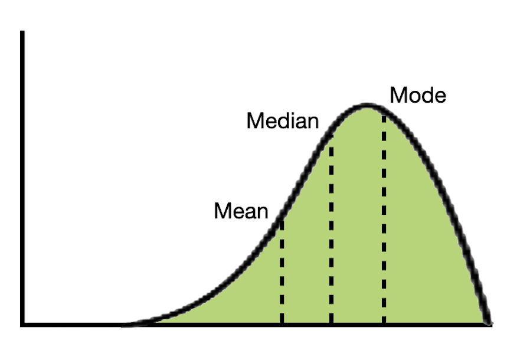
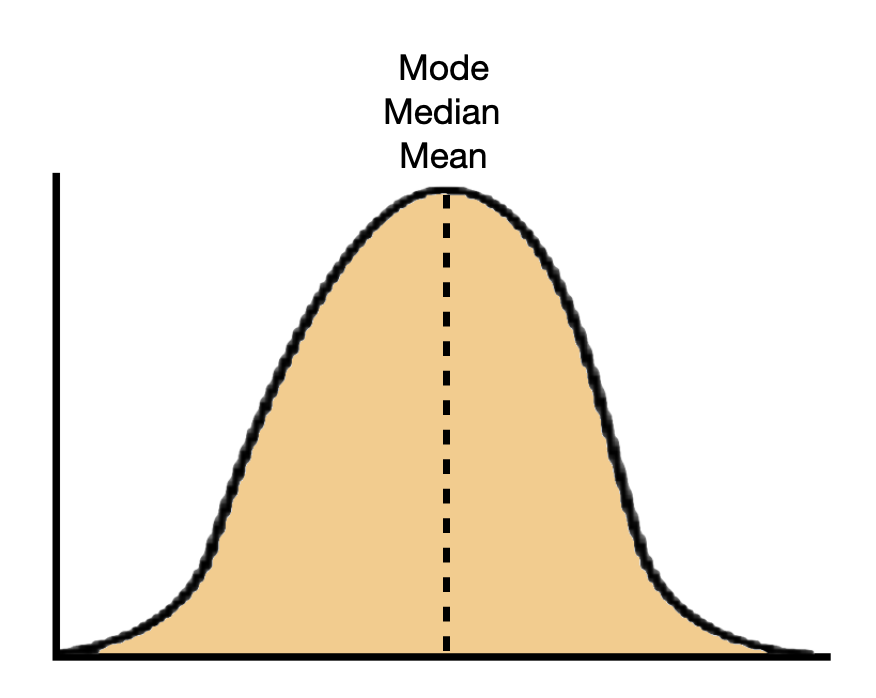
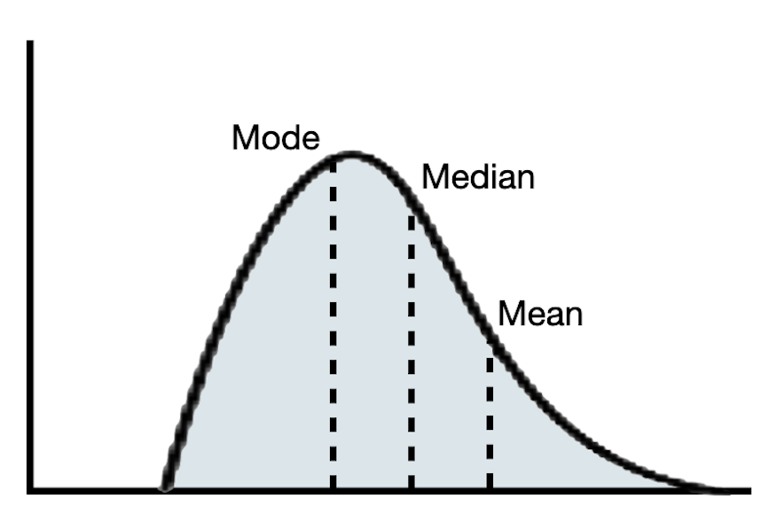

# Computing and Plotting Typical Values {#sec-typical-values}

This chapter will focus on how we can use R to compute statistical values of typical, the mean and median. You will also learn how to include those on your plot. To illustrate this, we will use the **mn-colleges.csv** data. This data includes admissions related data for the 33 institutions of higher learning in Minnesota. 

```{r}
#| label: load-packages
#| message: false
#| echo: false

# Load libraries
library(tidyverse)


# Import data
mn <- read_csv("data/mn-colleges.csv")

# View data
DT::datatable(mn)
```


The plot of the acceptance rates is provided below.


```{r}
#| fig-alt: "Histogram of acceptance rates for the 33 institutions of higher learning in Minnesota."
#| fig-width: 10
#| fig-height: 6
################################
# Histogram of acceptance rates
################################

ggplot(data = mn, aes(x = accept_rate)) +
  geom_histogram(color = "black", fill = "yellow", binwidth = 5) +
  labs(
    x = "Acceptance rate",
    y = "Count",
    title = "ACCEPTANCE RATES FOR THE 33 INSTITUTIONS OF HIGHER LEARNING IN MINNESOTA",
    subtitle = "\nMost institutions admit a high proportion of applicants. A typical institution in the distribution admits around 65% of its applicants (±10%).\nThere are, however, a few institutions that are quite selective, admitting fewer than 30% of the students who apply. Similarly there are\nsome institutions that accept almost all of their applicants.",
    caption = "Source: College Scorecard"
  )
```


<br />


## Numerical Summaries of Typical

In the previous examples, we estimated the typical value (center) from a visualization of the distribution. If the distribution is unimodal, we can also obtain more precise values for these characteristics by computing different numerical summaries.^[If the distribution is multi-modal many of these summaries cannot be computed, and even if they can be computed they are meaningless as summaries of a typical value.]

:::fyi
**LEARN MORE**

In this class we will focus on the computation of these values using R and their interpretations rather than on the mathematical manipulation and formulas. Here are some links to learn more about the underlying calculations of the measures that we will focus on in this class if you are interested: [mean, median, and mode](https://statisticsbyjim.com/basics/measures-central-tendency-mean-median-mode/).
:::


In describing the center of the distribution, we estimated the typical value based on the value for the "modal hump" in the density plot. There are two numerical values that are often computed to summarize the center of the distribution: the **mean** and the **median**. 

In a perfectly symmetric distributions, the mean and median are the same value. In practice, they are rarely exactly the same. If the distribution is roughly symmetric, these values should be similar. In skewed distributions, the mean and median will be different. In these distributions, the mean will be further in the tail of the distribution than the median. 

```{r}
#| label: fig-mean-median-mode
#| layout-ncol: 3
#| fig-cap: "Mean, median, and modal values in a left-skewed, symmetric, and right-skewed distribution."
#| fig-subcap:
#|   - "Left-Skewed Distribution"
#|   - "Symmetric Distribution"
#|   - "Right-Skewed Distribution"
#| fig-alt: "Mean, median, and modal values in a left-skewed, symmetric, and right-skewed distribution."
#| echo: false




```

In a symmetric distribution, any of the three center values (mean, median, or mode) are a good summarization of a typical value since they are all roughly the same. In skewed distributions, because the mean is further in the tail, it is often not a good reflection of a typical value in the distribution. Instead, the median or mode is often a better summary in these distributions.

<br />


### Computing Numerical Summaries in R

To compute numerical summary values, including the mean and median, we will use the `mean()` and `median()` functions. The inputs to the `mean()` and `median()` functions looks like this:

```
data_name$attribute_name
```

In R speak, this uses the column identified after the dollar sign from the data object identified before the dollar sign. Then the function, `mean()` or `median()`, computes the appropriate summary on the data in that column. To compute the mean and median acceptance rate we can use the following syntax:


```{r}
################################
# Compute the mean
################################

mean(mn$accept_rate)


################################
# Compute the median
################################

median(mn$accept_rate)
```

The mean, or average, of the 33 institutions' acceptance rates is 68.7% and the median admission rate for these institutions is 68.4%. The slightly higher mean value is consistent with how the mean and median compare in a slightly right-skewed distribution. 


:::fyi
**FYI**

There is no R function to compute the mode. If you want to report the mode, you need to estimate it from the visualization.
:::

<br />


## Plotting Vertical Reference Lines

Sometimes it is useful to add a vertical line on your histogram to indicate a particular value. For example, economists often add a line at the poverty level when they are plotting incomes. Similarly, data scientists might add lines to indicate the middle 95% of the distribution to indicate which observations are at the extremes. These lines act as a reference that help you better interpret the information being plotted.

We will illustrate how to include a vertical reference line by placing lines at the mean and median values in our histogram of acceptance rates. To add a vertical reference line we will use add a `geom_vline()` layer to our existing plot for each line that we want to add. To indicate the value that this line will go through, we use the argument `xintercept=`. For example, to add a vertical reference line at the mean acceptance rate we can use the following syntax:


```{r}
#| label: fig-mean
#| fig-cap: "Histogram of acceptance rates for the 33 institutions of higher learning in Minnesota. A vertical reference line has been added at the mean acceptance rate."
#| fig-alt: "Histogram of acceptance rates for the 33 institutions of higher learning in Minnesota. A vertical reference line has been added at the mean acceptance rate."
#| fig-width: 10
#| fig-height: 6
#####################################
# Histogram of acceptance rates
# Vertical reference line at the mean
#####################################

ggplot(data = mn, aes(x = accept_rate)) +
  geom_histogram(color = "black", fill = "yellow", binwidth = 5) +
  geom_vline(xintercept = 68.67273)
```


We can add as many vertical reference lines as we want; we just need to add more `geom_vline()` layers. For example, to add a vertical reference line at both the mean and the median we would use:

```{r}
#| label: fig-mean-median
#| fig-cap: "Histogram of acceptance rates for the 33 institutions of higher learning in Minnesota. A vertical reference line has been added at both the mean and median acceptance rate."
#| fig-alt: "Histogram of acceptance rates for the 33 institutions of higher learning in Minnesota. A vertical reference line has been added at both the mean and median acceptance rate."
#| fig-width: 10
#| fig-height: 6
#####################################
# Histogram of acceptance rates
# Vertical reference lines at the mean and median
#####################################

ggplot(data = mn, aes(x = accept_rate)) +
  geom_histogram(color = "black", fill = "yellow", binwidth = 5) +
  geom_vline(xintercept = 68.67273) +
  geom_vline(xintercept = 68.4)
```

<br />


### Modifying and Differentiating Lines

Note that it is important to convey to readers of your plot what the reference line is indicating. This could be added to you title or subtitle. (Later in the course you will learn how to make text annotations directly on the plot.) If you add more than one reference line to your plot it is also important to be able to differentiate between the lines. For example, how does a reader know which line is for the mean and which is for the median?

There are two primary ways that data scientists modify reference lines to differentiate between them. The first is linetype and the second is color. You already know how to change the color of a geometric object---the color of a line can be changed by adding the argument `color=` in the `geom_vline()` layer. There is also a `linetype=` argument that we can include that changes the default linetype. The different linetypes are:

- `linetype = "solid"` (default)
- `linetype = "dotted"`
- `linetype = "dashed"`
- `linetype = "dotdash"`
- `linetype = "longdash"`
- `linetype = "twodash"`

Below, we modify each of the vertical reference lines to have a unique color and linetype. We also increase the width of each line (to make them easier to see) by using the `linewidth=` argument. (The default line width is `linewidth=1`. Use trial-and-error to find an aesthetically pleasing width.) We also include the `labs()` layer to indicate this differentiation in the subtitle. 


```{r}
#| fig-alt: "Histogram of acceptance rates for the 33 institutions of higher learning in Minnesota. A vertical reference line has been added at both the mean and median acceptance rate."
#| fig-width: 10
#| fig-height: 6
#####################################
# Histogram of acceptance rates
# Vertical reference lines have different colors and linetypes; also wider
#####################################
ggplot(data = mn, aes(x = accept_rate)) +
  geom_histogram(color = "black", fill = "yellow", binwidth = 5) +
  geom_vline(xintercept = 68.67273, color = "darkblue", linetype = "solid", linewidth = 1.2) +
  geom_vline(xintercept = 68.4, color = "maroon", linetype = "longdash", linewidth = 1.2) +
  labs(
    x = "Acceptance rate",
    y = "Count",
    title = "ACCEPTANCE RATES FOR THE 33 INSTITUTIONS OF HIGHER LEARNING IN MINNESOTA",
    subtitle = "Vertical reference lines indicate the mean acceptance rate of 68.7 (solid, blue) and median acceptance rate of 68.4 (dashed, maroon). Most\ninstitutions admit a high proportion of applicants. There are, however, a few institutions that are quite selective, admitting fewer than 30% of\nthe students who apply.",
    caption = "Source: College Scorecard"
  )
```

<br />


