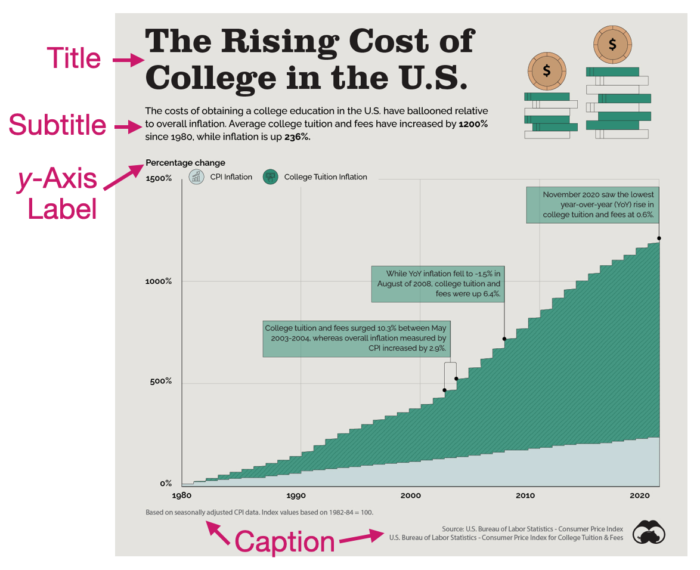
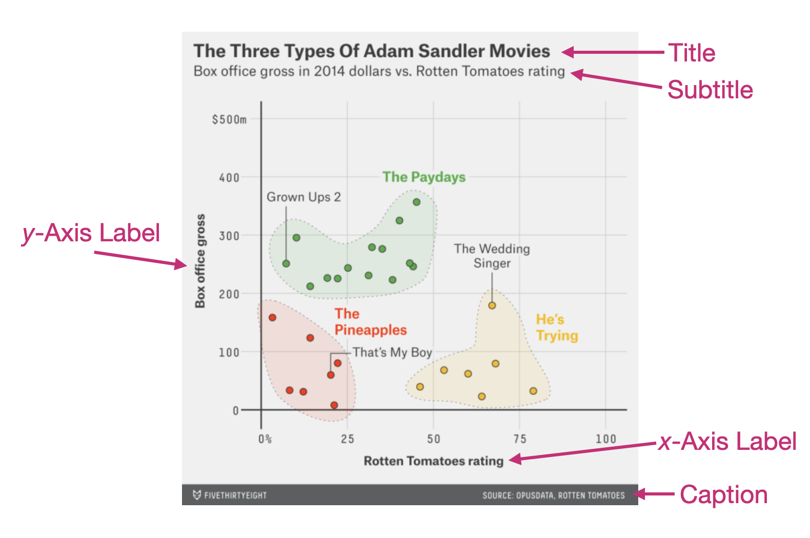

# Labels: Improving Interpretation  {#sec-labels}

This chapter will focus on how we can add labels to a plot. Labels include not only the information attached to a plot's axes, but also a title, subtitle, and footnote to a plot. Labels help us convey information about the datas' context to people who are engaging with our plot. They also act as a tool to help those readers make more accurate interpretations about the information being presented in the visualization.

@fig-college-cost shows a visualization that examines the cost of college tuition from 1980 to 2020 and compares that increase to the amount of inflation during that same time period. This visualization has included several different labels to help readers make sense of the visualized data.

```{r}
#| label: fig-college-cost
#| fig-caption: "An example data visualization from [Visual Capitalist](https://www.visualcapitalist.com/datastream/)."
#| fig-alt: "An example data visualization from Visual Capitalist. URL: https://www.visualcapitalist.com/datastream/"
#| out-width: "90%"
#| echo: false


```

<br />


## Titles and Subtitles

The title of a visualization serves the very important purpose of telling the reader what the visualization is about. It acts as an informative headline and provides a concise description that explains the data that are being visualized. Since it is the first text that readers see, it sets the stage for the whole visualization. In @fig-college-cost the title "The rising cost of college in the U.S." concisely explains the gist of the visualization.  

The subtitle provides additional details about the data visualization. It often highlights overall or specific findings that you want your audience to attend to. In @fig-college-cost the subtitle highlights the main finding that the percentage increase in attending college is higher than the percentage increase in inflation. It also provides the amount of increase for both college cost and inflation to further make this point.

As a second example, consider @fig-adam-sandler-movies. 

```{r}
#| label: fig-adam-sandler-movies
#| fig-caption: "An example data visualization from [fivethirtyeight](https://fivethirtyeight.com/)."
#| fig-alt: "An example data visualization from fivethirtyeight. URL: https://fivethirtyeight.com/"
#| out-width: "90%"
#| echo: false


```

This visualization examines the relationship between the Rotten Tomatoes rating and box office gross for 28 Adam Sandler movies. In this example the title provides the main finding from the data analysis, and the subtitle includes more specific contextual information about the analysis undertaken.

<br />


## Caption

In data visualizations, the caption is typically used to indicate the source of the underlying data. This is important because it helps give credibility to the visualization by making the source of the data transparent. It can also be used to provide notes that give additional information about the underlying data (e.g., how values were computed). The captions in @fig-college-cost do both of these. The caption on the bottom-right of the visualization provides the source of the underlying data, while the caption on the bottom-left gives us additional information about the basis for how the CPI-based inflation was calculated. In @fig-adam-sandler-movies, the caption only provides the source of the data used in the visualization.


<br />


## Axis Labels

Axis labels are typically included to provide important cues for interpreting data visualizations. They define the attributes that are being plotted and also often give information about the scales of those attributes. @fig-college-cost provides a label for the *y*-axis which informs us that what is being plotted is the change in percentage. Notice that there is no label on the *x*-axis in this visualization. 

Despite what your math teachers in high school may have taught you, not every axis needs to be labelled---although it can't hurt. In this visualization, the data plotted along the *x*-axis is year. When you look at this visualization, it is instantly obvious what the values on this axis are without a label telling you this. Moreover, after reading the title and subtitle, you could intuit that these values represent years without a label. In contrast, @fig-adam-sandler-movies includes a label on both axes, since what is being plotted there needs additional text to help the reader interpret the visualization.

<br />


## Adding Labels to a Plot in R

To illustrate how we can add labels to a plot, we are going to re-create the horizontal bar chart of the number of UMN buildings classified for each type of primary use (e.g., parking, residential). As a reminder, in the first code chunk of your QMD document, load the `{tidyverse}` library and use the `read_csv()` function to import the *umn-buildings.csv* data and assign the data into an object called `umn`. (You also might want to view the data to ensure that it imported into the QMD document correctly.) Don't forget to add code comments as well!


```{r}
#| label: load-packages2
#| message: false

# Load libraries
library(tidyverse)

# Import data
umn <- read_csv("data/umn-buildings.csv")
```

To create our initial bar chart we used the following syntax in a new code chunk.

```{r}
#| label: fig-buildings3
#| fig-cap: "Horizontal bar chart of the number of each building type owned by UMN. This plot includes a border and fill color."
#| fig-alt: "Horizontal Bar chart of the number of each building type owned by UMN. This plot includes a border and fill color."

ggplot(data = umn, aes(y = type)) +
  geom_bar(
    color = "black", 
    fill = "maroon"
  )
```


<br />


### Adding Labels to the UMN Buildings Bar Chart


To add labels, we are going to modify our original plot by adding a layer to our plot using the `labs()` function. So the bones of the code will look like this:


```{r}
#| eval: false

ggplot() +
  geom_bar() +
  labs()
```


Remember, good coding practice suggests that any modifications to the plot go on a separate line of code; this makes it easier to understand the code and also makes it easier for humans to read. 


There are several arguments for `labs()` depending on which label you want to add/edit. Five arguments^[There are other arguments that can also be added to `gf_labs()` that you will learn about later in the textbook. These helps us change the labels for our plot legends, etc. ] that we will use a lot include:

- `x=`: This argument adds/edits the label on the *x*-axis.
- `y=`: This argument adds/edits the label on the *y*-axis.
- `title=`: This argument adds/edits the title of the plot.
- `subtitle=`: This argument adds/edits the subtitle of the plot.
- `caption=`: This argument adds/edits the caption of the plot.


Each of these arguments takes a text string (i.e., enclosed in quotation marks) that gives the text you want to appear in that label. As an example consider the rendered plot using the following labels.

```{r}
#| label: fig-labels
#| fig-cap: "Horizontal bar chart of the number of each building type owned by UMN. Labels have been added to help readers better understand the visualization."
#| fig-alt: "Horizontal bar chart of the number of each building type owned by UMN. Labels have been added to help readers better understand the visualization."
#| fig-width: 10
#| fig-height: 6

ggplot(data = umn, aes(y = type)) +
  geom_bar(
    color = "black", 
    fill = "maroon"
  ) +
  labs(
    x = "Number of Buildings",
    y = "Building Type",
    title = "Buildings Owned by the University of Minnesota",
    subtitle = "The number buildings for each designated type on the Twin Cities campus.",
    caption = "Source: UMN Facility Information Services"
  )
```


Writing good labels is a process, and much like essays or papers, your first draft may not be the final draft. Looking at our labels, there are several improvements that can be made: (1) The title doesn't capture the visualization well. It also need to stand out more from the subtitle. (2) the subtitle needs additional text to explain "designated type". (3) Since it is clear from the title and subtitle that we are plotting building types, we may not need a label for the *y*-axis. To omit a label, don't add any text between the quotation marks for that label.


```{r}
#| label: fig-labels-take-two
#| fig-cap: "Horizontal bar chart of the number of each building type owned by UMN. Labels have been added to help readers better understand the visualization."
#| fig-alt: "Horizontal bar chart of the number of each building type owned by UMN. Labels have been added to help readers better understand the visualization."
#| fig-width: 10
#| fig-height: 6

ggplot(data = umn, aes(y = type)) +
  geom_bar(
    color = "black", 
    fill = "maroon"
  ) +
  labs(
    x = "Number of Buildings",
    y = "",
    title = "PRIMARY DESIGNATION OF BUILDINGS ON THE TWIN CITIES CAMPUS",
    subtitle = "Each building owned by the University o Minnesota has a primary designated use (e.g., residential). Most of the buildings on the Twin Cities campus are designated as Academic/Administration or Residential.",
    caption = "Source: UMN Facility Information Services"
  )
```


This draft is better, but (1) our subtitle runs off the page, and (2) we might want to add vertical space between the title and subtitle, and between the *x*-axis label and the caption.


:::fyi
**PROTIP**

In long labels, you can add a line break with `\n`. This means newline. You can add as many of these as you need to make sure that text doesn't run off the page. They can also be added at the beginning of the label to add vertical space between elements in the visualization.
:::


```{r}
#| label: fig-labels-take-three
#| fig-cap: "Horizontal bar chart of the number of each building type owned by UMN. Labels have been added to help readers better understand the visualization."
#| fig-alt: "Horizontal bar chart of the number of each building type owned by UMN. Labels have been added to help readers better understand the visualization."
#| fig-width: 10
#| fig-height: 6

ggplot(data = umn, aes(y = type)) +
  geom_bar(
    color = "black", 
    fill = "maroon"
  ) +
  labs(
    x = "Number of Buildings",
    y = "",
    title = "PRIMARY DESIGNATION OF BUILDINGS ON THE TWIN CITIES CAMPUS",
    subtitle = "\nEach building owned by the University o Minnesota has a primary designated use (e.g., residential).\nMost of the buildings on the Twin Cities campus are designated as Academic/Administration or Residential.",
    caption = "\nSource: UMN Facility Information Services"
  )
```


<br />


## Exercises: Your Turn {-}

Consider the following data visualization that shows the amount of playing time for each of the Minnesota Lynx players for the 2025 regular season. 

```{r}
#| label: fig-mn-lynx-playing-time
#| fig-caption: "A heatmap showing the amount of playing time for each of the Minnesota Lynx players for the 2025 regular season."
#| fig-alt: "A heatmap showing the amount of playing time for each of the Minnesota Lynx players for the 2025 regular season."
#| out-width: "90%"
#| echo: false

knitr::include_graphics("figs/04-02-03-mn-lynx-playing-time.png")
```


1. This visualization does not have a label for either the *x*- or *y*-axis. Explain why this is probably an okay decision for this visulaization.

<button class="solution-btn solution-btn-default" onclick="toggle_visibility('exercise_04-02-01');">Show/Hide Solution</button>

<div id="exercise_04-02-01" style="display:none; margin: -40px 0 40px 40px;">
In this visualization it is fairly obvious from the title and subtitle what the values being plotted on the *x*- and *y*-axis are; players and month. Because of this it isn't strictly necessary to label these axes. 
</div>


2. Write the syntax you would add into the `labs()` function if you were creating this plot using R.

<button class="solution-btn solution-btn-default" onclick="toggle_visibility('exercise_04-02-02');">Show/Hide Solution</button>

<div id="exercise_04-02-02" style="display:none; margin: -40px 0 40px 40px;">
```{r}
#| eval: false

labs(
  x = "",
  name = "",
  title = "2025 MINNESOTA LYNX PLAYING TIME",
  subtitle = "The number of minutes played in each of the 53 regular season games of 2025.\n",
  caption = "Data Source: ESPN via wehoops R package"
)
```
</div>


Consider the following data from the *umn-bike-amenities.csv* file. 

```{r}
#| label: import-bike-amenities-data
#| message: false
#| echo: false

# Import data
bike_amenities <- read_csv("data/umn-bike-amenities.csv")

# View data
DT::datatable(bike_amenities)
```

Imagine that this has been imported into a data object called `bike_amenities`. Also suppose we wanted to create a bar chart of the `campus` attribute, which provides the campus location (East Bank, West Bank, or St. Paul) of the bike amenities in the data.

3. Write out the syntax to create a horizontal bar chart of the `campus` attribute. Also color the bar borders black and fill the bars with yellow. Lastly, add labels to help readers better interpret the plot.

<button class="solution-btn solution-btn-default" onclick="toggle_visibility('exercise_04-02-03');">Show/Hide Solution</button>

<div id="exercise_04-02-03" style="display:none; margin: -40px 0 40px 40px;">
```{r}
ggplot(data = bike_amenities, aes(y = campus)) +
  geom_bar(
    color = "black", 
    fill = "yellow"
  ) +
  labs(
    x = "Number of bike amenities",
    y = "",
    title = "BIKE AMENITIES BY CAMPUS LOCATION",
    subtitle = "\nThe number of bike amenities (e.g., air stations, bike lockers) on each of the \nthree UMN Twin Cities campuses.",
    caption = "\nSource: UMN Facility Information Services"
  )
```
</div>


<br />