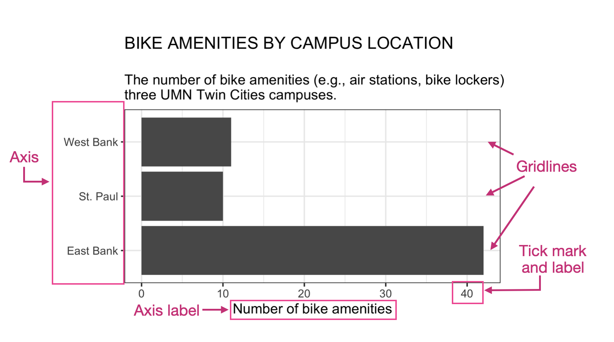
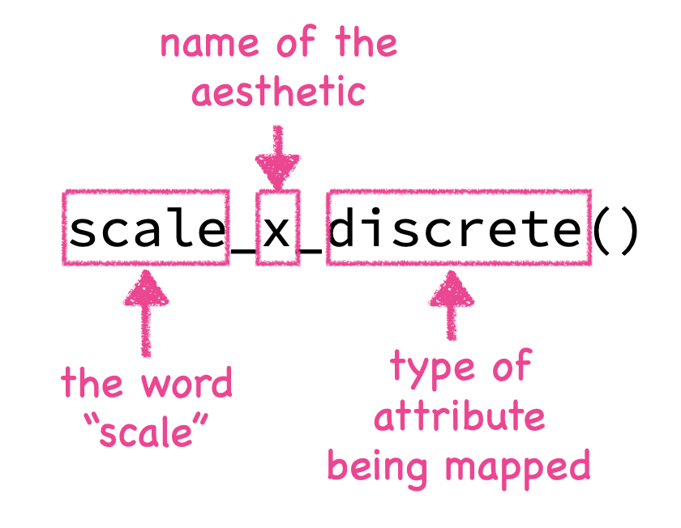
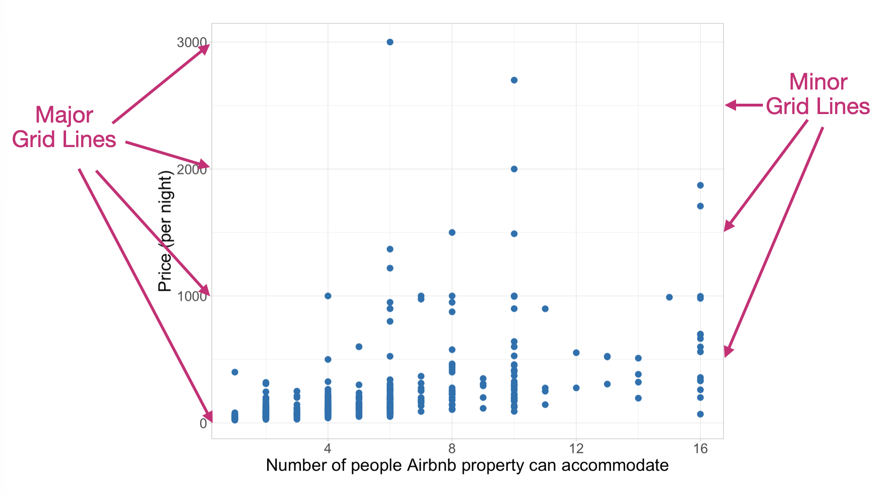

# Scales: Customizing Axes

This chapter will focus on how we can continue to improve our plot by customizing the scales and guides on our axes. Customization includes defining where the tick marks and gridlines appear, the labels associated with values on the axes, and much more. This customization again plays a large role in improving readability of a plot. 

@fig-scales shows our bike amenities plot and many of the different scale elements that can be customized. 

```{r}
#| label: fig-scales
#| fig-cap: "A plot showing some of the different aspects of scales that can be customized."
#| fig-alt: "A plot showing some of the different aspects of scales that can be customized."
#| out-width: "90%"
#| echo: false
#| message: false

library(tidyverse)
bike_amenities <- read_csv("data/umn-bike-amenities.csv")


```

<br />


## Scales and Aesthetic Mappings

Every aesthetic mapping in ggplot is associated with a scale. For example in the syntax show below for the bike amenities plot there are two aesthetic mappings. The first aesthetic mapping, `y=` is explicitly indicated in the `aes()` function---we are mapping the `campus` attribute to the *y*-position on the plot. The second mapping is implicit and maps counts to the *x*-position---it is happening even though we didn't explicitly include it in the syntax.

```{r}
#| eval: false

ggplot(data = bike_amenities, aes(y = campus)) +
  geom_bar()
```

Each of those two mappings is associated with a different scale, namely `scale_x` and `scale_y`. Each scale is further defined by the type of attribute that is being mapped. ggplot differentiates between two types of attributes: *continuous* attributes, and *discrete* attributes. You can think of continuous attributes as numbers and discrete attributes as categories.

In our example, the `campus` attribute, which is mapped to the *y*-position, is a categorical attribute; in the vocabulary of ggplot this is a discrete attribute. Whereas, counts, which is being mapped to the *x*-position is a continuous attribute. The scale layers are defined by the word "scale", the name of the aesthetic (e.g., x, y, color), and the type of attribute being mapped to the aesthetic (all separated by underscores). 

```{r}
#| fig-alt: "Scale syntax."
#| out-width: "50%"
#| fig-align: "center"
#| echo: false


```


So the two layers we can use in our example are:

- `scale_x_continuous()`
- `scale_y_discrete()`

The first layer will customize plot elements associated with the *x*-axis, and the second will customize plot elements associated with the *y*-axis. We can add these to our ggplot syntax. If the plot also has labels, the bones of the code will look like this:


```{r}
#| eval: false

ggplot() +
  geom_bar() +
  scale_x_continuous() +
  scale_y_discrete()
```

<br />


## Four Useful Arguments for Scales

While there are many arguments that you can use in the scales layers, the four most common arguments are:

- `name=`,
- `limits=`,
- `breaks=`, and
- `labels=`


The `name=` argument changes the label associated with the scale. So for our scales it would change the axis label. (This is equivalent to `x=` and `y=` in the `labs()` layer.) The `limits=` argument sets the minimum and maximum limits of the values associated wit hthe scale. The `breaks=` argument sets the data values where a tick mark and will be located in the plot. Finally, the `labels=` argument gives the names of the labels associated with each tick mark.

To illustrate these three argument, let's adapt the information in the *x*-axis on the bike amenities plot shown in @fig-scales. 

<br />


### The `name=` Argument

Currently, the axis label is "Number of bike amenities". This was previously provided in the `x=` argument of the `labs()`layer. We are instead going to create this label in the `name=` argument of the `scale_x_continuous()` layer. In a similar way, we can update the axis label on the *y*-axis using the `names=` argument in the `scale_y_discrete()` layer.


```{r}
#| label: fig-scales-name
#| fig-cap: "Adding axis labels in `name=` in the two scale layers."
#| fig-alt: "Adding axis labels in `name=` in the two scale layers."
#| out-width: "90%"

ggplot(data = bike_amenities, aes(y = campus)) +
  geom_bar() +
  scale_x_continuous(
    name = "Number of bike amenities"
  ) +
  scale_y_discrete(
    name = ""
  )
```

<br />

:::fyi
**PROTIP**

If you include the axis labels in the `names=` argument of the scales layers, delete the `x=` and `y=` arguments in `labs()` layer so that there isn't any conflict.
:::

<br />


### The `limits=` Argument

Currently, the values on the *x*-axis span from 0 to 40. ggplot chooses these limits based on the values in the data set. Suppose we wanted to change the limits to span from 0 to 45 instead. To do this we employ the `limits=` argument in the scale layer. This argument takes a vector that includes the value for the minimum limit and the value for the maximum limit---in our example, 0 and 45. Because there are multiple values being given to the argument we enclose those values in the `c()` function. For example:

```
limits = c(0, 45)
```

So adding the `limits=` argument tothe `scale_x_continuous()` layer, the syntax now looks like this:


```{r}
#| label: fig-scales-limits
#| fig-cap: "Changing axis limits in `limits=` in the scale layer associated with the *x*-axis."
#| fig-alt: "Changing axis limits in `limits=` in the scale layer associated with the *x*-axis."
#| out-width: "90%"

ggplot(data = bike_amenities, aes(y = campus)) +
  geom_bar() +
  scale_x_continuous(
    name = "Number of bike amenities",
    limits = c(0, 45)
  ) +
  scale_y_discrete(
    name = ""
  )
```

<br />


### The `breaks=` Argument

In the original plot, there are tick marks at the data values of 0, 10, 20, 30, and 40 on the *x*-axis (even after expanding our maximum value to 45). On the *y*-axis, the tick marks are at the data values of "East Bank", "St. Paul", and "West Bank". (Note that in discrete/categorical attributes the data values are strings not numbers and they are plotted in alphabetical order.) 

Although the values for the tick marks on the *x*-axis seem reasonable, as an example, let's include tick marks every five rather than every 10 values; at 0, 5, 10, 15, 20, 25, 30, 35, 40, and 45. To do this we include the `breaks=` argument in the `scale_x_continuous()` layer. Since we are giving this argument multiple values, similar to our `limits=` argument, we need to include all the values where we want tick marks inside a `c()` function.


```{r}
#| label: fig-scales-breaks
#| fig-cap: "Changing the tick mark locations in `breaks=` in the layer asociated with the *x*-axis."
#| fig-alt: "Changing the tick mark locations in `breaks=` in the layer asociated with the *x*-axis."
#| out-width: "90%"

ggplot(data = bike_amenities, aes(y = campus)) +
  geom_bar() +
  scale_x_continuous(
    name = "Number of bike amenities",
    limits = c(0, 45),
    breaks = c(0, 5, 10, 15, 20, 25, 30, 35, 40, 45)
  ) +
  scale_y_discrete(
    name = ""
  )
```


One thing to note is that gridlines are also added to each value that you define in the `breaks=` argument. If you have many tick marks defined on the axis, the number of gridlines might overwhelm the plot. The inclusion of gridlines in a plot is somewhat contentious. Edward Tufte has argued that gridlines are "chart clutter" and that because they compete with the data being visualized, they should be omitted from most plots. Others argue that because they help readers better estimate values in the plot they should be included, but should be made as subtle as possible (i.e., light in color and thin).

ggplot defines two different types of gridlines: major gridlines and minor gridlines. Major gridlines occur where there are tick marks on the axes. Minor gridlines are in-between the major gridlines. For example, in @fig-gridlines the major horizontal gridlines are at 0, 1000, 2000, and 3000. The minor horizontal gridlines are at 500, 1500, and 2500.


```{r}
#| label: fig-gridlines
#| fig-cap: "A plot indicating horizontal major and minor gridlines."
#| fig-alt: "A plot indicating horizontal major and minor gridlines."
#| out-width: "90%"
#| echo: false


```

We can differentiate between major and minor breaks in the scale layer. We define major gridlines, labels, and tick marks using the  `breaks=` argument and minor gridlines (but no labels or tick marks) using `minor_breaks=` argument . Suppose we want to have gridlines every five values along the *x*-axis, but only want tick marks at the values of 0, 10, 20, 30, and 40. Then we can employ both `breaks=` and `minor_breaks=` in the scale layer asociated with the *x*-axis:


```{r}
#| label: fig-scales-minor-breaks
#| fig-cap: "Changing the tick mark locations in `breaks=` in the layer asociated with the *x*-axis."
#| fig-alt: "Changing the tick mark locations in `breaks=` in the layer asociated with the *x*-axis."
#| out-width: "90%"

ggplot(data = bike_amenities, aes(y = campus)) +
  geom_bar() +
  scale_x_continuous(
    name = "Number of bike amenities",
    limits = c(0, 45),
    breaks = c(0, 10, 20, 30, 40),
    minor_breaks = c(5, 15, 25, 35, 45)
  ) +
  scale_y_discrete(
    name = ""
  )
```


<br />


### The `labels=` Argument

In our current plot, the tick labels on the *x*-axis are "0", "10", "20", "30", and "40". On the *y*-axis, our tick labels are "East Bank", "St. Paul", and "West Bank". Suppose we wanted to change the tick labels on the *y*-axis to "Minneapolis (East Bank)", "Saint Paul", and "Minneapolis (West Bank)" To do this we will include the `labels=` argument in the scale layer associated with the *y*-axis and provide the new tick label names inside the `c()` function since there are multiple values being given to the argument. (Note that we include `\n` in some of the labels to break the line.)


```{r}
#| label: fig-scales-labels
#| fig-cap: "Changing the tick mark labels in the `labels=` argument in the layer asociated with the *y*-axis."
#| fig-alt: "Changing the tick mark labels in the `labels=` argument in the layer asociated with the *y*-axis."
#| out-width: "90%"

ggplot(data = bike_amenities, aes(y = campus)) +
  geom_bar() +
  scale_x_continuous(
    name = "Number of bike amenities",
    limits = c(0, 45),
    breaks = c(0, 10, 20, 30, 40),
    minor_breaks = c(5, 15, 25, 35, 45)
  ) +
  scale_y_discrete(
    name = "",
    labels = c("Minneapolis\n(East Bank)", "Saint Paul", "Minneapolis\n(West Bank)")
  )
```

Three things to know about changing tick mark labels: (1) each label has to be enclosed in quotation marks; (2) the vector of labels in the `c()` function needs to have the same number of labels as there are tick marks on the axis; and (3) the order of labels needs to follow the same order as the values on the axis. 

So for example, say you only wanted to change the "St. Paul" label but you wanted to leave "East Bank" and "West Bank" as they were. You still need to include three labels since there are three tick marks---even though you only want to change one of the labels! So the argument would be: `labels = c("East Bank", "Saint Paul", "West Bank")`. In this vector, the label "East Bank" is associated with the label on the first tick mark, the label "Saint Paul" will be associated with the second tick mark, and the label "West Bank" would be associated with the third tick mark. (On the *y*-axis the first tick mark is at the bottom of the plot.)


<br />


## Exercises: Your Turn {-}


1. Use the *bls-earnings.csv* to create a histogram of the median weekly earnings for women who work an occupation in a professional occupation. 

- Use a binwidth of 200 to create this histogram. 
- Add a title, subtitle, and caption using the `labs()` layer. 
- Also update the axes labels using appropriate `scale_` layers.
- Add major gridlines at every $500.
- Label the *x*-axis tick labels so that they include the dollar sign (e.g., $500).

*Note.* You may get a warning about removed rows when you create this plot. This is just informing you that some rows in the data have NAs and are not being included in the visualization.

<button class="solution-btn solution-btn-default" onclick="toggle_visibility('exercise_04-04-01');">Show/Hide Solution</button>

<div id="exercise_04-04-01" style="display:none; margin: -40px 0 40px 40px;">
```{r}
#| fig-alt: "Histogram of the acceptance rates for the 33 institutions of higher learning in Minnesota."
#| out-width: "100%"
#| message: false
#| warning: false
# Import data
bls = read_csv("data/bls-earnings.csv")

# Histogram
ggplot(data = bls, aes(x = med_weeklypay_women)) +
  geom_histogram(
    breaks = seq(from = 0, to = 3000, by = 200),
    color = "black", 
    fill = "#FFB71E"
  ) +
  labs(
    title = "Female Empowerment: Bringing Home the Bacon",
    subtitle = "The median weekly earnings for women in 195 professional occupations.\n",
    caption = "\nSOURCE: Bureau of Labor Statistics"
  ) +
  scale_x_continuous(
    name = "Median weekly earnings",
    breaks = c(0, 500, 1000, 1500, 2000, 2500, 3000),
    labels = c("$0", "$500", "$1000", "$1500", "$2000", "$2500", "$3000")
  ) +
  scale_y_continuous(
    name = "Count"
  )
```
</div>


<br />