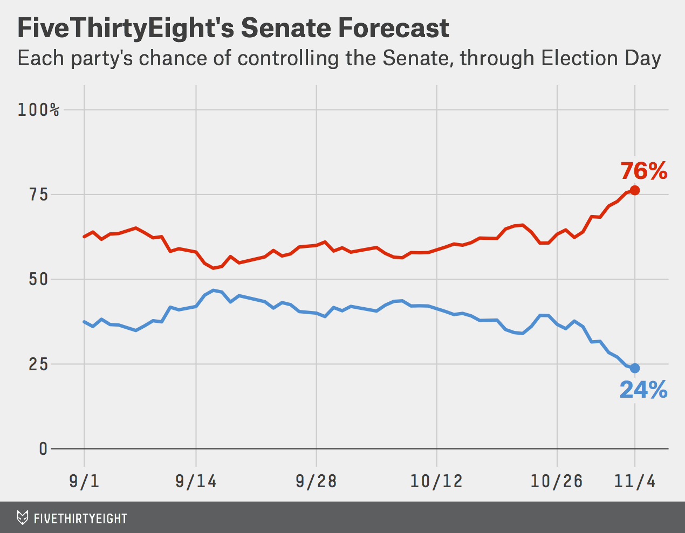
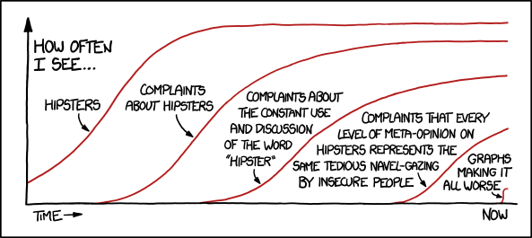
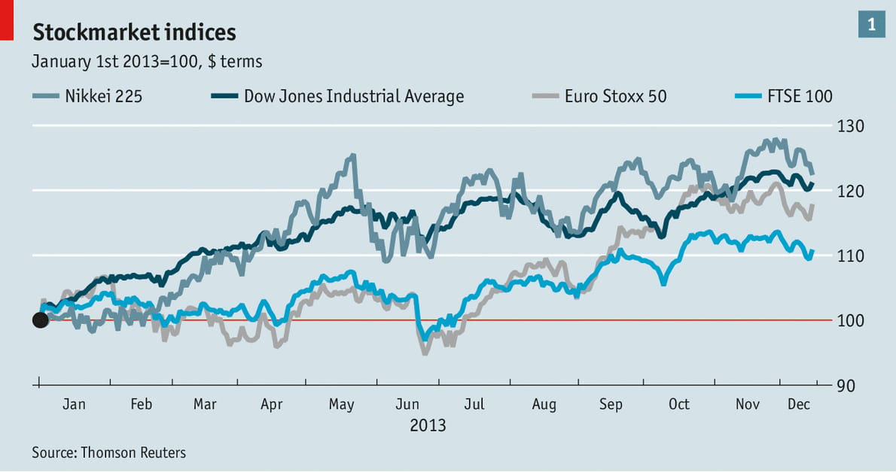

# Themes: Customizing the Background and Fonts {#sec-themes}

This chapter will focus on how we can continue to improve the aesthetics of a plot by customizing the theme. Plot theme is important for branding and also plays a role in further improving readability of a plot. The theme of a plot can also set the emotional tone by conveying cues about the context.


@fig-theme-branding shows line graphs created by three different companies. While the plot type (i.e., linegraph) is the same, the themes of these visualizations are very different.


```{r}
#| label: fig-theme-branding
#| layout: [[47, 50], [100]]
#| fig-cap: "Different companies use different themes based on their branding."
#| fig-subcap: 
#|   - "Line plot produced by FiveThirtyEight."
#|   - "Line plot produced by xkcd"
#|   - "Line plot produced by The Economist"
#| out-width: "100%"
#| echo: false




```

Most companies that produce data visualizations have a theme that corresponds to their company's specific branding. This might include things like the color palette employed and the font used. For example FiveThirtyEight visualizations typically have a grey background and use the Atlas Grotesk font for their titles and labels and the Decima Mono font for numerical data. PLots appearing in xkcd generally have a white background and use the xkcd font. Plots appearing in The Economist usually have a light-blue background and primarily using the Econ Sans and Econ Sans Condensed fonts. 

<br />


## Plot Background

Aside from being associated with the brand of a company or creator, the plot background plays an important role in the readability of the information displayed in the plot. The background of a visualization determines how well data points or key elements stand out. A white background makes darker colors pop, while a black background makes bright colors stand out, directly affecting clarity. This contrast between background and information is important for readability. 

```{r}
#| label: fig-contrast
#| fig-cap: "Plots showing different contrasts between the data points and the background color."
#| fig-subcap: 
#|   - "The pink data points do not show up well on the white background of this plot."
#|   - "The pink data points are easier to see on the black background of this plot."
#| out-width: "100%"
#| layout-ncol: 2
#| echo: false
#| message: false
#| warning: false

library(tidyverse)
source("scripts/theme_dark.R")

airbnb = read_csv("data/airbnb.csv")

ggplot(data = airbnb, aes(x = accommodates, y = price)) +
  geom_point(color = "#ebbed3") +
  labs(
    x = "Number of people Airbnb property can accommodate",
    y = "Price (per night)"
  ) +
  theme_light()


ggplot(data = airbnb, aes(x = accommodates, y = price)) +
  geom_point(color = "#ebbed3") +
  labs(
    x = "Number of people Airbnb property can accommodate",
    y = "Price (per night)"
  ) +
  theme_black()
```


The background color of a plot can also be influenced by the context of the visualization. @fig-dating shows how couples meet over time. The light pink background is associated with feelings of romance or love, making it a good color choice for a visualization about dating.

```{r}
#| label: fig-dating
#| fig-cap: "A line plot from [Visual Capitalist](https://www.visualcapitalist.com/online-dating-big-business/) showing the rise of online dating."
#| out-width: "100%"
#| echo: false

knitr::include_graphics("https://www.visualcapitalist.com/wp-content/uploads/2019/03/online-dating-mainchart-1.jpg")
```


<br />

## Font Choice

In addition to brand recognition (anyone who sees an xkcd plot who is familiar with the web comic instantly recognizes it as being from xkcd), the theme choices made by these companies convey a certain tone. Studies in design have found that different fonts and typographic styles impact the thoughts, feelings, and behaviors of those seeing the design. Companies use this when selecting fonts:

> For example, a brand that wants to be seen as serious and professional should choose to use fonts that align with this tone. On the flip side, if you’re crafting a poster for a children’s event, a font that appears approachable and friendly would be a more appropriate choice. [@Adobe-Express:2024]


In the example line plots, the font choices from both FiveThirtyEight and The Economist convey a more serious and scientific tone than the xkcd font, which is much more playful. One difference in font choice between The Economist and FiveThirtyEight is that the fonts used in The Economist plot are serif fonts and those used by FiveThirtyEight are sans serif. A serif font is a typeface characterized by small lines, strokes, or "flourishes" attached to the ends of larger strokes in letters. A sans serif^["Sans" is French for "without".] font is a typeface that lacks these strokes. 


```{r}
#| label: fig-serif
#| fig-cap: "Examples of serif and sans serif fonts from [Wikipedia](https://en.wikipedia.org/wiki/Serif)." 
#| fig-subcap: 
#|   - "A font with serifs. The serifs are shown in red."
#|   - "A sans serif font."
#| out-width: "60%"
#| echo: false

knitr::include_graphics("https://upload.wikimedia.org/wikipedia/commons/thumb/2/26/Serif_and_sans-serif_03.svg/500px-Serif_and_sans-serif_03.svg.png")
knitr::include_graphics("https://upload.wikimedia.org/wikipedia/commons/thumb/9/99/Serif_and_sans-serif_01.svg/500px-Serif_and_sans-serif_01.svg.png")
```

Serif fonts were traditionally used in print media and have generally been found to be easier to read in long-form print (e.g., books, newspapers). However, sans serif fonts tend to be easier to read on screens. This might explain why The Economist (which is a print-based publication) and FiveThirtyEight (which was an online publication before it closed down) chose a serif and sans serif font to use on their visualizations.


<br />


## Changing the Plot Theme in R

To change our plot theme, we are going to modify our original plot by adding a theme layer. There are different theme functions all having a name starting with `theme_`. We will connect the original plot again by adding it with the `+` operator.. To adhere to good coding practice, we will put the theme layer on a separate line of code and indent it. If the plot also has labels, the bones of the code will look like this:


```{r}
#| eval: false

ggplot() +
  geom_bar() +
  labs() +
  theme_something()
```

There are several different themes that we can use including: `theme_gray()` (the default theme), `theme_bw()`, `theme_light()`, `theme_dark()`, `theme_classic()`, and `theme_void()`. Below we show the bar chart of bike amenities in each of these six themes.

```{r}
#| label: fig-themes
#| fig-cap: "Plots showing different contrasts between the data points and the background color."
#| fig-subcap: 
#|   - "`theme_gray()`"
#|   - "`theme_bw()`"
#|   - "`theme_light()`"
#|   - "`theme_dark()`"
#|   - "`theme_classic()`"
#|   - "`theme_void()`"
#| out-width: "100%"
#| layout-ncol: 2
#| layout-nrow: 3
#| echo: false
#| message: false
#| warning: false

bike_amenities <- read_csv("data/umn-bike-amenities.csv")

ggplot(data = bike_amenities, aes(y = campus)) +
  geom_bar(
    color = "black", 
    fill = "yellow"
  ) +
  labs(
    x = "Number of bike amenities",
    y = "",
    title = "BIKE AMENITIES BY CAMPUS LOCATION",
    subtitle = "\nThe number of bike amenities (e.g., air stations, bike lockers) on each of the \nthree UMN Twin Cities campuses.",
    caption = "\nSource: UMN Facility Information Services"
  )

ggplot(data = bike_amenities, aes(y = campus)) +
  geom_bar(
    color = "black", 
    fill = "yellow"
  ) +
  labs(
    x = "Number of bike amenities",
    y = "",
    title = "BIKE AMENITIES BY CAMPUS LOCATION",
    subtitle = "\nThe number of bike amenities (e.g., air stations, bike lockers) on each of the \nthree UMN Twin Cities campuses.",
    caption = "\nSource: UMN Facility Information Services"
  ) +
  theme_bw()

ggplot(data = bike_amenities, aes(y = campus)) +
  geom_bar(
    color = "black", 
    fill = "yellow"
  ) +
  labs(
    x = "Number of bike amenities",
    y = "",
    title = "BIKE AMENITIES BY CAMPUS LOCATION",
    subtitle = "\nThe number of bike amenities (e.g., air stations, bike lockers) on each of the \nthree UMN Twin Cities campuses.",
    caption = "\nSource: UMN Facility Information Services"
  ) +
  theme_light()

ggplot(data = bike_amenities, aes(y = campus)) +
  geom_bar(
    color = "black", 
    fill = "yellow"
  ) +
  labs(
    x = "Number of bike amenities",
    y = "",
    title = "BIKE AMENITIES BY CAMPUS LOCATION",
    subtitle = "\nThe number of bike amenities (e.g., air stations, bike lockers) on each of the \nthree UMN Twin Cities campuses.",
    caption = "\nSource: UMN Facility Information Services"
  ) +
  theme_dark()

ggplot(data = bike_amenities, aes(y = campus)) +
  geom_bar(
    color = "black", 
    fill = "yellow"
  ) +
  labs(
    x = "Number of bike amenities",
    y = "",
    title = "BIKE AMENITIES BY CAMPUS LOCATION",
    subtitle = "\nThe number of bike amenities (e.g., air stations, bike lockers) on each of the \nthree UMN Twin Cities campuses.",
    caption = "\nSource: UMN Facility Information Services"
  ) +
  theme_classic()

ggplot(data = bike_amenities, aes(y = campus)) +
  geom_bar(
    color = "black", 
    fill = "yellow"
  ) +
  labs(
    x = "Number of bike amenities",
    y = "",
    title = "BIKE AMENITIES BY CAMPUS LOCATION",
    subtitle = "\nThe number of bike amenities (e.g., air stations, bike lockers) on each of the \nthree UMN Twin Cities campuses.",
    caption = "\nSource: UMN Facility Information Services"
  ) +
  theme_void()
```


Here are the differences in these themes:

- `theme_gray()`: The default ggplot2 theme with a grey background and white gridlines.
- `theme_bw()`: This theme has a white background with black gridlines. There is also a black box around the plot.
- `theme_light()`: This theme has a white background with black gridlines. 
- `theme_dark()`: This theme has a darker background with black gridlines. 
- `theme_classic()`: This theme has a white background with *x*- and *y*-axis lines and no gridlines.
- `theme_void()`: A completely empty theme.


Below, we show the syntax to create our bike amenities plot using the `theme_bw()` theme.


```{r}
#| label: fig-theme-bw
#| fig-cap: "Horizontal bar chart of the number of each building type owned by UMN. The theme has been changed to a white background with black gridlines."
#| out-width: "70%"
#| echo: true

ggplot(data = bike_amenities, aes(y = campus)) +
  geom_bar(
    color = "black", 
    fill = "yellow"
  ) +
  labs(
    x = "Number of bike amenities",
    y = "",
    title = "BIKE AMENITIES BY CAMPUS LOCATION",
    subtitle = "\nThe number of bike amenities (e.g., air stations, bike lockers) on each of the \nthree UMN Twin Cities campuses.",
    caption = "\nSource: UMN Facility Information Services"
  ) +
  theme_bw()
```


<br />


## Changing Font Size in R

To change the font size in our plot, we can add the `base_size=` argument into our theme layer. For example, to set the font size from 12 points (the default size) to 16 points we can use the following syntax:


```{r}
#| label: fig-fontsize
#| fig-cap: "Horizontal bar chart of the number of each building type owned by UMN. The theme has been changed to a white background with black gridlines."
#| out-width: "90%"
#| echo: true

ggplot(data = bike_amenities, aes(y = campus)) +
  geom_bar(
    color = "black", 
    fill = "yellow"
  ) +
  labs(
    x = "Number of bike amenities",
    y = "",
    title = "BIKE AMENITIES BY CAMPUS LOCATION",
    subtitle = "\nThe number of bike amenities (e.g., air stations, \n bike lockers) on each of the three UMN Twin Cities\n campuses.",
    caption = "\nSource: UMN Facility Information Services"
  ) +
  theme_bw(
    base_size = 16
    )
```


:::fyi
**CAREFUL**

When you make the text larger you will likely need to add line breaks to ensure that your labels do not run off the page.
:::

<br />


## Changing Font Family in R

To change the font family in the plot, we can add the `base_family=` argument into our theme layer. The default font family is a sans serif font. We can change this to either a serif font family (`base_family="serif"`) or a monospaced font family (`base_family="mono"`).^[Most modern fonts are variable width---that is not every letter has the same width. For example an "m" is generally wider than an "i". In a monospaced font all of the letters have the same width. (It also looks like a typewriter or old-school printer wrote the text.)] For example, to set the font family to a serif font we can use the following syntax:

```{r}
#| label: fig-family-serif
#| fig-cap: "Horizontal bar chart of the number of each building type owned by UMN. The theme has been changed to a white background with black gridlines."
#| out-width: "90%"
#| echo: true

ggplot(data = bike_amenities, aes(y = campus)) +
  geom_bar(
    color = "black", 
    fill = "yellow"
  ) +
  labs(
    x = "Number of bike amenities",
    y = "",
    title = "BIKE AMENITIES BY CAMPUS LOCATION",
    subtitle = "\nThe number of bike amenities (e.g., air stations, bike lockers)\non each of the three UMN Twin Cities campuses.",
    caption = "\nSource: UMN Facility Information Services"
  ) +
  theme_bw(
    base_size = 16, 
    base_family = "serif"
    )
```

<br />


## More Nuanced Changes with the `theme()` Layer

Using the `base_size=` and `base_family=` arguments change the font size and family for all the text in our plot, including text we did not set with the `labs()` function (e.g., the numbers in the plot). It also changes them all in the same way. For example, setting the font family to a serif font changed all the font in the plot to a serif font. We often want to have a more nuance in the different elements of the plot. To do this, we will add an additional `theme()` layer to our plot. The bones of this with a black-and-white theme would look like this:


```{r}
#| eval: false

ggplot() +
  geom_bar() +
  labs() +
  theme_bw() +
  theme()
```

The `theme()` layer allows us to customize almost every single aspect of the plot from the text, to the gridlines, to the tick marks. In the syntax below we change many of the text elements in the `theme()` layer. The argument name specifies the element being modified; for example `plot.title=` will modify the plot title. We then use the `element_text()` function to modify that element. In our example below, for example, we are modifying the plot title by changing the font size to 20 points and making it bold-faced. Most of the arguments should be self explanatory, with the exception of `hjust=` in the `plot.caption=` argument. `hjust=` changes the horizontal justification: `hjust=0` left-aligns the text, `hjust=1` (the default) right-aligns the text, and `hjust=0.5` centers the text. (You can input any value from 0 to 1.)


```{r}
#| label: fig-family-custom
#| fig-cap: "Horizontal bar chart of the number of each building type owned by UMN. The theme has been changed to a white background with black gridlines. Many of the text elements have been customized in the `theme()` layer."
#| out-width: "90%"
#| echo: true

ggplot(data = bike_amenities, aes(y = campus)) +
  geom_bar(
    color = "black", 
    fill = "yellow"
  ) +
  labs(
    x = "Number of bike amenities",
    y = "",
    title = "BIKE AMENITIES BY CAMPUS LOCATION",
    subtitle = "\nThe number of bike amenities (e.g., air stations, bike lockers)\non each of the three UMN Twin Cities campuses.",
    caption = "\nSource: UMN Facility Information Services"
  ) +
  theme_bw() +
  theme(
    # Customize title
    plot.title = element_text(size = 20, face = "bold"),
    
    # Customize subtitle
    plot.subtitle = element_text(size = 15, face = "italic", color = "#797979"),
    
    # Customize caption
    plot.caption = element_text(color = "#797979", hjust = 0, family = "mono"),
    
    # Customize main axis labels
    axis.title.x = element_text(size = 14),
    axis.title.y = element_text(size = 14),
    
    # Customize tick labels (numbers and categories)
    axis.text.x = element_text(size = 13),
    axis.text.y = element_text(size = 13),
  )
```


:::fyi
**LEARN MORE**

You can learn more about all the customiztions you can do in the `theme()` layer at <https://ggplot2.tidyverse.org/reference/theme.html>. Aside from seeing all of the potential modifactions, the webpage also has many example plots showing you these modifications.
:::

<br />


## Extending Font Choices: The `{extrafont}` Package

The font choice we have is limited to essentially three choices: a serif, sans serif, or monospaced font. Your computer likely has many font options available, but to use them in R we need to register them in a font database that R can access. Then you can use fonts you have installed on your computer (called system fonts) like TaylerSwiftHandwriting or Garamond in your plots.

The `{extrafont}` package has functions that allow you to register and use system fonts in your plots. Begin by installing this package. Then in the Console window (not in your QMD document) load the `{extrafont}` package using:

```{r}
#| message: false
library(extrafont)
```


Then we need to import fonts into the extrafont database. (We only do this one time.) In the console type the following syntax:

```{r}
#| eval: false
# Import fonts
font_import()
```

This will then ask you whether you want to import the fonts. It will print a message like: `Importing fonts may take a few minutes, depending on the number of fonts and the speed of the system.
Continue? [y/n]`

Type `y` into the console and hit enter/return. This will attempt to autodetect the directory containing your system fonts and create a fontmap that you will register in your QMD document so that these fonts can be used in your plots. 

:::fyi
**WARNING**

This might take awhile depending on how many fonts you have installed on your computer!
:::


The next step is to register the fonts so that R can access them. To do this type the following syntax in the console:

```{r}
#| eval: false
# View font names
loadfonts()
```


:::fyi
**NOTE**

You only need to import the fonts and register the fonts one time. That is why we do this in the console rather than in a QMD file. If you did this in a QMD file, it would import and register he fonts every time that you rendered the file!
:::


<br />


### Using `{extrafont}` in Your Plots


Once you have imported and registered the fonts, you can use them in your plots. Type `font()` into the console to see the names of the fonts that will be accessible for you to use in your plots. Note that these are the names that you will need to ultimately use in your R syntax when you want to use these fonts.

```{r}
#| eval: false
# View font names
fonts()
```

```
  [1] ".SF Camera"                    ".SF Compact Rounded"           ".Keyboard"                    
  [4] ".New York"                     ".SF Arabic"                    ".SF Arabic Rounded"           
  [7] ".SF Armenian"                  ".SF Armenian Rounded"          ".SF Compact"               
 [22] "Arial"                         "Arial Narrow"                  "Arial Rounded MT Bold"        
       :                                 :                               :
[217] "Trebuchet MS"                  "Verdana"                       "Webdings"                     
[220] "Wingdings"                     "Wingdings 2"                   "Wingdings 3"
```

One of the fonts available on my computer is "TaylorSwiftHandwriting". To use this in my plot, I can identify this font in the `family=` argument of the theme elements. For example to make all the text in the plot use the "TaylorSwiftHandwriting" font we can use:


```{r}
#| label: fig-family-tswift
#| fig-cap: "Horizontal bar chart of the number of each building type owned by UMN. The theme has been changed to a white background with black gridlines."
#| out-width: "90%"
#| echo: true

ggplot(data = bike_amenities, aes(y = campus)) +
  geom_bar(
    color = "black", 
    fill = "yellow"
  ) +
  labs(
    x = "Number of bike amenities",
    y = "",
    title = "BIKE AMENITIES BY CAMPUS LOCATION",
    subtitle = "\nThe number of bike amenities (e.g., air stations, bike lockers)\non each of the three UMN Twin Cities campuses.",
    caption = "\nSource: UMN Facility Information Services"
  ) +
  theme_bw(
    base_size = 16, 
    base_family = "TaylorSwiftHandwriting"
    )
```


You can also use the `family=` arguments in the individual text elements in the `theme()` function. For example:


```{r}
#| label: fig-family-custom-extrafont
#| fig-cap: "Horizontal bar chart of the number of each building type owned by UMN. The theme has been changed to a white background with black gridlines. Many of the text elements have been customized in the `theme()` layer."
#| out-width: "90%"
#| echo: true

ggplot(data = bike_amenities, aes(y = campus)) +
  geom_bar(
    color = "black", 
    fill = "yellow"
  ) +
  labs(
    x = "Number of bike amenities",
    y = "",
    title = "BIKE AMENITIES BY CAMPUS LOCATION",
    subtitle = "\nThe number of bike amenities (e.g., air stations, bike lockers)\non each of the three UMN Twin Cities campuses.",
    caption = "\nSource: UMN Facility Information Services"
  ) +
  theme_bw() +
  theme(
    # Customize title
    plot.title = element_text(size = 20, face = "bold", family = "TaylorSwiftHandwriting"),
    
    # Customize subtitle
    plot.subtitle = element_text(size = 15, face = "italic", color = "#797979", family = "Roboto"),
    
    # Customize caption
    plot.caption = element_text(color = "#797979", hjust = 0, family = "mono"),
    
    # Customize main axis labels
    axis.title.x = element_text(size = 14, family = "Times New Roman"),
    axis.title.y = element_text(size = 14, family = "Times New Roman"),
    
    # Customize tick labels (numbers and categories)
    axis.text.x = element_text(size = 13, family = "Times New Roman"),
    axis.text.y = element_text(size = 13, family = "Times New Roman")
  )
```


<br />


## Exercises: Your Turn {-}


1.  Use the *bls-earnings.csv* to create a histogram of the median weekly earnings for women who work an occupation in a professional occupation.

- Color the bar borders black and fill the bars with an RGB color.
- Use a binwidth of 200 to create this histogram.
- Add a title, subtitle, and caption using the `labs()` layer. 
- Also update the axes labels using appropriate `scale_` layers.
- Change the default grey theme to something different
- Try using the `theme()` layer to update the size and font used in the different labels.

*Note.* You may get a warning about removed rows when you create this plot. This is just informing you that some rows in the data have NAs and are not being included in the visualization.

<button class="solution-btn solution-btn-default" onclick="toggle_visibility('exercise_04-06-01');">Show/Hide Solution</button>

<div id="exercise_04-06-01" style="display:none; margin: -40px 0 40px 40px;">
```{r}
#| fig-alt: "Histogram of the acceptance rates for the 33 institutions of higher learning in Minnesota."
#| out-width: "100%"
#| message: false
#| warning: false
# Import data
bls = read_csv("data/bls-earnings.csv")

# Histogram
ggplot(data = bls, aes(x = med_weeklypay_women)) +
  geom_histogram(
    breaks = seq(from = 0, to = 3000, by = 200),
    color = "black", 
    fill = "#FFB71E"
  ) +
  labs(
    title = "Female Empowerment: Bringing Home the Bacon",
    subtitle = "The median weekly earnings for women in 195 professional occupations.\n",
    caption = "\nSOURCE: Bureau of Labor Statistics"
  ) +
  scale_x_continuous(
    name = "Median weekly earnings",
    breaks = c(0, 500, 1000, 1500, 2000, 2500, 3000),
    labels = c("$0", "$500", "$1000", "$1500", "$2000", "$2500", "$3000")
  ) +
  scale_y_continuous(
    name = "Count"
  ) +
  theme_bw() +
  theme(
    # Customize title
    plot.title = element_text(size = 19, face = "bold", family = "Roboto Slab"),
    
    # Customize subtitle
    plot.subtitle = element_text(size = 15, face = "italic", color = "#797979", family = "Roboto Condensed"),
    
    # Customize caption
    plot.caption = element_text(color = "#797979", hjust = 0, family = "Roboto"),
    
    # Customize main axis labels
    axis.title.x = element_text(size = 14, family = "Roboto"),
    axis.title.y = element_text(size = 14, family = "Roboto"),
    
    # Customize tick labels (numbers and categories)
    axis.text.x = element_text(size = 13, family = "Roboto"),
    axis.text.y = element_text(size = 13, family = "Roboto")
  )
```
</div>


<br />


## References {-}

