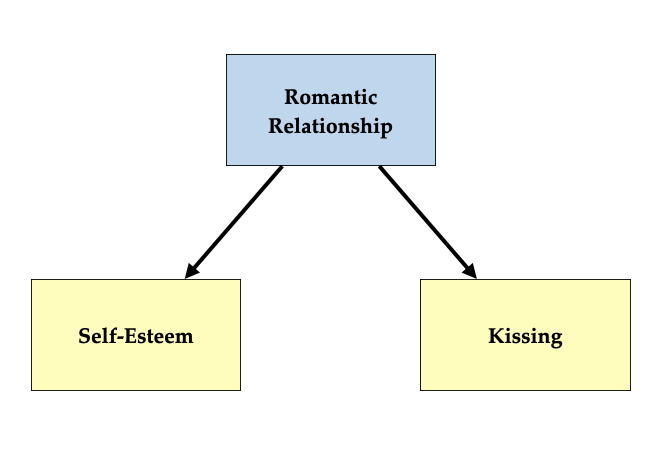
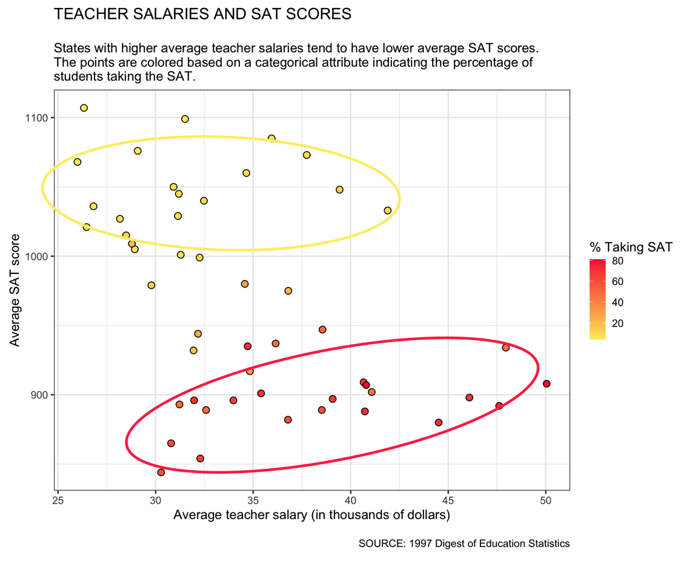

# Interactions: Different Quantitative Relationships Based on the Values of a Third Attribute

This chapter will focus on how we can compare quantitative relationships by mapping categorical attributes to different aesthetics in the scatterplot. To illustrate this, we will use the *sat.csv* data. This dataset includes state-level education data including per-student expenditures, teacher-to-student ratios, average teacher salary, the percentage of students who take the SAT, and average SAT scores.


```{r}
#| label: load-packages2
#| message: false
#| fig-width: 6
#| fig-height: 6
#| out-width: "90%"

######################
# Load library
######################

library(tidyverse)


######################
# Import data
######################

sat <- read_csv("data/sat.csv")
```


After loading libraries and importing the data, we can create a scatterplot to examine the relationship between teacher salaries and SAT total scores. Do students in states with more highly paid teachers perform better than students in states with less highly paid teachers?


```{r}
#| fig-alt: "Scatterplot of teacher salries and total SAT scores."
#| fig-width: 6
#| fig-height: 6
#| out-width: "90%"

######################
# Scatterplot
######################

ggplot(data = sat, aes(x = salary, y = sat)) +
  geom_point(shape = 21, color = "black", fill = "#ffde7a", size = 3) +
  labs(
    title = "TEACHER SALARIES AND SAT SCORES",
    subtitle = "\nStates with higher average teacher salaries tend to have\nlower average SAT scores.",
    caption = "\nSOURCE: 1997 Digest of Education Statistics",
    x = "Average teacher salary (in thousands of dollars)",
    y = "Average SAT score"
  ) +
  theme_bw(
    base_size = 14
  )
```


This plot shows a moderate, negative, linear relationship suggesting that states with higher average teacher salaries tend to have lower average SAT scores. This is quite surprising!

<br />


## Correlation vs. Causation

Does this finding mean that we need to pay teachers less so that students start performing better? No! While some people might try to make that argument, it is the wrong conclusion because of the nature of the data. To understand this, we need to dive into the differences between *observational* and *experimental* data.

Experimental data are data that have been collected from a study in which the researcher **randomly assigned cases/participants in their sample to different levels of the predictor**. In our example, a researcher would have needed to randomly assign the average teacher salary to different states. In the world, teacher salaries are not randomly assigned! When the data are observational, any causal conclusions about relationships are often erroneous because the conclusions we draw are often impacted/biased by confounding. 

Confounding occurs when some variable influences both attributes in the relationship. For example, @Bergstrom:2021 writes about a study titled "Never Been Kissed" that showed a relationship between self-esteem and whether or not someone has been kissed prior to starting college. Since the authors did not randomly assign levels of self-esteem, this is an observational study. Bergstrom and West point out that higher self-esteem does not likely have a causal relationship with being kissed, but that a confounding variable in this relationship is whether people were involved in a romantic relationship prior to college. Being involved in a romantic relationship impacts (has a relationship with) both self-esteem AND whether or not someone has been kissed. A diagram for this is shown below.

```{r}
#| label: fig-confounding
#| fig-cap: "Being involved in a romantic relationship in a confounder in the relationship between self-esteem AND whether or not someone has been kissed because it impacts (has a relationship) both variables."
#| fig-alt: ""
#| echo: false


```

:::fyi
**FYI**

Confounders are why you often hear people say that "correlation is not causation". What they mean is that just because two attributes are related, it does not necessiarily mean that one causes the other---even when it makes sense logically.
:::


One of the big problems with confounders is that once we account for them, the relationship between our original two attributes might change. This type of confounding is called an *interaction*. For example, consider this result from a business study that found a positive relationship between employee's neuroticism and their salaries. The scatterplot (below) suggests that employees that are more neurotic tend to have higher salaries.


```{r}
#| label: fig-salary-neuroticism-01
#| fig-cap: "Salary versus neuroticism (0 = not at all neurotic; 7= very neurotic) as measured by the Big Five personality survey for $n=1000$ employees from a Fortune 500 company."
#| fig-alt: "Salary versus neuroticism (0 = not at all neurotic; 7= very neurotic) as measured by the Big Five personality survey for $n=1000$ employees from a Fortune 500 company."
#| out-width: "100%"
#| echo: false
#| message: false
# Example 2
set.seed(123)
n = 1000

Education = rbinom(n, 2, 0.5)
Neuroticism = rnorm(n) + Education
Salary = Education * 2 + rnorm(n) - Neuroticism * 0.3

Salary = sample(10000:11000, 1) + scales::rescale(Salary, to = c(0, 100000))
# summary(Salary)
Neuroticism = scales::rescale(Neuroticism, to = c(0, 7))
# summary(Neuroticism)
Education = factor(Education, labels = c("Low", "Medium", "High"))

data <- data.frame(
  Salary,
  Neuroticism,
  Education
)

data |> 
  ggplot(aes(x = Neuroticism, y = Salary)) +
    geom_point(alpha = 0.5) + 
    geom_smooth(method = 'lm', se = FALSE) +
    theme_bw()
```


One confounding variable, however, is education level. Education level has a relationship with each of the two attributes: (1) employees with higher education levels tend to be more neurotic; and (2) employees with higher education levels tend to earn higher salaries. Below, we show the same scatterplot with the points colored by education level.


```{r}
#| label: fig-salary-neuroticism
#| fig-cap: "Salary versus neuroticism (0 = not at all neurotic; 7= very neurotic) as measured by the Big Five personality survey for $n=1000$ employees from a Fortune 500 company. The data are colored by education level."
#| fig-alt: "Salary versus neuroticism (0 = not at all neurotic; 7= very neurotic) as measured by the Big Five personality survey for $n=1000$ employees from a Fortune 500 company. The data are colored by education level."
#| out-width: "100%"
#| echo: false
#| message: false
data |> 
  ggplot(aes(x = Neuroticism, y = Salary)) +
    geom_point(aes(col = Education), alpha = 0.5) + 
    geom_smooth(aes(col = Education), method = 'lm', se = FALSE) +
    ggsci::scale_color_d3()  +
    theme_bw() +
    theme(
        legend.background = element_rect(fill = "transparent"),
        legend.justification = c(1, 0),
        legend.position = c(1, 0)
        )
```

Once we account for education level, employees who are more neurotic tend to have **lower salaries**, on average. This reversal of the direction of the relationship once we account for confounding variables is quite common (so common it has a name, [Simpson's Paradox](https://en.wikipedia.org/wiki/Simpson%27s_paradox)) and makes it difficult to be sure about the "true" relationship between variables in observational data.

:::fyi
**FYI**

One way to think about interactions is that the answer to the question "what is the relationship between X and Y?" is "it depends on the value of Z." For example if someone asked, "what is the relationship between employee's neuroticism and their salaries?", we would need to answer: "that depends on education level". 
:::

<br />


## Examining Interactions in R

Going back to our original example, one confounding variable is the percentage of students in the state who actually take the SAT. Some states (e.g., Mississippi, Utah, Iowa) have a very low percentage of students who take the SAT, while others (e.g., Connecticut, Massachusetts, New York) have a high percentage of students who take the SAT. Below we look at the scatterplots with the percentage of students who take the SAT (`frac`) and both teacher salary and average SAT score.

```{r}
#| fig-alt: "Scatterplots showing that the percentage of students who take the SAT has a relationship with both teacher salary and average SAT score."
#| echo: false
#| message: false
#| fig-width: 12
#| fig-height: 6
#| out-width: "100%"

library(patchwork)

p1 = ggplot(data = sat, aes(x = frac, y = salary)) +
  geom_point(shape = 21, color = "black", fill = "#ffde7a", size = 3) +
  labs(
    title = "% TAKING SAT AND TEACHER SALARIES",
    subtitle = "\nStates with a higher percentage of students taking the\nSAT tend to have higher average teacher salaries.",
    caption = "\nSOURCE: 1997 Digest of Education Statistics",
    x = "% Taking the SAT",
    y = "Average teacher salary (in thousands of dollars)"
  ) +
  theme_bw(
    base_size = 14
  )

p2 = ggplot(data = sat, aes(x = frac, y = sat)) +
  geom_point(shape = 21, color = "black", fill = "#ffde7a", size = 3) +
  labs(
    title = "% TAKING SAT AND SAT SCORES",
    subtitle = "\nStates with a higher percentage of students taking the\nSAT tend to have lower average SAT scores.",
    caption = "\nSOURCE: 1997 Digest of Education Statistics",
    x = "% Taking the SAT",
    y = "Average SAT score"
  ) +
  theme_bw(
    base_size = 14
  )

p1 | p2
```

:::fyi

**FYI**

Understanding why a variable is an interaction/confounder requires you to draw on content (not statistical) knowledge. 

In our example, it turns out that students who take the SAT that live in states where a small proportion of students actually take the test are probably high achieving students, who will likely perform well on the exam. These states will subsequently have a higher average SAT score. Similarly in states that have a high percentage of students taking the test, the distribution of scores is more spread out and the average score is lower. Additionally, the SAT is associated with schools that primarily are located on the east and west coast (e.g., Ivy league and California schools). Since students tend to go to college close-ish to home, states with a higher percentage of students taking the SAT are typically east and west coast states. These states have a much higher cost-of-living than other states and subsequently pay their teachers more money. 
:::


To see how the confounder impacts the relationship between teacher salary and SAT score, we need to include the confounder (percentage taking the SAT) in the scatterplot. Typically we do this using one of the following methods: (1) Facetting, or (2) coloring. If your confounding attribute is categorical, you can use either of these methods. If, however, your confounding attribute is quantitative, we can't really use facetting since there would be too many plots created.

<br />


## Categorical Confounder

The dataset includes the attribute `frac_cat` which is a categorical split of the percentage of students taking the SAT into three categories: Low, Mid, and High. Since you already know how to facet using an attribute, we will focus here on coloring by the attribute. The key is to add a mapping of the confounder to either `color=` or `fill=` in the global `aes()`. (Which one you use depends on the shape of the points you are using.) Below, since we will be using `shape=21`, we map the `frac_cat` attribute to `fill=`:

```{r}
#| fig-alt: "Scatterplot of teacher salries and total SAT scores. The points are colored based on the frac_cat attribute."
#| message: false
#| fig-width: 8
#| fig-height: 6
#| out-width: "90%"

######################
# Scatterplot
######################

ggplot(data = sat, aes(x = salary, y = sat, fill = frac_cat)) +
  geom_point(shape = 21, color = "black", size = 3) +
  labs(
    title = "TEACHER SALARIES AND SAT SCORES",
    subtitle = "\nStates with higher average teacher salaries tend to have lower average SAT scores.\nThe points are colored based on a categorical attribute indicating the percentage of\nstudents taking the SAT.",
    caption = "\nSOURCE: 1997 Digest of Education Statistics",
    x = "Average teacher salary (in thousands of dollars)",
    y = "Average SAT score"
  ) +
  theme_bw(
    base_size = 14
  )
```


There are a couple of things that we might want to update related to this plot:

- The values in the legend should be re-order to go from Low, to Mid, to High. (The default order is alphabetical).
- The color palette should reflect the ordinal nature of the confounder (low--mid--high).
- The labels can be updated to include "%".
- The legend should have a different title.

We can accomplish all of this in the `scale_fill_manual()` layer. The key to re-ordering is to add `breaks=` in this layer. This argument takes a vector (`c()`) that gives the original values of the legend in the new order. The remaining changes can be made using arguments you already know, namely: `name=`, `values=`, and `labels=`.


```{r}
#| fig-alt: "Scatterplot of teacher salries and total SAT scores. The points are colored based on the frac_cat attribute."
#| message: false
#| fig-width: 8
#| fig-height: 6
#| out-width: "90%"

######################
# Scatterplot
######################

ggplot(data = sat, aes(x = salary, y = sat, fill = frac_cat)) +
  geom_point(shape = 21, color = "black", size = 3) +
  labs(
    title = "TEACHER SALARIES AND SAT SCORES",
    subtitle = "\nStates with higher average teacher salaries tend to have lower average SAT scores.\nThe points are colored based on a categorical attribute indicating the percentage of\nstudents taking the SAT.",
    caption = "\nSOURCE: 1997 Digest of Education Statistics",
    x = "Average teacher salary (in thousands of dollars)",
    y = "Average SAT score"
  ) +
  theme_bw(
    base_size = 14
  ) +
  scale_fill_manual(
    name = "% Taking SAT",
    breaks = c("Low", "Mid", "High"),
    values = c(
      "Low" = "#b4de2c",
      "Mid" = "#26828e",
      "High" = "#440154"
    ),
    labels = c(
      "Low" = "Low %",
      "Mid" = "Mid %",
      "High" = "High %"
    )
  )
```

:::fyi
**FYI**

Andrew Heiss has a [nice write-up on different color palettes](https://datavizs25.classes.andrewheiss.com/resource/colors.html) in R. Two other good resources are [Best Color Palettes for Scientific Figures and Data Visualizations](https://www.simplifiedsciencepublishing.com/resources/best-color-palettes-for-scientific-figures-and-data-visualizations) and [ColorBrewer](https://colorbrewer2.org/)
:::

<br />


## Adding Smoothers for Interpretations

So far we have been eyeballing the relationships in a scatterplot to discern direction. There are also several statistical methods that help us interpret relationships. One methodology that data scientists use when visualizing relationships in a scatterplot is to add a statistical smoother. A statistical smoother attempts to remove random noise and short-term fluctuations from data so that the true underlying pattern or trend becomes clear. There are many types of statistical smoothers. The two we will use in this course are:

- **Linear Regression Smoother:** Used for linear relationships (i.e., the relationship can be modeled by a straight line)
- **Loess Smoother:** Used for non-linear relationships (i.e., the relationship is better modeled by a curve)

To add either of these smoothers to the scatterplot, we include a `geom_smooth()` layer. In this layer the argument `method=` indicates the type of smoother you want to add: `method="lm"` for a linear regression smoother, or `method="loess"` for a loess smoother. We also include `se=FALSE` so that only the line or curve is displayed^[The default is `se=TRUE` which adds uncertainty bands around the line or curve. This isn't bad, but can make your plot more busy.].

Looking at the different colored points in our plot, each of the three relationships seems relatively linear, so we will add a linear regression smoother to our scatterplot.

```{r}
#| fig-alt: "Scatterplot of teacher salries and total SAT scores. The points are colored based on the frac_cat attribute."
#| message: false
#| fig-width: 8
#| fig-height: 6
#| out-width: "90%"

######################
# Scatterplot
# Linear regression smoother is added
######################

ggplot(data = sat, aes(x = salary, y = sat, fill = frac_cat)) +
  geom_point(shape = 21, color = "black", size = 3) +
  geom_smooth(method = "lm", se = FALSE) +
  labs(
    title = "TEACHER SALARIES AND SAT SCORES",
    subtitle = "\nStates with higher average teacher salaries tend to have lower average SAT scores.\nThe points are colored based on a categorical attribute indicating the percentage of\nstudents taking the SAT.",
    caption = "\nSOURCE: 1997 Digest of Education Statistics",
    x = "Average teacher salary (in thousands of dollars)",
    y = "Average SAT score"
  ) +
  theme_bw(
    base_size = 14
  ) +
  scale_fill_manual(
    name = "% Taking SAT",
    breaks = c("Low", "Mid", "High"),
    values = c(
      "Low" = "#b4de2c",
      "Mid" = "#26828e",
      "High" = "#440154"
    ),
    labels = c(
      "Low" = "Low %",
      "Mid" = "Mid %",
      "High" = "High %"
    )
  )
```


Since smoothers use `color=` (not `fill=`) to define their color, the global `fill=frac_cat` used the default blue color for all the smoothers. It would be nice for the smoothers to have the same color as the filled points. To do this we need to (1) map the `frac_cat` attribute to `color=` in an `aes()` function, and (2) set up `scale_color_manual()` with ALL THE EXACT SAME arguments as `scale_fill_manual()`.


```{r}
#| fig-alt: "Scatterplot of teacher salries and total SAT scores. The points are colored based on the frac_cat attribute."
#| message: false
#| fig-width: 8
#| fig-height: 6
#| out-width: "90%"

######################
# Scatterplot
# Linear regression smoother is added and colored
######################

ggplot(data = sat, aes(x = salary, y = sat, fill = frac_cat)) +
  geom_point(shape = 21, color = "black", size = 3) +
  geom_smooth(method = "lm", se = FALSE, aes(color = frac_cat)) +
  labs(
    title = "TEACHER SALARIES AND SAT SCORES",
    subtitle = "\nStates with higher average teacher salaries tend to have lower average SAT scores.\nThe points are colored based on a categorical attribute indicating the percentage of\nstudents taking the SAT.",
    caption = "\nSOURCE: 1997 Digest of Education Statistics",
    x = "Average teacher salary (in thousands of dollars)",
    y = "Average SAT score"
  ) +
  theme_bw(
    base_size = 14
  ) +
  scale_fill_manual(
    name = "% Taking SAT",
    breaks = c("Low", "Mid", "High"),
    values = c(
      "Low" = "#b4de2c",
      "Mid" = "#26828e",
      "High" = "#440154"
    ),
    labels = c(
      "Low" = "Low %",
      "Mid" = "Mid %",
      "High" = "High %"
    )
  )  +
  scale_color_manual(
    name = "% Taking SAT",
    breaks = c("Low", "Mid", "High"),
    values = c(
      "Low" = "#b4de2c",
      "Mid" = "#26828e",
      "High" = "#440154"
    ),
    labels = c(
      "Low" = "Low %",
      "Mid" = "Mid %",
      "High" = "High %"
    )
  )
```


Describing these three relationships in context:

> The states with lower percentages of students taking the SAT (green) have a relatively flat linear relationship between teacher salary and SAT scores. This implies that there isn't a relationship between average teacher salary and average SAT score. This relationship is different for states with moderate percentage of students taking the SAT (blue). The relationship between teacher salary and SAT scores for these states is linear and positive indicating that states that pay their teacher more, on average, tend to be the same states whose students perform better on the SAT. Finally, the relationship for states that have a high percentages of students taking the SAT (purple) is negative and linear. This suggests that in these states, the states that pay their teacher more, on average, tend to be the same states whose students perform more poorly on the SAT (although it should be noted that this relationship is almost flat). Looking at the strength of these three relationships, the relationship is stronger for the states with a moderate or high percentage of students taking the SAT than it is for states with a low percentage of students taking the SAT.

<br />


### Quantitative Confounder

Splitting a quantitative attribute up into different categories is often an arbitrary (but informed) choice by the data scientist. For example, how do we split the percentage of students taking the SAT into low, middle, and high? Do we make it so that there are roughly the same number of states in each category? Or do we split the range of the attribute into three equal ranges? Or do we use some other way to do this? Your results are often dependent on how you do the splitting.

Rather than splitting a quantitative attribute into different categories, you can also condition directly using a quantitative confounder. The one caveat is that you cannot facet on a quantitative attribute^[You can facet on a quantitative attribute, but remember R creates one plot per value in the attribute. So if you facet on a quantitative attribute you will likely have many, many plots that are all but unreadable!]. To illustrate, we will map the `frac` attribute to `fill=` in the global `aes()` function.

```{r}
#| fig-alt: "Scatterplot of teacher salries and total SAT scores. The points are colored based on the frac attribute."
#| message: false
#| fig-width: 8
#| fig-height: 6
#| out-width: "90%"

######################
# Scatterplot
# Fill mapped to quantitative attribute
######################

ggplot(data = sat, aes(x = salary, y = sat, fill = frac)) +
  geom_point(shape = 21, color = "black", size = 3) +
  labs(
    title = "TEACHER SALARIES AND SAT SCORES",
    subtitle = "\nStates with higher average teacher salaries tend to have lower average SAT scores.\nThe points are colored based on a categorical attribute indicating the percentage of\nstudents taking the SAT.",
    caption = "\nSOURCE: 1997 Digest of Education Statistics",
    x = "Average teacher salary (in thousands of dollars)",
    y = "Average SAT score"
  ) +
  theme_bw(
    base_size = 14
  )
```

When we map color/fill to a quantitative attribute, the color used is no longer a set of discrete values. Instead, it is a color gradient, that is a smooth, gradual blend from one color to another, or from one shade to another. We can change the colors used in the gradient by employing the `scale_fill_gradient()` layer. (If the quantitative attribute was mapped to `color=`, we would use `scale_color_gradient()`.) 

This layer takes the arguments `low=` and `high=` indicating the two color values that should be attached to the lowest value of the quantitative confounder and the highest value of the quantitative confounder. The function then interpolates the remaining color values. Similar to `scale_fill_manual()`, you can also change the legend title using `name=`. Below we change the gradient to use colors from yellow to red.


```{r}
#| fig-alt: "Scatterplot of teacher salries and total SAT scores. The points are colored based on the frac attribute. The fill gradient has been changed to use colors from yellow to red."
#| message: false
#| fig-width: 8
#| fig-height: 6
#| out-width: "90%"

######################
# Scatterplot
# Fill mapped to quantitative attribute
# Gradient changed
######################

ggplot(data = sat, aes(x = salary, y = sat, fill = frac)) +
  geom_point(shape = 21, color = "black", size = 3) +
  labs(
    title = "TEACHER SALARIES AND SAT SCORES",
    subtitle = "\nStates with higher average teacher salaries tend to have lower average SAT scores.\nThe points are colored based on a categorical attribute indicating the percentage of\nstudents taking the SAT.",
    caption = "\nSOURCE: 1997 Digest of Education Statistics",
    x = "Average teacher salary (in thousands of dollars)",
    y = "Average SAT score"
  ) +
  theme_bw(
    base_size = 14
  ) +
  scale_fill_gradient(
    name = "% Taking SAT",
    low = "#ffee58",
    high = "#ff1744"
  )
```


Interpreting the relationship for different colors is a lot harder (if not impossible) when you have a quantitative confounder. Rather than trying to do this for every color in the gradient try doing it for the lower and higher values in the gradient. For example, in our plot, we might identify the relationship for the more yellow observations and the relationship for the more red observations.

```{r}
#| label: fig-gradient
#| fig-cap: "The states with lower percentages of students taking the SAT (yellow) have a relatively flat linear relationship between teacher salary and SAT scores. While the states with higher percentages of students taking the SAT (red) have a positive linear relationship between teacher salary and SAT scores."
#| fig-alt: "The states with lower percentages of students taking the SAT (yellow) have a negative linear relationship between teacher salary and SAT scores. While the states with higher percentages of students taking the SAT (red) have a positive linear relationship between teacher salary and SAT scores."
#| echo: false


```

Describing these two relationships in context:

> The states with lower percentages of students taking the SAT (yellow) have a relatively flat linear relationship between teacher salary and SAT scores. This implies that there is not a relationship between average teacher salary and average SAT score. While the states with higher percentages of students taking the SAT (red) have a positive linear relationship between teacher salary and SAT scores. In this group of states, the states that have higher average teacher salaries tend to have higher average SAT scores. Both of these relationships are moderately strong, although the relationship is stronger for the states with higher percentages of students taking the SAT.

<br />


## References


