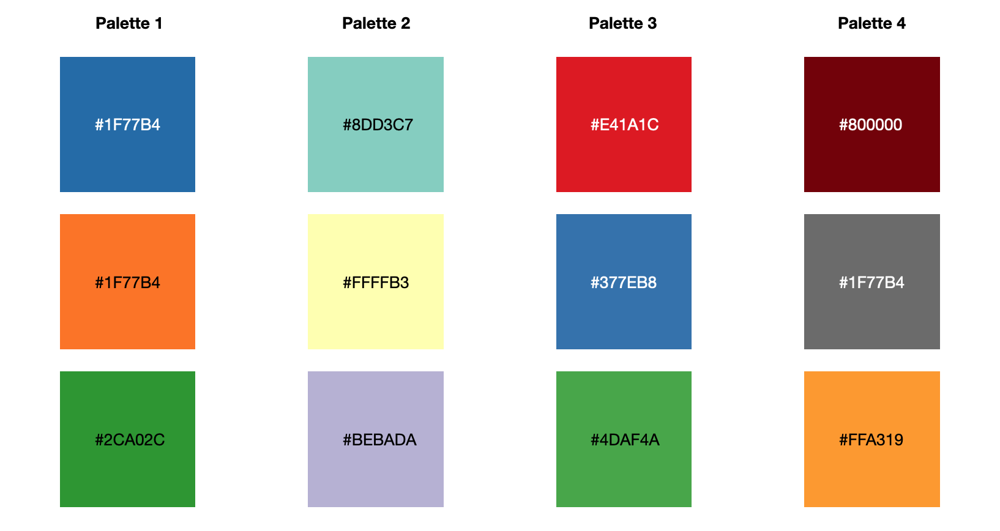
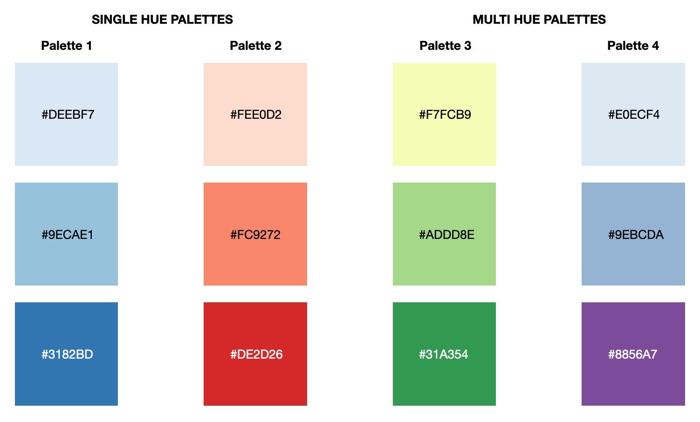
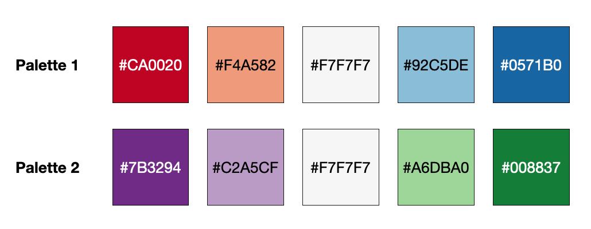
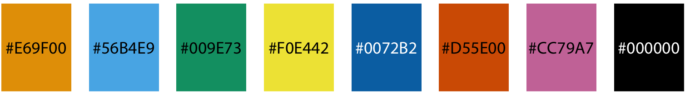
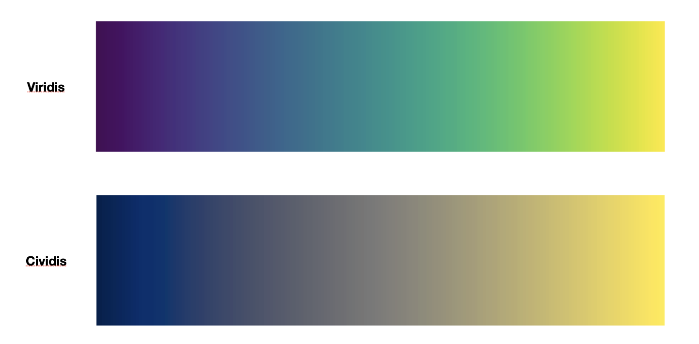
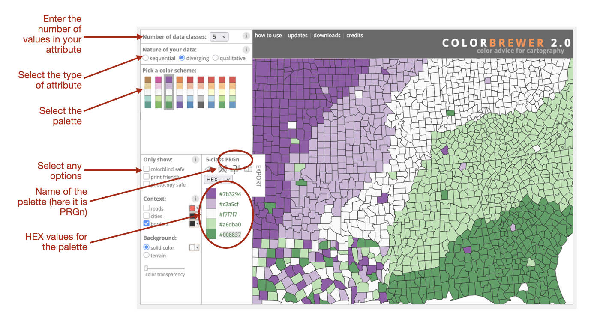
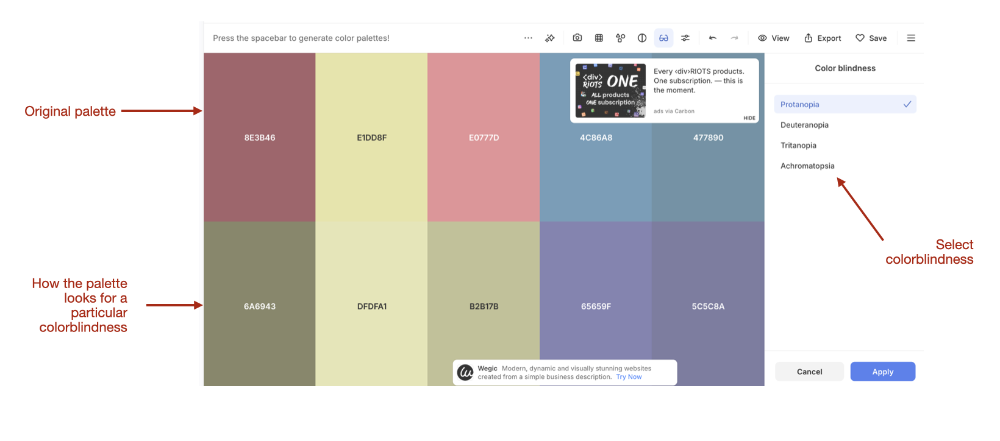

# Color Palettes for Data Visualizations


This chapter will focus on considerations we need to make when choosing a color palette for our data visualization. To illustrate ideas later in the chapter, we will again use the *sat.csv* data. There are a couple of extra packages that you will also need to load in addition to`{tidyverse}`. (Reminder: You will need to install these packages prior to loading them.) Those packages are `{ggokabeito}`, `{viridisLite}` and `{RColorBrewer}`


```{r}
#| label: load-packages2
#| message: false
#| fig-width: 6
#| fig-height: 6
#| out-width: "90%"

######################
# Load library
######################

library(tidyverse)
library(ggokabeito)
library(viridisLite)
library(RColorBrewer)


######################
# Import data
######################

sat <- read_csv("data/sat.csv")
```


<br />


## Selecting a Color Palette

Selecting a color palette can be challenging. It should be aesthetically pleasing, but needs to convey the differences and nuances in the data that you are using color to display. For example the color palette we choose when using color to display a categorical attribute will be different than the color palette we choose when using color to display a quantitative attribute. This is because the goal for the colors you choose is different when you display a categorical versus a quantitative attribute.

<br />


## Color Palettes for Categorical Attributes

When you are coloring values of a categorical attribute the goal is to have readers of your visualization be able to differentiate between the different categories. This means that you want to select a color palette that has highly differentiable colors. Color theory suggests many ways to do this including choosing distinct hues with varied lightness and saturation.

@fig-cat-color-pal shows four different color palettes for a categorical attribute with three categories. Each of these palettes differentiates the categories by adopting a set of contrasting hues. 


```{r}
#| label: fig-cat-color-pal
#| fig-cap: "Four different color palettes for a categorical attribute with three categories."
#| fig-alt: "Four different color palettes for a categorical attribute with three categories."
#| echo: false


```


## Color Palettes for Ordinal Attributes

An ordinal attribute is one in which there is a sequential order to the values of the attribute. This can be a quantitative attribute where higher values indicate more (or less) of something than lower values. It can also be a categorical attributes that has ordered categories. For example, consider a categorical attribute that indicates the amount of education someone has with the categories: high school, some college, college degree, graduate school. This is ordinal because different categories indicate more or less education than other categories.


When you are coloring values of an ordinal attribute the goal is to not only have readers of your visualization be able to differentiate between the different values of the attribute, but also inform them of the magnitude of those values. That is, we want to capture the ordinal nature of the attribute via the color palette. 

To do this we use a *sequential color palette*. There are two common methods for selecting a sequential color palettes. The first is to pick a single hue and vary the intensity of the color, using lighter hues of a color for lower values and darker hues of that same color for higher values. A second method is to use multiple hues along an ordered spectrum (e.g., yellow--orange--red) or that go from light to dark.

```{r}
#| label: fig-seq-color-pal
#| fig-cap: "Four sequential color palettes for an attribute with three ordered values."
#| fig-alt: "Four sequential color palettes for an attribute with three ordered values."
#| echo: false


```

:::fyi
**FYI**

The gradient that we used in the last chapter is an example of a sequential color palette. The gradient goes one step further and assumes the values are on a continuous scale. Because of this a gradient is not appropriate for ordinal categorical attributes; it is only appropriate for quantitative attributes.
:::

<br />


## Color Palettes for Diverging Attributes

A diverging attribute not only has a sequential order to the values of the attribute, but also has a "zero" value with values on both sides of that value. One example is Likert type items that you might encounter on a survey where your responses are: strongly disagree, disagree, neutral, agree, and strongly agree. These responses are not only ordinal, but they diverge in both directions from the "neutral" response. The color palette for a diverging attribute needs to have the same properties as a sequential palette, but also needs to reflect this in two directions, which necessitates a multi-hued palette.

```{r}
#| label: fig-div-color-pal
#| fig-cap: "Two diverging color palettes for an attribute with five ordered values."
#| fig-alt: "Two diverging color palettes for an attribute with five ordered values."
#| echo: false


```

<br />


## Colorblindness and Accesible Color Palettes

In selecting a color palette, you will also want to think about accessibility in your choice of color palette. Roughly 8% of males and 0.5% of females have some form of color vision deficiency which will affect how they see and interpret the plot.^[Also, the new Federal accessibility law requires certain levels of color contrast. Although this applies mainly to text color, thinking about color contrasts is good practice. You can check the contrast of two colors at https://contrast-ratio.org/.] 

<br />


### Colorblind Friendly Palette for Categorical Attributes

One good palette for colorblindness for categorical attributes is the Okabe Ito palette. Masataka Okabe (Jikei Medical School) and Kei Ito (University of Tokyo) developed this palette to have distinguishable colors to people with any of the three common types of color vision deficiency. 

```{r}
#| label: fig-okabe-ito-color-pal
#| fig-cap: "Okabe Ito colorblind-friendly palette."
#| fig-alt: "Okabe Ito colorblind-friendly palette."
#| echo: false


```

To use the Obabe-Ito palette in R, we can use either the `scale_color_okabe_ito()` or `scale_fill_okabe_ito()` functions from the `{ggokabeito}` package.  We use this in place of `scale_color_manual()` or `scale_fill_manual()`. Below we show this for filling in the points in our scatterplot of the relationship between teacher pay and SAT scores conditioned on region of the country.

```{r}
#| fig-alt: "Scatterplot of teacher salries and total SAT scores. The points are colored based on the region attribute."
#| message: false
#| fig-width: 8
#| fig-height: 6
#| out-width: "90%"

######################
# Scatterplot using categorical attribute for fill
######################

ggplot(data = sat, aes(x = salary, y = sat, fill = region)) +
  geom_point(shape = 21, color = "black", size = 3) +
  labs(
    title = "TEACHER SALARIES AND SAT SCORES",
    subtitle = "\nStates with higher average teacher salaries tend to have lower average SAT scores.\nThe points are colored based on a categorical attribute indicating region of the\ncountry.",
    caption = "\nSOURCE: 1997 Digest of Education Statistics",
    x = "Average teacher salary (in thousands of dollars)",
    y = "Average SAT score"
  ) +
  theme_bw(
    base_size = 14
  ) +
  scale_fill_okabe_ito(
    name = "Region"
  )
```

<br />


### Colorblind Friendly Palette for Sequential Attributes

For ordered/sequential data, the Viridis or Civdis color palettes are two colorblind-friendly choices. The Viridis palette was created by Stéfan van der Walt and Nathaniel Smith for scientists to be aesthetically pleasing and also perceptually accurate. (You can watch a YouTube video of the designers presenting this palette at the SciPy conference [here](https://www.youtube.com/watch?v=xAoljeRJ3lU).) The Cividis palette, created by @Nunez:2018, was a modification of the Viridis palette that increased the "perceptual distances between points" making the colors in this palette even more distinguishable for people with color vision deficiencies.

```{r}
#| label: fig-viridis-color-pal
#| fig-cap: "The Viridis and Cividis colorblind-friendly palettes for sequential data."
#| fig-alt: "The Viridis and Cividis colorblind-friendly palettes for sequential data."
#| echo: false


```


To use the Viridis or Cividis palette in R, we use functions from the `{viridisLite}` Package. The functions we would use are:


- `scale_fill_viridis_d()` or `scale_color_viridis_d()` for sequential categorical data. (The "d" is for discrete, which is another word for categorical.)
- `scale_fill_viridis_c()` or `scale_color_viridis_c()` for sequential quantitative data. (The "c" is for continuous, which is another word for quantitative.)

To use the Cividis palette we use these same functions, but add the argument `option="cividis"`.

Below we will illustrate this by filling our points based on the categorical and quantitative attributes indicating the percentage of students taking the SAT.

```{r}
#| fig-alt: "Scatterplot of teacher salries and total SAT scores. The points are colored based on the frac_cat attribute."
#| message: false
#| fig-width: 8
#| fig-height: 6
#| out-width: "90%"

######################
# Scatterplot using sequential categorical attribute for fill
# Viridis palette
######################

ggplot(data = sat, aes(x = salary, y = sat, fill = frac_cat)) +
  geom_point(shape = 21, color = "black", size = 3) +
  labs(
    title = "TEACHER SALARIES AND SAT SCORES",
    subtitle = "\nStates with higher average teacher salaries tend to have lower average SAT scores.\nThe points are colored based on a categorical attribute indicating region of the\ncountry.",
    caption = "\nSOURCE: 1997 Digest of Education Statistics",
    x = "Average teacher salary (in thousands of dollars)",
    y = "Average SAT score"
  ) +
  theme_bw(
    base_size = 14
  ) +
  scale_fill_viridis_d(
    name = "% Taking the SAT"
  )

######################
# Scatterplot using sequential quantitative attribute for fill
# Cividis palette
######################

ggplot(data = sat, aes(x = salary, y = sat, fill = frac)) +
  geom_point(shape = 21, color = "black", size = 3) +
  labs(
    title = "TEACHER SALARIES AND SAT SCORES",
    subtitle = "\nStates with higher average teacher salaries tend to have lower average SAT scores.\nThe points are colored based on a categorical attribute indicating region of the\ncountry.",
    caption = "\nSOURCE: 1997 Digest of Education Statistics",
    x = "Average teacher salary (in thousands of dollars)",
    y = "Average SAT score"
  ) +
  theme_bw(
    base_size = 14
  ) +
  scale_fill_viridis_c(
    name = "% Taking the SAT",
    option = "cividis"
  )
```


<br />


### Colorblind Friendly Palette for Diverging Attributes

@Harrower:2003 developed several colorblind friendly palettes for use with categorical, sequential, and diverging attributes. The website <https://colorbrewer2.org> is an interactive tool that helps you select a different palette. 


```{r}
#| label: fig-color-brewer
#| fig-cap: "The Color Brewer website is an interactive site that helps you select aesthetically pleasing and perceptually accurate color palettes."
#| fig-alt: "The Color Brewer website is an interactive site that helps you select aesthetically pleasing and perceptually accurate color palettes."
#| echo: false


```


After using the website to select a color palette, you can use `scale_fill_manual()` or `scale_color_manual()` to enter the appropriate HEX colors. The `{tidyverse}` package also includes the functions `scale_fill_brewer()` and `scale_color_brewer()`. Within these functions, we can use the argument `palette=` to indicate the name of the Color Brewer palette you want to use.

We will illustrate using a diverging color palette from Color Brewer using the attribute `frac_mdn` to color the points. This attribute indicates whether the percentage of SAT takes is lower or higher than the median. The five values are: Extremely Low, Low, Median, High, and Extremely High. We will use the "PRGn" diverging color palette to fill our points. 


```{r}
#| fig-alt: "Scatterplot of teacher salries and total SAT scores. The points are colored based on the frac_mdn attribute."
#| message: false
#| fig-width: 8
#| fig-height: 6
#| out-width: "90%"

######################
# Scatterplot using diverging attribute for fill
# PRGn palette
######################

ggplot(data = sat, aes(x = salary, y = sat, fill = frac_mdn)) +
  geom_point(shape = 21, color = "black", size = 3) +
  labs(
    title = "TEACHER SALARIES AND SAT SCORES",
    subtitle = "\nStates with higher average teacher salaries tend to have lower average SAT scores.\nThe points are colored based on a categorical attribute indicating the percentage of\nstudents taking the SAT relative to the median.",
    caption = "\nSOURCE: 1997 Digest of Education Statistics",
    x = "Average teacher salary (in thousands of dollars)",
    y = "Average SAT score"
  ) +
  theme_bw(
    base_size = 14
  ) +
  scale_fill_brewer(
    name = "% Taking the SAT",
    palette = "PRGn"
  )
```


Unforunately, R is applying the color palette in alphabetical order, so it is not accurately mapping the appropriate colors to the labels. If we need to re-order the labels, it is easier to go back to `scale_fill_manual()` and include the `breaks=` and `values=` arguments. The HEX color values can be copied from the Color Brewer website. We will also re-order the labels in the legend from lowest to highest.


```{r}
#| fig-alt: "Scatterplot of teacher salries and total SAT scores. The points are colored based on the frac_mdn attribute. Here the categories have been re-ordered."
#| message: false
#| fig-width: 8
#| fig-height: 6
#| out-width: "90%"

######################
# Scatterplot using diverging attribute for fill
# Re-ordered using scale_fill_manual()
######################

ggplot(data = sat, aes(x = salary, y = sat, fill = frac_mdn)) +
  geom_point(shape = 21, color = "black", size = 3) +
  labs(
    title = "TEACHER SALARIES AND SAT SCORES",
    subtitle = "\nStates with higher average teacher salaries tend to have lower average SAT scores.\nThe points are colored based on a categorical attribute indicating the percentage of\nstudents taking the SAT relative to the median.",
    caption = "\nSOURCE: 1997 Digest of Education Statistics",
    x = "Average teacher salary (in thousands of dollars)",
    y = "Average SAT score"
  ) +
  theme_bw(
    base_size = 14
  ) +
  scale_fill_manual(
    name = "% Taking the SAT",
    breaks = c("Extremely Low", "Low", "Median", "High", "Extremely High"),
    values = c(
      "Extremely Low" = "#008837",
      "Low" = "#a6dba0",
      "Median" = "#f7f7f7",
      "High" = "#c2a5cf",
      "Extremely High" = "#7b3294"
    )
  )
```

<br />


### Evaluating Your Palette for Accesibility 

There are several online tools for evaluating a color palette for accessibility. For example, Coolors.co has a colorblind simulator. You can generate a palette at <https://coolors.co/generate>. Then click the eyeglasses icon. You can then see how the palette looks to people who have four different types of colorblindness. Make sure that each color in your palette is differentiable!

```{r}
#| label: fig-coolors
#| fig-cap: "The coolors.co colorblindness simulator."
#| fig-alt: "The coolors.co colorblindness simulator."
#| echo: false


```

<br />


## Exploring More Palettes

There are several R packages that include built in color palettes. Many of these have a `scale_color_` and `scale_fill` function that integrates automatically with `ggplot()`. You can find a pretty comprehensive list here: <https://github.com/EmilHvitfeldt/r-color-palettes>

Some of my favorites include:

- Color palettes inspired by the National Parks `{NatParksPalettes}`
- Color palettes inspired by Wes Anderson movies `{wesanderson}`
- Color palettes inspired by works at the Metropolitan Museum of Art in New York `{MetBrewer}`
- Aesthetically pretty color palettes `{PrettyCols}`

<br />


## References {-}


