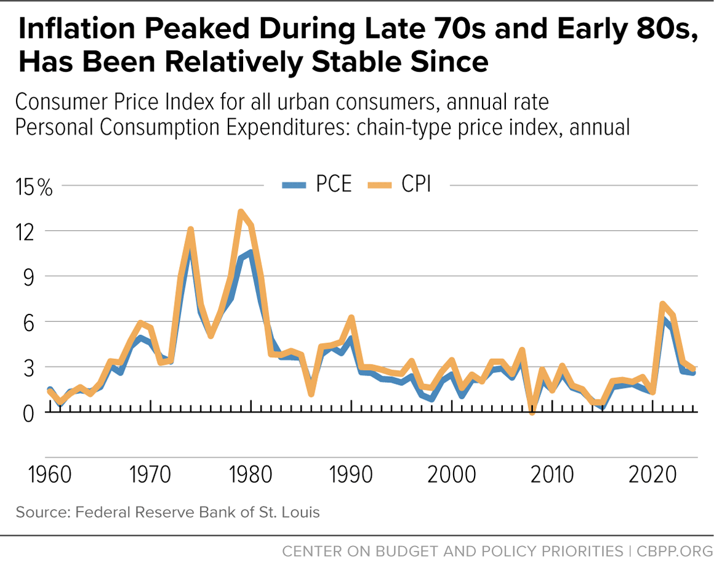
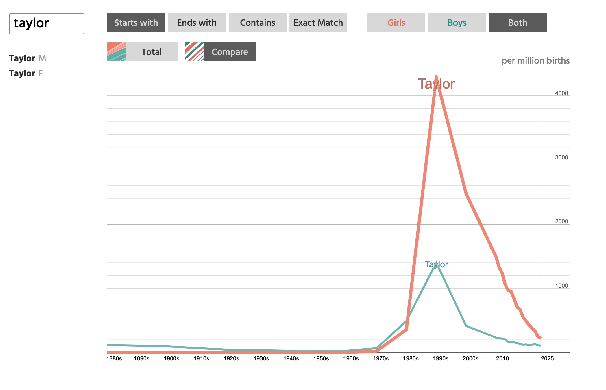
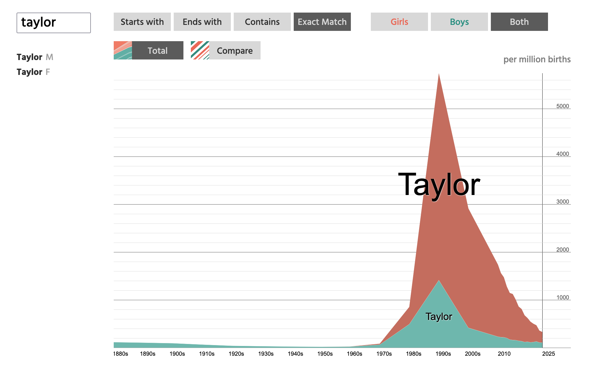
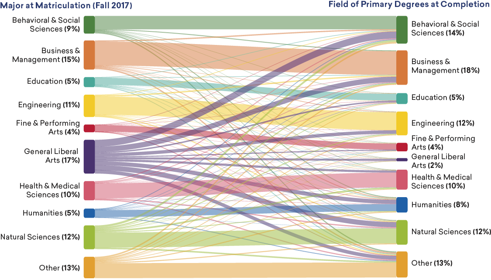

# Visualizations to Address Change Over Time {#sec-plot-enhance}

One common type of research question that gets asked are questions about change over time. For example:

- How has the cost of attending college changed over time?
- How has inflation changed from decade-to-decade?
- How have political parties shifted over time?

To answer these questions we need *temporal* or *longitudinal*  data. This simply means that we need data that has been collected over time. There are several visualizations that are used for plotting temporal data. 

<br />


## Linegraph

The simplest visualization for plotting temporal data is the linegraph. 

As an example, @fig-linegraph shows the annual rate for [two different economic measures](https://www.cbpp.org/research/economy/inflation-key-measures-to-understand) over time. 

```{r}
#| label: fig-linegraph
#| fig-cap: "Plot created by the Center on Budget and Policy Priorities showing inflation over time."
#| fig-alt: "Plot created by the Center on Budget and Policy Priorities showing inflation over time."
#| out-width: "80%"
#| echo: false


```

The data story with a linegraph is to describe how something changes over time. Not only are the ups (increasing tend) and downs (decreasing trend) of the plot interesting, but so are the minimums and maximums. Information about the time period being plotted is often brought in to contextualize the change over time.

The Center on Budget and Policy Priorities interprets the linegraph in @fig-linegraph in the following way:

> The United States has seen some notable periods of high inflation in the past, specifically during the 1970s and the early 2020s. In 1974, the CPI inflation rate reached 12 percent, and then dropped to around 5 percent by 1976. After subsiding largely by itself, inflation rose again in 1980 to almost 15 percent. This volatility was driven by a number of factors including two oil shocks, the first being the 1973 oil crisis, which created an oil shortage and pushed up oil prices for consumers and businesses. The second one was the oil shock of 1978-79, which was caused by the Iranian Revolution and the subsequent collapse of Iranian oil production.

<!-- In most line graphs, time is displayed on the *x*-axis and the value of the measures(s) that are were collected over time are plotted on the *y*-axis.  -->

<br />


## Area Graph

The area graph is quite similar to the linegraph. It is essentially a line graph with the area under the line shaded in.  @fig-areagraph shows an area graph that shows the popularity of the name "Taylor" over time. This was created using the NameGrapher at the [namerology](https://namerology.com/baby-name-grapher/) website. 

```{r}
#| label: fig-areagraph
#| fig-cap: "Popularity of the name 'Taylor' over time. This is plotted as both a linegraph (LEFT) and area graph (RIGHT)."
#| fig-alt: "Popularity of the name 'Taylor' over time. This is plotted as both a linegraph (LEFT) and area graph (RIGHT)."
#| layout-ncol: 2
#| out-width: "100%"
#| echo: false



```

The data story for an area graph is the same as that for the linegraph. 

> The name "Taylor" increased in popularity in the 1970s and 80s. While it was a more popular name for males until about 1980, it surged in popularity for females in the 80s, quickly overtaking males. By the early 1990s, when it hit its peak, about 0.4% of females were named "Taylor" (and a little over 0.1% of males). (Taylor Swift was born in 1989 at peak Taylor-naming!) Since then, the name has continued to decrease in popularity for both sexes.


<br />


## Slope Graph

The slope graph is useful for showing the change over time when you have multiple cases, but only two time points. For example, @fig-slopegraph shows a slope graph comparing the total salary cap of NHL teams in the 2024-25 season to that in the 2025-26 season. 

```{r}
#| label: fig-slopegraph
#| fig-cap: "Slope graph showing the change in total salary cap for each NHL team between the 2024-25 and 2025-26 seasons."
#| fig-alt: "Slope graph showing the change in total salary cap for each NHL team between the 2024-25 and 2025-26 seasons."
#| fig-height: 10
#| out-width: "100%"
#| echo: false
#| message: false

library(tidyverse)
library(ggimage)
#https://www.spotrac.com/nhl/cap/_/year/2024
nhl = read_csv("data/nhl-salary.csv")

nhl <- nhl |>
  group_by(team) |>
  mutate(slope = if_else(first(cap_total) > last(cap_total), "increase", "decrease")) |>
  ungroup()

ggplot(nhl, aes(x = year, y = cap_total, group = team,)) +
  geom_line(aes(color = slope), linewidth = 0.5) +
  geom_image(data =  ~filter(., year == "2024"), aes(image = logo), size = 0.022, nudge_x = -0.03) +
  geom_image(data =  ~filter(., year == "2025"), aes(image = logo), size = 0.022, nudge_x = 0.03) +
  labs(
    title = "Total salary cap changes for all NHL teams from\nthe 2024-25 season to the 2025-26 season.",
    caption = "SOURCE: spotrac.com"
  )+
  scale_x_discrete(
    name = "",
    position = "top"
    ) + # Moves year labels to top
  scale_y_continuous(
    name = "",
    breaks = seq(from = 65, to = 110, by = 5),
    labels = scales::unit_format(unit = "M", prefix = "$")
  ) +
  scale_color_manual(
    values = c("increase" = "steelblue", "decrease" = "tomato")
  ) +
  theme_minimal() +
  guides(color = "none")
```

The data story is about the slopes that go up versus those that go down (and those that stay flat). 

> Of the 32 NHL teams, 25 of them increased their total salary cap from the 2024-25 season to the 2025-26 season.  There were seven NHL teams whose total salary cap was less in the 2025-26 season than it was in the 2024-25 season: Carolina Hurricanes, Chicago Blackhawks, Colorado Avalanche, Detroit Red Wings, Toronto Maple Leafs, Washington Capitals, and Winnipeg Jets. Of these seven teams, only Carolina and Colorado made the playoffs in the 2025-26 season. Moreover, Toronto and Washington made the playoffs in 2024-25 but missed them in 2025-26.


<br />


## Waterfall Chart

A waterfall chart displays a sequence of bars that indicate positive or negative changes. They are most useful when you need to visualize the cumulative effect of positive and negative values on an initial value.

@fig-waterfall shows a waterfall chart of change in global carbon emissions for the last 30 years. In 1994 the global carbon emissions was 27.3 Gt (billion tons). Each year since 1994 you can see the increase/decrease leading up to the 38.1 Gt total in 2024.
 

```{r}
#| label: fig-waterfall
#| fig-cap: "Waterfall chart showing the change in global carbon emissions for the last 30 years."
#| fig-alt: "Waterfall chart showing the change in global carbon emissions for the last 30 years."
#| fig-height: 7
#| fig-width: 10
#| out-width: "100%"
#| echo: false
#| message: false


carbon = read_csv("data/global-carbon-budget.csv")

# In order to preserve the order of the lines in a dataframe I convert the desc variable to a factor; id and type variable are also added:
# balance$desc <- factor(balance$desc, levels = balance$desc)
carbon$id <- seq_along(carbon$diff)
carbon$type <- ifelse(carbon$diff > 0, "increase","decrease")
carbon[carbon$year %in% c(1994, 2024), "type"] <- "net"

# Next the data will be slightly reworked to specify the coordinates for drawing the waterfall bars.
carbon$end <- cumsum(carbon$diff)
carbon$end <- c(head(carbon$end, -1), 0)
carbon$start <- c(0, head(carbon$end, -1))
#balance <- balance[, c(3, 1, 4, 6, 5, 2)]

ggplot(carbon, aes(year, fill = type)) + 
  annotate("segment",
    x    = c(1994, 2000, 2005, 2010, 2015, 2020, 2024),
    xend = c(1994, 2000, 2005, 2010, 2015, 2020, 2024),
    y    = -0.5,   # how far down you want the line to start
    yend = 45,   # top of the plot area
    color = "grey90"
  ) +
  annotate("segment", x = 1997, y = 0, xend = 1997, yend = 45, linetype = "dashed") +
  annotate("segment", x = 2015, y = 0, xend = 2015, yend = 45, linetype = "dashed") +
  geom_rect(
    aes(x = year, xmin = year - 0.45, xmax = year + 0.45, ymin = end, ymax = start)
    ) +
  geom_text(data = carbon[-1, ],
    aes(x = year, 
        y = pmax(start, end),
        label = ifelse(diff > 0, paste0("+", round(diff, 2)), round(diff, 2))
        ),
  vjust = -0.4, size = 2.5
) +
  labs(
    caption = "SOURCE: globalcarbonproject.org"
  ) +
  annotate("text", x = 1997.2, y = 38, label = "Kyoto Protocol\n(1997)", hjust = 0, size = 3) +
  annotate("text", x = 2015.2, y = 26, label = "Paris Climate\nAgreement Signed\n(2015)", hjust = 0, size = 3) +
  annotate("text", x = 1994, y = 13.65, label = "27.3", size = 2.5) +
  annotate("text", x = 2024, y = 19.05, label = "38.1", size = 2.5) +
  scale_x_continuous(
    name = "",
    breaks = c(1994, 2000, 2005, 2010, 2015, 2020, 2024)
  ) +
  scale_y_continuous(
    name = "Global Carbon Emissions (Gt)"
  ) +
  scale_fill_manual(
    values = c("#ad1457", "#9e9e9e", "#ef6c00")
  ) +
  theme_minimal() +
  theme(
    panel.grid.major.x = element_blank(),
    panel.grid.minor.x = element_blank(),
    axis.text.x = element_text(vjust = 15)
  ) +
  guides(
    fill = "none"
  ) 
```

The data story for a waterfall chart is really about the component parts that get added or subtracted rather than the cumulative total.

> In the last 30 years global carbon emissions has increased from 27.3 Gt to 38.1 Gt. While most of these years there were increases in carbon emissions, there were a couple notable exceptions. In 1997 and 1998 global carbon emissions decreased. This was when the Kyoto Protocol was adopted committing industrialized nations to legally binding greenhouse gas (GHG) emission reduction targets. The other decrease occurred in 2016, after the Paris Agreement was signed in 2015. Moreover, after 2015, the rate of increase diminished relative to the pre-2015 increase.

<br />


## Sankey Diagrams

Sankey diagrams (a.k.a., alluvial plots) show flow between different states (called "nodes"). In plotting temporal data, they show the flow between time points. The flow thickness in the plot is proportional to the quantity, helping visualize the magnitude of inputs and outputs. The @AAAS:2025 created a Sankey diagram visualizing the flow of how college students stay with or change majors while seeking a Bachelor's degree (see @fig-sankey).     


```{r}
#| label: fig-sankey
#| fig-cap: "Sankey diagram visualizing the noncompletion and change of majors among students seeking a Bachelor's degree from their matriculation in Fall 2017 to Summer 2024."
#| fig-alt: "Sankey diagram visualizing the noncompletion and change of majors among students seeking a Bachelor's degree from their matriculation in Fall 2017 to Summer 2024."
#| out-width: "100%"
#| echo: false


```

The data story for Sankey diagrams is to describe the flow in and out of the different nodes. In the example, we would want to describe the majors that kept or lost students. AAAS describes this with the following prose (edited to remove some technical detail):


> Business and management majors and engineering majors were the most likely to stick with their majors. Students were least likely to remain in a general liberal arts major. As a result, while general liberal arts majors accounted for 17 percent of entering students, this field represented just 2 percent of the cohort who completed degrees (suggesting that this category is now the functional equivalent of an undeclared major in the past). Education and the natural sciences were the only other fields with retention rates below 70 percent among students starting in their fields.
>
> Conversely, only two fields gained more students from other fields than they lost to dropouts or changes in major. Approximately 20,000 more students finished with degrees in both the behavioral and social sciences and the humanities than had matriculated into those fields in 2017. One in five students who started in general liberal studies had switched to the behavioral and social sciences by graduation, as did 9 percent of students who began in the natural sciences and 7 percent of students who started in the humanities. (The humanities saw a similar influx of students from other fields. Compared to the humanities and behavioral and social sciences, the natural sciences have both a lower retention rate among students starting in the field and relatively little in-migration from other fields.

<br />


## References {-}


<!-- ## References {-} -->